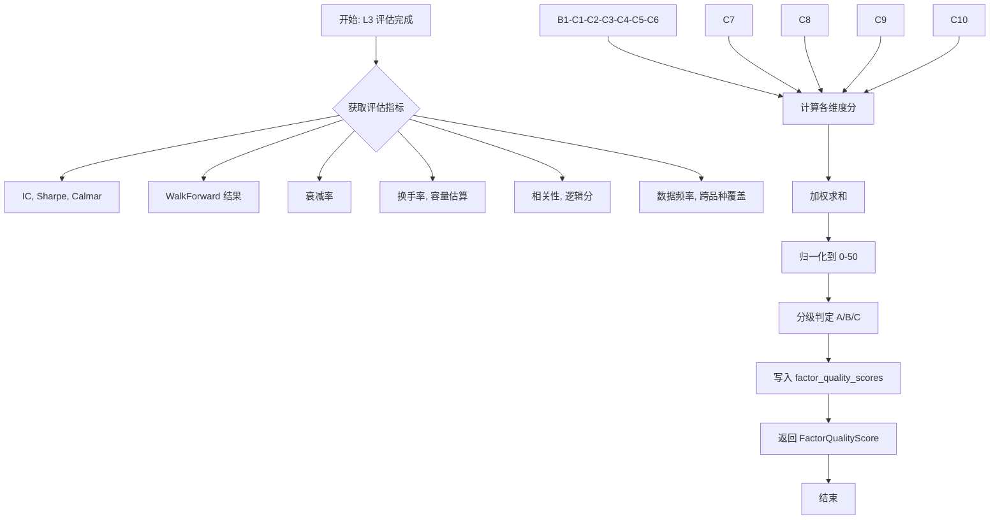
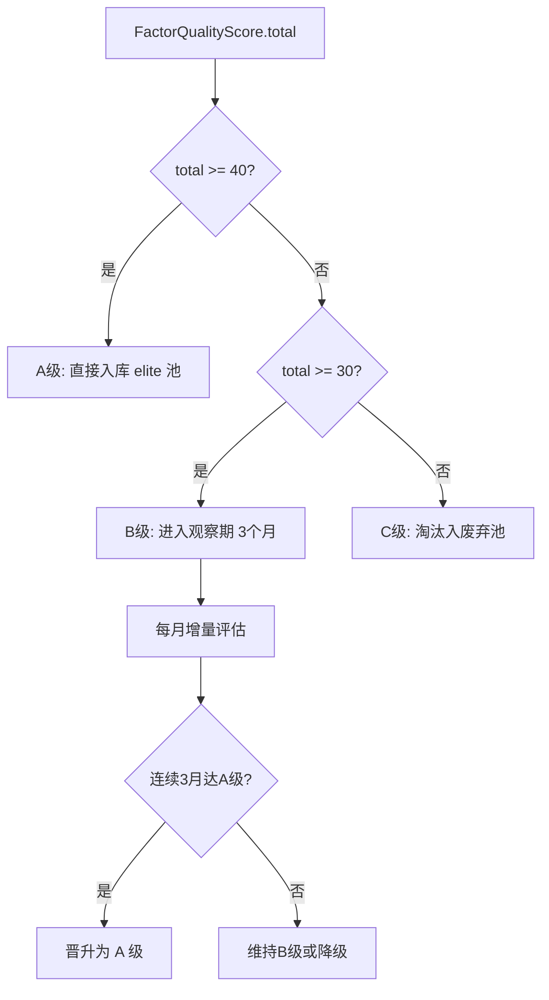

# A.1 因子质量评分卡 — 详细技术设计

> 版本: v1.0.0
> 关联: [11-factor-mining-optimization-plan.md](file:///d:/Programs/factor_system/docs/harness/11-factor-mining-optimization-plan.md) → Phase A.1
> 状态: 规划中

---

## 1. 目标与范围

建立 **10 维度定量评分体系**（每个维度 0–5 分，总分 50 分），替代当前 L3 评估链的 pass/fail 判定，为分级准入（A/B/C 级）和因子排名提供依据。

**范围**:
- 本次设计聚焦评分卡的 **数据模型、评分算法、接口契约** 三部分。
- 不涉及评估链的改动（评估链改动见 B.3 因子审计）。

**不在范围**:
- 因子代码/算子改动
- 回测引擎改动

---

## 2. 数据模型设计

### 2.1 DuckDB Schema 扩展

在 `factor_db` 中新增 `factor_quality_scores` 表。

```sql
CREATE TABLE IF NOT EXISTS factor_quality_scores (
    score_id              VARCHAR(36) PRIMARY KEY,
    factor_id             VARCHAR(36) NOT NULL,
    total_score           DOUBLE NOT NULL DEFAULT 0,
    dimension_scores      JSON NOT NULL,        -- 各维度明细 JSON
    evaluated_at          TIMESTAMP NOT NULL,
    score_version         VARCHAR(20) NOT NULL DEFAULT 'v1',
    -- 关键维度快捷索引列
    ic_score              DOUBLE NOT NULL DEFAULT 0,
    sharpe_score          DOUBLE NOT NULL DEFAULT 0,
    stability_score       DOUBLE NOT NULL DEFAULT 0,
    robustness_score      DOUBLE NOT NULL DEFAULT 0,
    capacity_score        DOUBLE NOT NULL DEFAULT 0,
    tradability_score     DOUBLE NOT NULL DEFAULT 0,
    diversity_score       DOUBLE NOT NULL DEFAULT 0,
    logic_score           DOUBLE NOT NULL DEFAULT 0,
    timeliness_score      DOUBLE NOT NULL DEFAULT 0,
    compatibility_score   DOUBLE NOT NULL DEFAULT 0,
    FOREIGN KEY (factor_id) REFERENCES factor_catalog(factor_id)
);

CREATE INDEX IF NOT EXISTS idx_fqs_factor_id
    ON factor_quality_scores(factor_id);
CREATE INDEX IF NOT EXISTS idx_fqs_total_score
    ON factor_quality_scores(total_score DESC);
CREATE INDEX IF NOT EXISTS idx_fqs_evaluated_at
    ON factor_quality_scores(evaluated_at);
```

### 2.2 核心类型定义

```python
class DimensionScore(TypedDict, total=False):
    """单个维度的评分。"""
    name: str                               # 维度名
    raw_value: float                        # 原始值
    score: float                            # 归一化分 (0-5)
    description: str                        # 简要说明

class FactorQualityScore(TypedDict, total=False):
    """完整评分卡。"""
    score_id: str
    factor_id: str
    total_score: float
    dimension_scores: list[DimensionScore]
    evaluated_at: str                      # ISO 格式
    score_version: str
    grade: Literal['A', 'B', 'C']          # 分级准入


class FactorQualityCardConfig(TypedDict, total=False):
    """评分卡配置。"""
    max_per_dimension: int                  # 单维度满分 (默认 5)
    total_max: int                          # 总分上限 (默认 50)
    grade_A_threshold: float                # A 级阈值 (默认 40)
    grade_B_min: float                      # B 级下限 (默认 30)
    decay_discount_rate: float             # 衰减折扣率 (默认 0.1)
```

---

## 3. 评分维度与算法

### 3.1 十个维度

| # | 维度 | 名称 | 权重 | 输入来源 |
|---|------|------|------|----------|
| 1 | 有效性 | `ic_score` | 1.0 | L1 评估链：IC / ICIR |
| 2 | 收益性 | `sharpe_score` | 1.0 | L1 评估链：Sharpe、Calmar |
| 3 | 稳定性 | `stability_score` | 0.8 | WalkForward：IC 跨窗口一致性 |
| 4 | 鲁棒性 | `robustness_score` | 0.8 | 衰减率、压力测试结果 |
| 5 | 容量 | `capacity_score` | 0.6 | 容量估算模型 |
| 6 | 交易性 | `tradability_score` | 0.6 | 换手率、流动性指标 |
| 7 | 多样性 | `diversity_score` | 0.5 | 与已有因子相关性 |
| 8 | 逻辑性 | `logic_score` | 0.5 | L2 经济逻辑评分 |
| 9 | 实时性 | `timeliness_score` | 0.4 | 数据更新频率、信号延迟 |
| 10 | 兼容性 | `compatibility_score` | 0.4 | 跨品种/跨市场泛化 |

**权重总和**: 6.6（最终加权后归一化到 50 分）。

### 3.2 评分映射函数

每个维度将原始指标映射到 0–5 分：

```python
def _map_ic_to_score(ic: float) -> float:
    """IC → 有效性分。阈值: IC=0.08→5分, 0.03→3分, 0.01→1分, 0→0分"""
    if ic <= 0: return 0.0
    if ic >= 0.08: return 5.0
    if ic >= 0.03: return 3.0
    if ic >= 0.01: return 1.0
    return (ic / 0.01) * 1.0   # 线性插值 0-1

def _map_sharpe_to_score(sharpe: float) -> float:
    """Sharpe → 收益性分。阈值: Sharpe=3→5分, 1.5→3分, 0.5→1分"""
    if sharpe <= 0: return 0.0
    if sharpe >= 3: return 5.0
    if sharpe >= 1.5: return 3.0
    if sharpe >= 0.5: return 1.0
    return (sharpe / 0.5) * 1.0

def _map_decay_to_score(decay_rate: float) -> float:
    """衰减率 → 鲁棒性分。衰减率越低分越高。"""
    # decay_rate: 月环比 IC 下降幅度（正值表示衰减）
    if decay_rate <= 0.1: return 5.0
    if decay_rate <= 0.3: return 3.0
    if decay_rate <= 0.5: return 1.0
    return 0.0
```

### 3.3 总分计算

```python
def compute_total_score(dim_scores: list[DimensionScore],
                        weights: list[float],
                        total_max: int = 50) -> float:
    # 加权求和，再归一化
    raw_total = sum(s['score'] * w for s, w in zip(dim_scores, weights))
    weight_sum = sum(weights)
    # 当前：raw_total 最大 = 5 * weight_sum
    # 目标：映射到 0–total_max
    normalized = (raw_total / (5.0 * weight_sum)) * total_max
    return round(normalized, 2)
```

### 3.4 分级准入

```python
def determine_grade(total_score: float,
                    th_A: float = 40.0,
                    th_B_min: float = 30.0) -> Literal['A', 'B', 'C']:
    if total_score >= th_A: return 'A'
    if total_score >= th_B_min: return 'B'
    return 'C'
```

| 等级 | 总分范围 | 准入动作 |
|------|----------|----------|
| A | ≥ 40 | 直接入库 elite 池，参与组合构建 |
| B | 30–40 | 进入观察期（3 个月），期间每月增量评估 |
| C | < 30 | 淘汰，进入淘汰池（保留历史） |

---

## 4. 接口契约

### 4.1 `FactorQualityCard` 类

```python
class FactorQualityCard:
    """因子质量评分卡计算器。

    Usage:
        card = FactorQualityCard(config)
        score = card.evaluate(
            factor_id='...',
            ic=0.05, sharpe=2.1,
            walk_forward_result=wf_result,
            decay_rate=0.12,
            turnover=0.15,
            correlation_max=0.45,
            logic_score=4,
            data_frequency='daily',
            cross_symbol_coverage=0.85,
            capacity_estimate=100_000_000
        )
    """

    def __init__(self, config: FactorQualityCardConfig | None = None) -> None: ...

    def evaluate(self, *,
                 factor_id: str,
                 ic: float,
                 sharpe: float,
                 walk_forward_result: WalkForwardResult,
                 decay_rate: float,
                 turnover: float,
                 correlation_max: float,
                 logic_score: int,
                 data_frequency: Literal['tick', 'minute', 'hour', 'daily'],
                 cross_symbol_coverage: float,
                 capacity_estimate: float) -> FactorQualityScore: ...

    def _compute_dimension_scores(self, ...) -> list[DimensionScore]: ...
    def _compute_total(self, dims: list[DimensionScore]) -> float: ...
    def _determine_grade(self, total: float) -> Literal['A', 'B', 'C']: ...
```

### 4.2 `FactorQualityCardRepository` 类

```python
class FactorQualityCardRepository:
    """DuckDB 评分卡读写仓储。

    Usage:
        repo = FactorQualityCardRepository(db)
        repo.save_score(score)
        top = repo.list_top_scores(limit=20, grade='A')
        history = repo.get_score_history(factor_id='...')
    """

    def save_score(self, score: FactorQualityScore) -> str: ...
    def get_latest_score(self, factor_id: str) -> FactorQualityScore | None: ...
    def list_top_scores(self, *, limit: int = 20,
                        grade: Literal['A', 'B', 'C'] | None = None) -> list[FactorQualityScore]: ...
    def get_score_history(self, factor_id: str) -> list[FactorQualityScore]: ...
    def delete_scores_for_factor(self, factor_id: str) -> int: ...
```

### 4.3 与现有评估链的集成点

`FactorQualityCard` 作为 L3 评估链的**补充输出**，而非替代现有三级评估。集成位置：

```
evolution_loop.py
  └── evaluation_chain.run()          # 现有 L1/L2/L3 评估
  └── verifier.verify()               # 现有 Verifier 锁定检查
  └── [新增] card.evaluate()          # 评分卡计算
  └── [新增] repo.save_score()        # 存入 factor_quality_scores
  └── [新增] determine_grade()        # 分级准入判定
  └── promote_to_elite(grade)         # 根据等级决定入库方式
```

---

## 5. 流程设计

### 5.1 评分卡计算流程



### 5.2 分级准入流程



---

## 6. 技术约束

| 约束 | 说明 |
|------|------|
| **向后兼容** | `evaluation_chain.py` 的现有三级评估接口不变，评分卡为新增输出 |
| **性能** | 单次评分计算 < 10ms（纯内存计算，不含 DB 写入） |
| **幂等性** | 同一 `factor_id` + `evaluated_at` 重复计算结果一致 |
| **可配置** | 所有阈值通过 `FactorQualityCardConfig` 配置，支持运行时调整 |
| **数据隔离** | 评分卡数据独立于 `factor_versions`，便于版本管理 |

---

## 7. 文件改动清单

| 文件 | 动作 | 说明 |
|------|------|------|
| `fts/factor_engine/factor_quality_card.py` | **新增** | `FactorQualityCard` 类及评分映射函数 |
| `fts/factor_engine/factor_db/schema.py` | **修改** | 新增 `factor_quality_scores` 表定义 |
| `fts/factor_engine/factor_db/repository.py` | **修改** | 新增评分卡 CRUD 方法 |
| `fts/factor_engine/evolution_loop.py` | **修改** | L3 评估后调用评分卡，分级准入 |
| `tests/factor_engine/test_factor_quality_card.py` | **新增** | 评分卡单元测试 |
| `tests/factor_engine/test_grade_classification.py` | **新增** | 分级准入测试 |

---

## 8. 验收标准

| # | 标准 | 检验方式 |
|---|------|----------|
| 1 | 10 维度评分均可独立计算，结果在 0–5 分范围内 | 单元测试 |
| 2 | 总分计算公式正确：10 维度加权求和归一化到 50 分 | 单元测试 |
| 3 | A/B/C 分级判定逻辑符合阈值定义 | 单元测试 |
| 4 | 评分卡数据正确写入 `factor_quality_scores` 表 | 集成测试 |
| 5 | `evolution_loop.py` 在 L3 评估后调用评分卡 | 代码审查 |
| 6 | 评估链现有接口行为不变（向后兼容） | 回归测试全绿 |
| 7 | 单次评分计算 < 10ms | 性能测试 |

---

## 9. 一致性元数据

| 字段 | 值 |
|:-----|:----|
| 关联文档 | [11-factor-mining-optimization-plan.md](file:///d:/Programs/factor_system/docs/harness/11-factor-mining-optimization-plan.md) → Phase A.1 |
| 依赖模块 | `evaluation_chain.py`（评估指标）、`walk_forward.py`（稳定性）、`factor_db/`（存储） |
| 前置条件 | L3 评估链能输出 IC/Sharpe/WalkForward 结果（已满足） |
| 后置影响 | 因子准入流程从 pass/fail 改为 A/B/C 三级准入 |