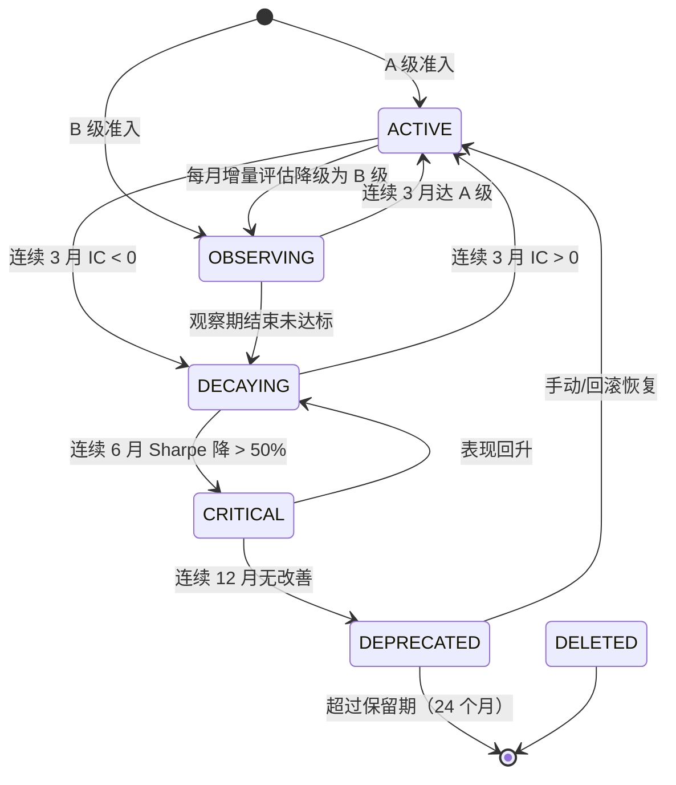
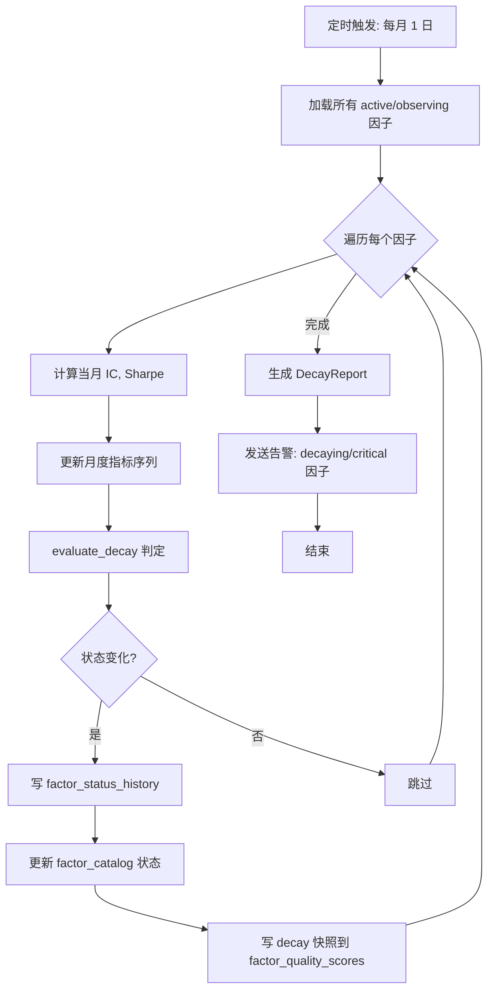
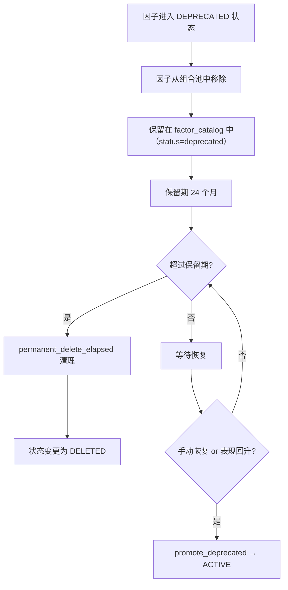

# A.2 因子衰减追踪与自动淘汰 — 详细技术设计

> 版本: v1.0.0
> 关联: [11-factor-mining-optimization-plan.md](file:///d:/Programs/factor_system/docs/harness/11-factor-mining-optimization-plan.md) → Phase A.2
> 状态: 规划中

---

## 1. 目标与范围

建立因子**生命周期管理**机制：
- 自动识别衰减因子，触发降级或淘汰
- 为每个因子维护状态机（active → decaying → critical_deprecated）
- 定期增量重评估，输出因子衰减报告
- 支持被淘汰因子的历史查询和回滚恢复

**范围**:
- 因子状态机设计
- 衰减判定算法
- 自动淘汰工作流
- 与 `elite_tracker.py` 和 `factor_db` 的集成

---

## 2. 数据模型设计

### 2.1 因子状态枚举

```python
class FactorStatus(str, Enum):
    """因子生命周期状态。"""
    ACTIVE = "active"                   # 活跃：参与组合构建
    OBSERVING = "observing"             # 观察期：B 级准入后观察
    DECAYING = "decaying"               # 衰减中：连续 3 月 IC < 0
    CRITICAL = "critical_deprecated"    # 严重衰减：连续 6 月 Sharpe 下降 > 50%
    DEPRECATED = "deprecated"           # 已淘汰：连续 12 月无改善
    DELETED = "deleted"                 # 已删除：手动清理
```

**状态转移规则**:



### 2.2 Schema 扩展

在 `factor_catalog` 表上扩展状态追踪字段：

```sql
-- factor_catalog 表扩展
ALTER TABLE factor_catalog ADD COLUMN IF NOT EXISTS status VARCHAR(20) NOT NULL DEFAULT 'active';
ALTER TABLE factor_catalog ADD COLUMN IF NOT EXISTS status_updated_at TIMESTAMP;
ALTER TABLE factor_catalog ADD COLUMN IF NOT EXISTS consecutive_ic_negative_months INT NOT NULL DEFAULT 0;
ALTER TABLE factor_catalog ADD COLUMN IF NOT EXISTS consecutive_sharpe_drop_months INT NOT NULL DEFAULT 0;
ALTER TABLE factor_catalog ADD COLUMN IF NOT EXISTS last_incremental_eval_at TIMESTAMP;
ALTER TABLE factor_catalog ADD COLUMN IF NOT EXISTS decay_rate_3m DOUBLE;
ALTER TABLE factor_catalog ADD COLUMN IF NOT EXISTS decay_rate_6m DOUBLE;

-- 索引
CREATE INDEX IF NOT EXISTS idx_fc_status ON factor_catalog(status);
```

新增 `factor_status_history` 表记录状态变迁历史：

```sql
CREATE TABLE IF NOT EXISTS factor_status_history (
    history_id      VARCHAR(36) PRIMARY KEY,
    factor_id       VARCHAR(36) NOT NULL,
    from_status     VARCHAR(20) NOT NULL,
    to_status       VARCHAR(20) NOT NULL,
    reason          VARCHAR(200) NOT NULL,
    changed_at      TIMESTAMP NOT NULL,
    snapshot       JSON NOT NULL,
    FOREIGN KEY (factor_id) REFERENCES factor_catalog(factor_id)
);

CREATE INDEX IF NOT EXISTS idx_fsh_factor_id ON factor_status_history(factor_id);
CREATE INDEX IF NOT EXISTS idx_fsh_changed_at ON factor_status_history(changed_at);
```

### 2.3 核心类型

```python
class DecayConfig(TypedDict, total=False):
    """衰减追踪配置。"""
    eval_interval_days: int                # 增量评估间隔 (默认 30)
    ic_negative_threshold: float           # IC 负值阈值 (默认 0)
    ic_negative_months_decay: int         # 连续几月 IC < 0 标为 decaying (默认 3)
    sharpe_drop_ratio_threshold: float     # Sharpe 下降比例 (默认 0.5)
    sharpe_drop_months_critical: int       # 连续几月 Sharpe 降标为 critical (默认 6)
    no_improvement_months_deprecated: int  # 无改善几月淘汰 (默认 12)
    retention_months_deprecated: int       # 淘汰保留期 (默认 24)
    min_observance_months: int             # 最少观察期 (默认 3)


class DecayEvalResult(TypedDict, total=False):
    """单次衰减评估结果。"""
    factor_id: str
    current_status: FactorStatus
    proposed_status: FactorStatus
    ic_trend: Literal['improving', 'stable', 'deteriorating']
    sharpe_trend: Literal['improving', 'stable', 'deteriorating']
    decay_rate_3m: float
    decay_rate_6m: float
    actions: list[str]                     # ['降级为 decaying', '触发淘汰流程']
    reason: str
    snapshot: dict
```

---

## 3. 衰减判定算法

### 3.1 IC 趋势分析

```python
def analyze_ic_trend(monthly_ics: list[float],
                     negative_threshold: float = 0) -> dict:
    """分析 IC 趋势。

    Returns:
        {
            'trend': 'improving' | 'stable' | 'deteriorating',
            'consecutive_negative_months': int,
            'avg_ic_3m': float,
            'avg_ic_6m': float,
        }
    """
    if len(monthly_ics) < 3:
        return {'trend': 'insufficient_data', ...}

    # 计算连续 IC < 0 的月份数
    consecutive_negative = 0
    for ic in reversed(monthly_ics):
        if ic < negative_threshold:
            consecutive_negative += 1
        else:
            break

    # 近 3/6 月平均
    avg_3m = sum(monthly_ics[-3:]) / 3
    avg_6m = sum(monthly_ics[-6:]) / min(6, len(monthly_ics))

    # 趋势判定
    if consecutive_negative >= 3:
        trend = 'deteriorating'
    elif avg_3m > avg_6m * 1.1:
        trend = 'improving'
    elif avg_3m < avg_6m * 0.9:
        trend = 'deteriorating'
    else:
        trend = 'stable'

    return {...}
```

### 3.2 Sharpe 衰减率计算

```python
def compute_sharpe_decay_rate(monthly_sharpes: list[float]) -> dict:
    """计算 Sharpe 环比衰减率。

    Returns:
        {
            'decay_rate_3m': float,    # 近 3 月 Sharpe 环比
            'decay_rate_6m': float,    # 近 6 月 Sharpe 环比
            'consecutive_drop_months': int,
            'cumulative_drop': float,
        }
    """
    if len(monthly_sharpes) < 2:
        return {'decay_rate_3m': 0.0, 'decay_rate_6m': 0.0,
                'consecutive_drop_months': 0, 'cumulative_drop': 0.0}

    # 环比变化
    deltas = []
    for i in range(1, len(monthly_sharpes)):
        prev = max(monthly_sharpes[i - 1], 0.001)
        delta = (monthly_sharpes[i] - prev) / prev
        deltas.append(delta)

    # 近 3/6 月平均衰减率
    decay_3m = abs(sum(deltas[-3:]) / max(1, len(deltas[-3:])))
    decay_6m = abs(sum(deltas[-6:]) / max(1, len(deltas[-6:])))

    # 连续下降月数
    consecutive_drop = 0
    for d in reversed(deltas):
        if d < 0:
            consecutive_drop += 1
        else:
            break

    # 累计下降
    cumulative = 1.0
    for d in deltas:
        cumulative *= (1.0 + d)
    cumulative_drop = 1.0 - cumulative

    return {...}
```

### 3.3 状态转移判定

```python
def evaluate_decay(factor: FactorCatalog,
                   monthly_metrics: list[MonthlyMetric],
                   config: DecayConfig) -> DecayEvalResult:
    """综合判定因子衰减状态。"""
    ic_trend = analyze_ic_trend(monthly_metrics.ics)
    sharpe_decay = compute_sharpe_decay_rate(monthly_metrics.sharpes)

    proposed = factor.status
    actions = []
    reason = ""

    # 规则 1: 连续 3 月 IC < 0 → 标记 decaying
    if ic_trend['consecutive_negative_months'] >= config['ic_negative_months_decay']:
        if factor.status == FactorStatus.ACTIVE:
            proposed = FactorStatus.DECAYING
            actions.append('降级为 decaying')
            reason = f"连续 {config['ic_negative_months_decay']} 月 IC < 0"

    # 规则 2: 连续 6 月 Sharpe 下降 > 50% → 标记 critical
    if sharpe_decay['consecutive_drop_months'] >= config['sharpe_drop_months_critical']:
        if sharpe_decay['cumulative_drop'] >= config['sharpe_drop_ratio_threshold']:
            proposed = FactorStatus.CRITICAL
            actions.append('触发 critical 状态')
            reason += f"; 累计 Sharpe 下降 {sharpe_decay['cumulative_drop']:.1%}"

    # 规则 3: 连续 12 月无改善 → 淘汰
    if proposed in (FactorStatus.DECAYING, FactorStatus.CRITICAL):
        if _no_improvement_for_months(factor, monthly_metrics, config):
            proposed = FactorStatus.DEPRECATED
            actions.append('触发淘汰流程')
            reason += "; 长期无改善"

    # 规则 4: 衰减恢复 → 回升
    if factor.status == FactorStatus.DECAYING:
        if ic_trend['consecutive_negative_months'] == 0 and sharpe_decay['decay_rate_3m'] < 0.1:
            proposed = FactorStatus.ACTIVE
            actions.append('恢复为 active')
            reason = "IC 回升且 Sharpe 稳定"

    return DecayEvalResult(
        factor_id=factor.factor_id,
        current_status=factor.status,
        proposed_status=proposed,
        ic_trend=ic_trend['trend'],
        sharpe_trend=sharpe_decay['trend'],
        decay_rate_3m=sharpe_decay['decay_rate_3m'],
        decay_rate_6m=sharpe_decay['decay_rate_6m'],
        actions=actions,
        reason=reason,
        snapshot={...}
    )
```

---

## 4. 接口契约

### 4.1 `FactorDecayTracker` 类

```python
class FactorDecayTracker:
    """因子衰减追踪器。

    Usage:
        tracker = FactorDecayTracker(repository, config)
        # 运行月度增量评估
        report = tracker.run_monthly_eval()
        # 查看单个因子衰减状态
        status = tracker.get_decay_status(factor_id)
        # 生成衰减报告
        report = tracker.generate_decay_report()
    """

    def __init__(self, repository: FactorDbRepository,
                 config: DecayConfig | None = None) -> None: ...

    def run_monthly_eval(self) -> list[DecayEvalResult]:
        """对所有 active/observing 因子执行增量评估。"""
        ...

    def evaluate_single(self, factor_id: str) -> DecayEvalResult:
        """评估单个因子的衰减状态。"""
        ...

    def get_decay_status(self, factor_id: str) -> FactorDecayStatus:
        """获取因子当前衰减状态。"""
        ...

    def generate_decay_report(self) -> DecayReport:
        """生成全量因子衰减报告。"""
        ...

    def promote_deprecated(self, factor_id: str,
                           reason: str = '') -> DecayEvalResult:
        """手动将废弃因子恢复为 active。"""
        ...

    def permanent_delete_elapsed(self) -> int:
        """清理超过保留期的废弃因子。"""
        ...
```

### 4.2 `DecayReport` 类型

```python
class DecayReport(TypedDict, total=False):
    """因子衰减报告。"""
    report_id: str
    generated_at: str
    summary: DecaySummary
    factor_changes: list[DecayEvalResult]
    deprecated_factors: list[dict]
    grade_distribution: dict[str, int]


class DecaySummary(TypedDict, total=False):
    total_factors: int
    active_count: int
    observing_count: int
    decaying_count: int
    critical_count: int
    deprecated_count: int
    avg_decay_rate_3m: float
    avg_decay_rate_6m: float
    new_deprecated_this_month: int
    promoted_this_month: int
```

---

## 5. 流程设计

### 5.1 月度增量评估流程



### 5.2 自动淘汰流程



### 5.3 与现有系统集成

```
scheduler/  (每月 1 日)
  └── factor_decay_tracker.run_monthly_eval()
        ├── factor_db.repository.load_active_factors()
        ├── data_futures 获取月度数据
        ├── evaluation_chain.run_l1_only()    # 仅 L1 回测，轻量
        ├── evaluate_decay()                 # 衰减判定
        ├── 更新 factor_catalog.status
        ├── 写 factor_status_history
        └── generate_decay_report()
            ├── 推送 Prometheus 指标
            └── 发送告警
```

---

## 6. Prometheus 指标

| 指标名 | 类型 | 标签 | 说明 |
|--------|------|------|------|
| `fts_factor_decay_active_count` | Gauge | - | 活跃因子数 |
| `fts_factor_decay_decaying_count` | Gauge | - | 衰减中因子数 |
| `fts_factor_decay_critical_count` | Gauge | - | 严重衰减因子数 |
| `fts_factor_decay_deprecated_count` | Gauge | - | 已淘汰因子数 |
| `fts_factor_decay_rate_3m` | Gauge | `factor_id` | 单因子 3 月衰减率 |
| `fts_factor_decay_evaluations_total` | Counter | `status_before, status_after` | 状态变更次数 |

---

## 7. 技术约束

| 约束 | 说明 |
|------|------|
| **增量评估轻量** | 月度评估仅运行 L1 回测（IC/Sharpe），不运行 L2/L3 |
| **幂等性** | 同一月份重复运行结果一致 |
| **不可变历史** | 状态变更通过 `factor_status_history` 记录，不可修改 |
| **恢复支持** | 废弃因子在保留期内可恢复为 active |
| **性能** | 100 个因子的月度增量评估 < 5 分钟 |
| **告警** | decaying 因子发送 Warning，critical 发送 Critical |

---

## 8. 文件改动清单

| 文件 | 动作 | 说明 |
|------|------|------|
| `fts/factor_engine/factor_decay_tracker.py` | **新增** | `FactorDecayTracker` 类及判定算法 |
| `fts/factor_engine/factor_db/schema.py` | **修改** | `factor_catalog` 扩展状态字段 + `factor_status_history` 表 |
| `fts/factor_engine/factor_db/repository.py` | **修改** | 衰减追踪相关 CRUD |
| `fts/monitor/prometheus_metrics.py` | **修改** | 新增衰减追踪 Prometheus 指标 |
| `fts/scheduler/schedules.py` | **修改** | 新增月度增量评估定时任务 |
| `tests/factor_engine/test_factor_decay_tracker.py` | **新增** | 衰减追踪单元测试 |
| `tests/factor_engine/test_decay_state_machine.py` | **新增** | 状态机转移测试 |

---

## 9. 验收标准

| # | 标准 | 检验方式 |
|---|------|----------|
| 1 | IC 趋势分析正确识别连续负值月份和改善趋势 | 单元测试 |
| 2 | Sharpe 衰减率正确计算 3 月和 6 月环比 | 单元测试 |
| 3 | 状态转移按规则正确执行（active→decaying→critical→deprecated） | 状态机测试 |
| 4 | 状态变更完整记录在 `factor_status_history` 表 | 集成测试 |
| 5 | 废弃因子在保留期内可恢复为 active | 单元测试 |
| 6 | 超过保留期的废弃因子被永久清理 | 单元测试 |
| 7 | 月度增量评估在 5 分钟内完成 | 性能测试 |
| 8 | 衰减报告正确生成，Prometheus 指标正常 | 集成测试 |

---

## 10. 一致性元数据

| 字段 | 值 |
|:-----|:----|
| 关联文档 | [11-factor-mining-optimization-plan.md](file:///d:/Programs/factor_system/docs/harness/11-factor-mining-optimization-plan.md) → Phase A.2 |
| 依赖模块 | `factor_db/repository.py`（数据持久化）、`evaluation_chain.py`（L1 回测）、`scheduler/`（定时触发） |
| 前置条件 | `factor_catalog` 表存在，`evaluation_chain.run_l1_only()` 可用 |
| 后置影响 | 因子准入从静态 pass/fail 变为动态生命周期管理 |