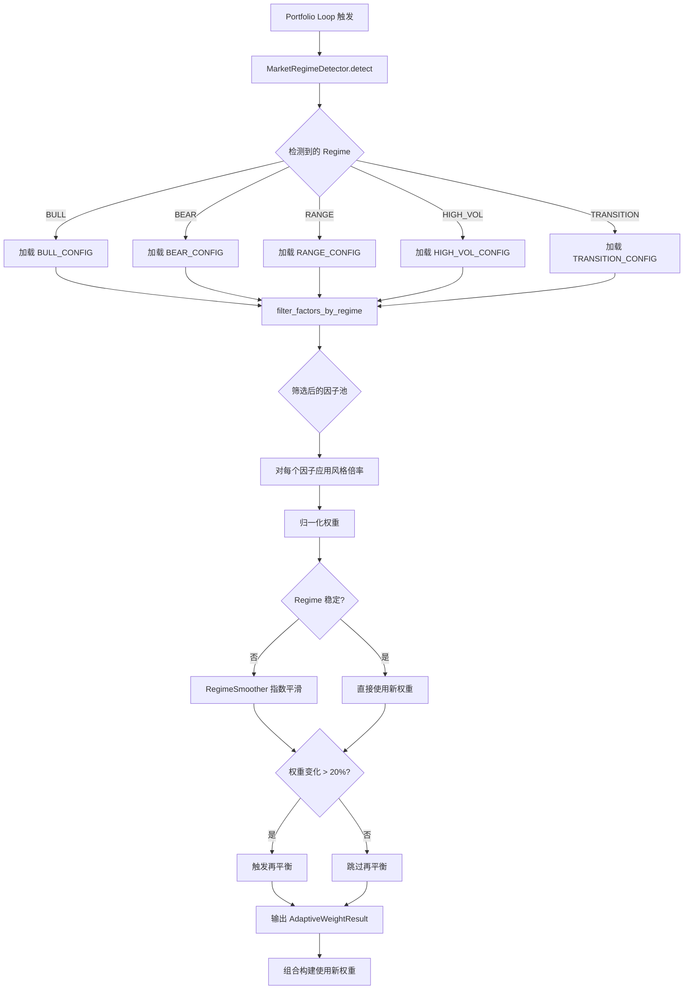
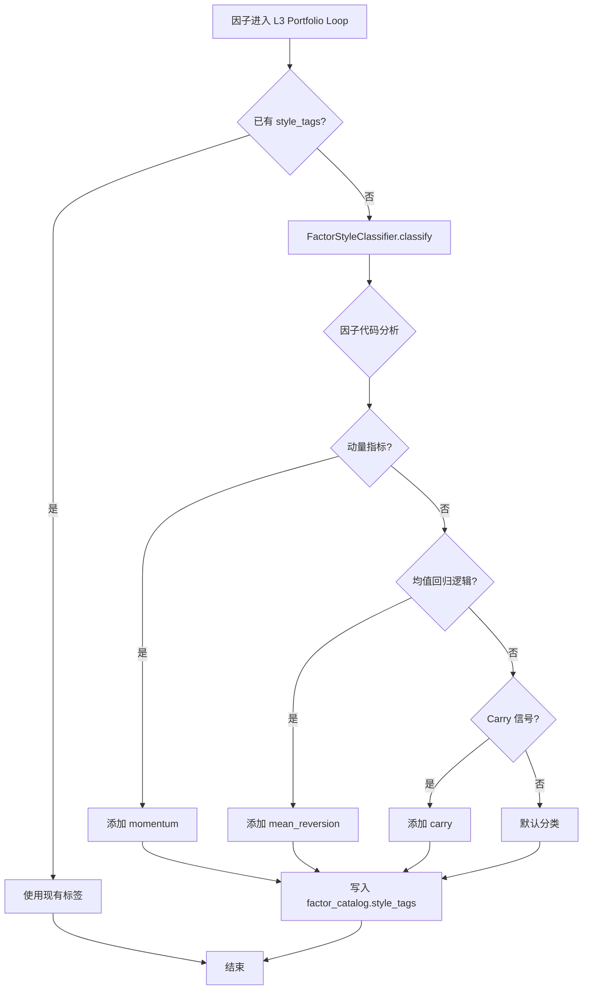

# A.3 自适应动态权重调整 — 详细技术设计

> 版本: v2.39.0
> 关联: [11-factor-mining-optimization-plan.md](file:///d:/Programs/factor_system/docs/harness/plans/11-factor-mining-optimization-plan.md) → Phase A.3
> 状态: **已实现**（实现方式与原设计不同）
> 实现说明: 自适应权重已实现于 `fts/factor_engine/portfolio_loop.py`：`REGIME_FAMILY_MULTIPLIERS` 映射表 + `regime_adaptive_weight_adjustment()` 函数 + `PortfolioLoop` 集成 `enable_regime_adaptation`（Step 2.5），Regime 检测用 `fts/factor_engine/regime.py` 的 `RegimeAwareSelector`。**未实现**原设计的 `AdaptiveWeightManager`/`FactorStyleClassifier`/`RegimeSmoother` 类与 `factor_catalog.style_tags` 字段；权重映射基于 **FactorFamily（因子家族）** 而非 FactorStyle（风格标签）。

---

## 1. 目标与范围

将 L3 Portfolio Loop 的**静态权重分配**升级为**自适应动态权重**：
- 权重随市场状态（Regime）自动调整
- 因子池根据 Regime 动态筛选
- 支持日频/周频/月频三种更新模式

**范围**:
- 市场状态（Regime）与因子风格的映射体系
- 动态权重调整算法
- 与现有 `portfolio_loop.py` 的集成

**不在范围**:
- Regime 检测算法本身（已在 `regime.py` 中实现）
- 因子正交化算法（现有逻辑保留）

---

## 2. 数据模型设计

### 2.1 因子风格标签体系

> **实现现状**: **未实现**。实际实现以 **FactorFamily（因子家族）** 为映射维度：`portfolio_loop.py` 定义 `REGIME_FAMILY_MULTIPLIERS`（Regime → FactorFamily 权重倍率映射），`FactorFamily` 枚举定义于 `fts/factor_engine/contracts.py`（如 momentum/carry/mean_reversion 等家族）。以下 FactorStyle 风格标签体系与 `style_tags` 字段为原设计（未实现）。

```python
class FactorStyle(str, Enum):
    """因子风格标签（原设计，未实现）。"""
    MOMENTUM = "momentum"           # 趋势/动量
    MEAN_REVERSION = "mean_reversion" # 均值回归
    CARRY = "carry"                 # Carry 收益
    VALUE = "value"                 # 价值
    LOW_VOL = "low_vol"             # 低波动
    HIGH_BETA = "high_beta"         # 高 beta
    DEFENSIVE = "defensive"         # 防御
    GROWTH = "growth"               # 成长
    QUALITY = "quality"             # 质量
    SENTIMENT = "sentiment"         # 情绪
    VOLATILITY = "volatility"       # 波动率
    OPEN_INTEREST = "open_interest" # 持仓量
    CROSS_SECTION = "cross_section" # 截面
    INTRADAY = "intraday"           # 日内
```

在 `factor_catalog` 表上新增 `style_tags` JSON 字段：

```sql
-- 原设计（未实现）
ALTER TABLE factor_catalog ADD COLUMN IF NOT EXISTS style_tags JSON;
-- 示例: ["momentum", "carry"]
```

### 2.2 核心类型定义

```python
class RegimeWeightConfig(TypedDict, total=False):
    """Regime 权重配置。"""
    weight_multipliers: dict[str, float]   # FactorStyle → 权重倍率
    allowed_styles: list[FactorStyle]      # 允许参与的因子风格
    excluded_styles: list[FactorStyle]     # 排除的因子风格
    max_factors: int                       # 最大参与因子数
    min_factors: int                       # 最小参与因子数
    rebalance_frequency: Literal['daily', 'weekly', 'monthly']


class AdaptiveWeightConfig(TypedDict, total=False):
    """自适应权重配置。"""
    bull_config: RegimeWeightConfig
    bear_config: RegimeWeightConfig
    range_config: RegimeWeightConfig
    high_vol_config: RegimeWeightConfig
    transition_config: RegimeWeightConfig
    default_config: RegimeWeightConfig
    decay_blend_alpha: float               # Regime 切换时的指数平滑系数 (默认 0.3)
    min_activation_days: int               # Regime 稳定最少天数 (默认 3)


class AdaptiveWeightResult(TypedDict, total=False):
    """自适应权重计算结果。"""
    regime: MarketRegime
    factor_weights: dict[str, float]        # factor_id → 最终权重
    selected_factors: list[str]             # 入选因子 ID 列表
    excluded_factors: list[str]             # 被排除因子 ID 列表
    base_weights: dict[str, float]         # 调整前的基础权重
    multipliers_applied: dict[str, float]   # 各因子应用的权重倍率
    rebalance_triggered: bool               # 本次是否触发了再平衡
    rebalance_reason: str


class MarketRegime(str, Enum):
    """市场状态（原设计枚举，未实现）。

    **实现现状**: 实际 Regime 由 `fts/factor_engine/regime.py` 的
    `RegimeAwareSelector.detect()` 输出，为 `MarketRegime` TypedDict，
    regime 取值: ``bull`` / ``bear`` / ``oscillate`` / ``high_vol`` / ``low_vol``，
    检测逻辑: MA20 斜率判定趋势 → ATR 判定波动率 → 兜底 oscillate。
    """
    BULL_TRENDING = "bull_trending"
    BEAR_TRENDING = "bear_trending"
    RANGE_BOUND = "range_bound"
    HIGH_VOLATILITY = "high_volatility"
    TRANSITION = "transition"
    UNKNOWN = "unknown"
```

---

## 3. Regime 权重映射

### 3.1 默认映射表

#### Bull Trending（牛市趋势）

```python
BULL_CONFIG = RegimeWeightConfig(
    weight_multipliers={
        FactorStyle.MOMENTUM: 1.3,
        FactorStyle.CARRY: 1.2,
        FactorStyle.GROWTH: 1.2,
        FactorStyle.HIGH_BETA: 1.15,
        FactorStyle.SENTIMENT: 1.1,
        FactorStyle.LOW_VOL: 0.7,
        FactorStyle.DEFENSIVE: 0.6,
        FactorStyle.MEAN_REVERSION: 0.8,
    },
    allowed_styles=[...],
    excluded_styles=[],
    max_factors=30,
    min_factors=10,
    rebalance_frequency='weekly',
)
```

#### Bear Trending（熊市趋势）

```python
BEAR_CONFIG = RegimeWeightConfig(
    weight_multipliers={
        FactorStyle.MOMENTUM: 0.6,
        FactorStyle.CARRY: 0.8,
        FactorStyle.HIGH_BETA: 0.4,
        FactorStyle.DEFENSIVE: 1.4,
        FactorStyle.LOW_VOL: 1.3,
        FactorStyle.QUALITY: 1.2,
        FactorStyle.VALUE: 1.2,
        FactorStyle.SENTIMENT: 0.7,
    },
    allowed_styles=[...],
    excluded_styles=[FactorStyle.HIGH_BETA],
    max_factors=20,
    min_factors=8,
    rebalance_frequency='weekly',
)
```

#### Range Bound（震荡市）

```python
RANGE_CONFIG = RegimeWeightConfig(
    weight_multipliers={
        FactorStyle.MEAN_REVERSION: 1.3,
        FactorStyle.VOLATILITY: 1.2,
        FactorStyle.DEFENSIVE: 1.1,
        FactorStyle.MOMENTUM: 0.8,
        FactorStyle.CARRY: 0.9,
    },
    allowed_styles=[...],
    excluded_styles=[FactorStyle.HIGH_BETA],
    max_factors=25,
    min_factors=10,
    rebalance_frequency='daily',
)
```

#### High Volatility（高波动期）

```python
HIGH_VOL_CONFIG = RegimeWeightConfig(
    weight_multipliers={
        FactorStyle.LOW_VOL: 1.4,
        FactorStyle.DEFENSIVE: 1.3,
        FactorStyle.VALUE: 1.2,
        FactorStyle.QUALITY: 1.15,
        FactorStyle.MOMENTUM: 0.5,
        FactorStyle.HIGH_BETA: 0.3,
        FactorStyle.SENTIMENT: 0.4,
    },
    allowed_styles=[FactorStyle.LOW_VOL, FactorStyle.DEFENSIVE, FactorStyle.VALUE, FactorStyle.QUALITY, FactorStyle.CARRY],
    excluded_styles=[FactorStyle.HIGH_BETA, FactorStyle.SENTIMENT],
    max_factors=15,
    min_factors=5,
    rebalance_frequency='daily',
)
```

#### Transition（过渡期）

```python
TRANSITION_CONFIG = RegimeWeightConfig(
    weight_multipliers={
        # 中性配置，仅对趋势性因子小幅减权
        FactorStyle.MOMENTUM: 0.9,
        FactorStyle.HIGH_BETA: 0.85,
        FactorStyle.MEAN_REVERSION: 1.05,
    },
    allowed_styles=[...],
    excluded_styles=[],
    max_factors=25,
    min_factors=8,
    rebalance_frequency='weekly',
)
```

### 3.2 动态因子池筛选

```python
def filter_factors_by_regime(factors: list[FactorCatalog],
                              config: RegimeWeightConfig) -> tuple[list[FactorCatalog], list[FactorCatalog]]:
    """根据 Regime 配置筛选参与的因子。

    Returns:
        (selected, excluded) — 入选和被排除的因子列表
    """
    selected = []
    excluded = []

    for factor in factors:
        # 跳过非 active 状态的因子
        if factor.status != FactorStatus.ACTIVE:
            excluded.append(factor)
            continue

        styles = factor.style_tags or []

        # 检查是否在排除列表
        if any(s in config.get('excluded_styles', []) for s in styles):
            excluded.append(factor)
            continue

        # 检查是否在允许列表（如果指定了）
        allowed = config.get('allowed_styles', [])
        if allowed and not any(s in allowed for s in styles):
            excluded.append(factor)
            continue

        selected.append(factor)

    # 限制最大因子数（按因子质量评分排序）
    max_factors = config.get('max_factors', len(selected))
    if len(selected) > max_factors:
        selected = sorted(selected, key=lambda f: f.quality_score, reverse=True)[:max_factors]

    return selected, excluded
```

---

## 4. 自适应权重算法

### 4.1 权重计算流程

```python
def compute_adaptive_weights(factors: list[FactorCatalog],
                             regime: MarketRegime,
                             base_weights: dict[str, float],
                             config: AdaptiveWeightConfig) -> AdaptiveWeightResult:
    """计算自适应权重。"""

    # 1. 获取当前 Regime 对应的权重配置
    regime_config = _get_regime_config(regime, config)

    # 2. 根据 Regime 筛选因子池
    selected, excluded = filter_factors_by_regime(factors, regime_config)

    # 3. 对每个入选因子应用风格倍率
    raw_weights = {}
    multipliers = {}
    for factor in selected:
        styles = factor.style_tags or []
        # 取该因子所有风格中最高的倍率
        multiplier = max(
            (regime_config['weight_multipliers'].get(s, 1.0) for s in styles),
            default=1.0
        )
        multipliers[factor.factor_id] = multiplier

        # 从基础权重开始，乘以风格倍率
        base_w = base_weights.get(factor.factor_id, 1.0 / len(selected))
        raw_weights[factor.factor_id] = base_w * multiplier

    # 4. 归一化
    total = sum(raw_weights.values())
    if total > 0:
        final_weights = {k: v / total for k, v in raw_weights.items()}
    else:
        final_weights = {k: 1.0 / len(selected) for k in selected}

    # 5. 检查是否需要重平衡
    rebalance_triggered = _check_rebalance_needed(
        previous_weights, final_weights, regime_config
    )

    return AdaptiveWeightResult(
        regime=regime,
        factor_weights=final_weights,
        selected_factors=[f.factor_id for f in selected],
        excluded_factors=[f.factor_id for f in excluded],
        base_weights=base_weights,
        multipliers_applied=multipliers,
        rebalance_triggered=rebalance_triggered,
        rebalance_reason=_get_rebalance_reason(regime, rebalance_triggered),
    )
```

### 4.2 Regime 切换平滑

```python
class RegimeSmoother:
    """Regime 切换时的权重平滑器，避免权重剧烈跳变。"""

    def __init__(self, alpha: float = 0.3, min_days: int = 3):
        self._alpha = alpha
        self._min_days = min_days
        self._current_regime: MarketRegime | None = None
        self._regime_since: datetime | None = None

    def should_apply(self, detected_regime: MarketRegime,
                     current_weights: dict[str, float],
                     new_weights: dict[str, float]) -> dict[str, float]:
        """计算平滑后的权重。

        - 如果 Regime 变化且已稳定 min_days：应用新权重
        - 如果 Regime 不稳定：指数平滑新旧权重
        - 使用 alpha 控制过渡速度
        """
        # 更新 Regime 追踪
        if detected_regime != self._current_regime:
            self._current_regime = detected_regime
            self._regime_since = datetime.now()

        # 计算 Regime 稳定天数
        stable_days = (datetime.now() - self._regime_since).days
        if stable_days < self._min_days:
            # 过渡期：指数平滑
            smoothed = {}
            for fid in set(list(current_weights.keys()) + list(new_weights.keys())):
                old = current_weights.get(fid, 0.0)
                new = new_weights.get(fid, 0.0)
                smoothed[fid] = (1 - self._alpha) * old + self._alpha * new
            total = sum(smoothed.values())
            if total > 0:
                smoothed = {k: v / total for k, v in smoothed.items()}
            return smoothed

        # Regime 稳定：直接使用新权重
        return new_weights
```

### 4.3 再平衡触发条件

```python
def _check_rebalance_needed(previous: dict[str, float],
                             current: dict[str, float],
                             config: RegimeWeightConfig) -> bool:
    """判断是否需要触发再平衡。"""
    # 计算权重变化幅度
    max_change = 0.0
    for fid in set(list(previous.keys()) + list(current.keys())):
        prev = previous.get(fid, 0.0)
        curr = current.get(fid, 0.0)
        if prev > 0:
            change = abs(curr - prev) / prev
            max_change = max(max_change, change)

    # 阈值：最大权重变化 > 20% 触发再平衡
    return max_change > 0.2
```

---

## 5. 接口契约

### 5.1 `AdaptiveWeightManager` 类

> **实现现状**: **未实现**（原设计类）。实际实现为 `fts/factor_engine/portfolio_loop.py` 中的模块级函数 `regime_adaptive_weight_adjustment(signals, regime, factors)` + 常量 `REGIME_FAMILY_MULTIPLIERS`，由 `PortfolioLoop.run()` 在 Step 2.5 调用（`enable_regime_adaptation=True` 时）。

```python
# 实际实现: portfolio_loop.py
REGIME_FAMILY_MULTIPLIERS: dict[str, dict[str, float]] = {
    # regime → FactorFamily → 权重倍率
    "bull":      {"momentum": 1.3, "carry": 1.2, ...},
    "bear":      {"defensive": 1.4, "low_vol": 1.3, ...},
    "oscillate": {"mean_reversion": 1.3, ...},
    "high_vol":  {"low_vol": 1.4, "defensive": 1.3, ...},
    "low_vol":   {...},
}

def regime_adaptive_weight_adjustment(
    signals: dict[str, float],
    regime: dict[str, Any],
    factors: list[FactorCatalog],
) -> tuple[dict[str, float], dict[str, float]]:
    """按 Regime 对因子信号权重做自适应调整（返回调整后信号 + 实际倍率）。"""
    ...

# 集成点: PortfolioLoop.run()
#   self._regime_selector = RegimeAwareSelector()   # regime.py
#   regime = self._regime_selector.detect(market_ohlcv)
#   signals, multipliers = regime_adaptive_weight_adjustment(signals, regime, factors)
```

> **与原设计的差异**:
> - 基于 FactorFamily 家族倍率，而非 FactorStyle 风格标签（无需 `style_tags` 字段）。
> - 无独立的 Regime 平滑器（`RegimeSmoother`）与再平衡触发逻辑（`_check_rebalance_needed`）。
> - 未实现 `update_config` / `list_configs` 热更新接口。

### 5.2 `FactorStyleClassifier` 类

> **实现现状**: **未实现**。实际无需风格分类器（基于 FactorFamily 映射）。

```python
class FactorStyleClassifier:
    """因子风格分类器（原设计，未实现）。

    基于因子代码逻辑和元数据自动归类风格标签。
    支持手动覆盖（人工标注优先）。
    """

    def classify(self, factor: FactorCatalog) -> list[FactorStyle]:
        """为因子分配风格标签。"""
        ...

    def classify_batch(self, factors: list[FactorCatalog]) -> dict[str, list[FactorStyle]]:
        """批量分类。"""
        ...

    def override_tags(self, factor_id: str, tags: list[FactorStyle]) -> None:
        """手动覆盖因子的风格标签。"""
        ...

    def clear_override(self, factor_id: str) -> None:
        """清除手动覆盖，恢复自动分类。"""
        ...
```

---

## 6. 流程设计

### 6.1 自适应权重计算流程



### 6.2 与现有 Portfolio Loop 集成

```
portfolio_loop.py
  ├── load_elite_factors()
  ├── [新增] AdaptiveWeightManager.compute_weights()
  │     ├── regime_detector.detect()
  │     ├── style_classifier.classify_batch()
  │     ├── filter_factors_by_regime()
  │     ├── compute_adaptive_weights()
  │     └── RegimeSmoother.should_apply()
  ├── orthogonalize(signals, weights)      # 现有逻辑，权重已自适应
  ├── decay_test(factors, weights)
  ├── build_portfolio(weights)
  ├── verifier.verify()
  └── inject_to_fdt(portfolio)
```

### 6.3 因子风格分类流程



---

## 7. 技术约束

| 约束 | 说明 |
|------|------|
| **性能** | 权重计算 < 50ms（100 因子 × 5 分钟频率） |
| **向后兼容** | `PortfolioLoop.run()` 在 `AdaptiveWeightManager` 不可用时回退到原有等权 |
| **可配置** | 所有 Regime 权重倍率通过配置文件管理，支持运行时热更新 |
| **最小因子数** | 不允许因子池 < 5 个因子（避免单一风险） |
| **风格分类可覆盖** | 支持手动覆盖因子标签，人工标注优先级高于自动分类 |
| **平滑过渡** | Regime 切换后至少 3 天的平滑过渡期 |
| **数据隔离** | 风格标签存储在 `factor_catalog.style_tags`，独立于版本历史 |

---

## 8. 文件改动清单

| 文件 | 动作 | 现状 | 说明 |
|------|------|------|------|
| `fts/factor_engine/adaptive_weight.py` | **新增** | ⬜ 未实现 | `AdaptiveWeightManager`/`RegimeSmoother` 未实现（逻辑内聚于 portfolio_loop.py） |
| `fts/factor_engine/factor_style_classifier.py` | **新增** | ⬜ 未实现 | `FactorStyleClassifier` 未实现（基于 FactorFamily 映射，无需分类器） |
| `fts/factor_engine/regime.py` | **修改** | ✅ 已实现 | `RegimeAwareSelector` + `MarketRegime` TypedDict（bull/bear/oscillate/high_vol/low_vol） |
| `fts/factor_engine/portfolio_loop.py` | **修改** | ✅ 已实现 | `REGIME_FAMILY_MULTIPLIERS` + `regime_adaptive_weight_adjustment()` + `PortfolioLoop.enable_regime_adaptation`（Step 2.5） |
| `fts/factor_engine/factor_db/schema.py` | **修改** | ⬜ 未实现 | `factor_catalog.style_tags` 字段未新增 |
| `fts/monitor/prometheus_metrics.py` | **修改** | ⬜ 未实现 | Regime/权重变化指标未实现（当前为 `prometheus_setup.py`） |
| `tests/factor_engine/test_adaptive_weight.py` | **新增** | ✅ 已实现 | 自适应权重测试（对应测试文件存在） |
| `tests/factor_engine/test_regime_smoother.py` | **新增** | ⬜ 未实现 | Regime 平滑器测试（RegimeSmoother 未实现） |
| `tests/factor_engine/test_style_classifier.py` | **新增** | ⬜ 未实现 | 风格分类测试（分类器未实现） |

---

## 9. Prometheus 指标

| 指标名 | 类型 | 标签 | 说明 |
|--------|------|------|------|
| `fts_regime_current` | Gauge | `regime` | 当前市场状态 (1=是, 0=否) |
| `fts_weight_factor_count` | Gauge | `regime` | 参与权重计算的因子数 |
| `fts_weight_selected_factors` | Gauge | `regime` | 入选因子数 |
| `fts_weight_excluded_factors` | Gauge | `regime` | 被排除因子数 |
| `fts_weight_max_change_ratio` | Gauge | `regime` | 最大权重变化比例 |
| `fts_weight_rebalance_total` | Counter | `regime` | 再平衡触发次数 |

---

## 10. 验收标准

| # | 标准 | 检验方式 |
|---|------|----------|
| 1 | 每个 Regime 有独立的权重配置，因子风格映射正确 | 配置审查 |
| 2 | Regime 切换时权重通过 RegimeSmoother 平滑过渡 | 单元测试 |
| 3 | 高波动期自动缩减因子池至 ≤ 15 个 | 集成测试 |
| 4 | 牛市动量因子权重自动提高到 1.3 倍 | 单元测试 |
| 5 | 熊市自动排除 HIGH_BETA 因子 | 集成测试 |
| 6 | Portfolio Loop 在 AdaptiveWeightManager 不可用时回退到等权 | 回归测试 |
| 7 | 权重计算 < 50ms | 性能测试 |
| 8 | Prometheus 指标正常输出 Regime 和权重变化 | 集成测试 |
| 9 | 因子风格标签可手动覆盖并持久化 | 单元测试 |
| 10 | 回测对比显示自适应权重优于静态等权 | 对比测试 |

---

## 11. 一致性元数据

| 字段 | 值 |
|:-----|:----|
| 关联文档 | [11-factor-mining-optimization-plan.md](file:///d:/Programs/factor_system/docs/harness/plans/11-factor-mining-optimization-plan.md) → Phase A.3 |
| 依赖模块 | `regime.py`（市场状态检测）、`portfolio_loop.py`（组合构建）、`factor_db/`（因子数据） |
| 前置条件 | `MarketRegimeDetector` 可用，因子质量评分卡（A.1）已实施 |
| 后置影响 | 组合权重从静态变为动态，因子池随 Regime 变化 |
| 与现有计划关联 | Phase B.3 多 Agent 协作中的 ReviewAgent 可复用风格分类逻辑 |