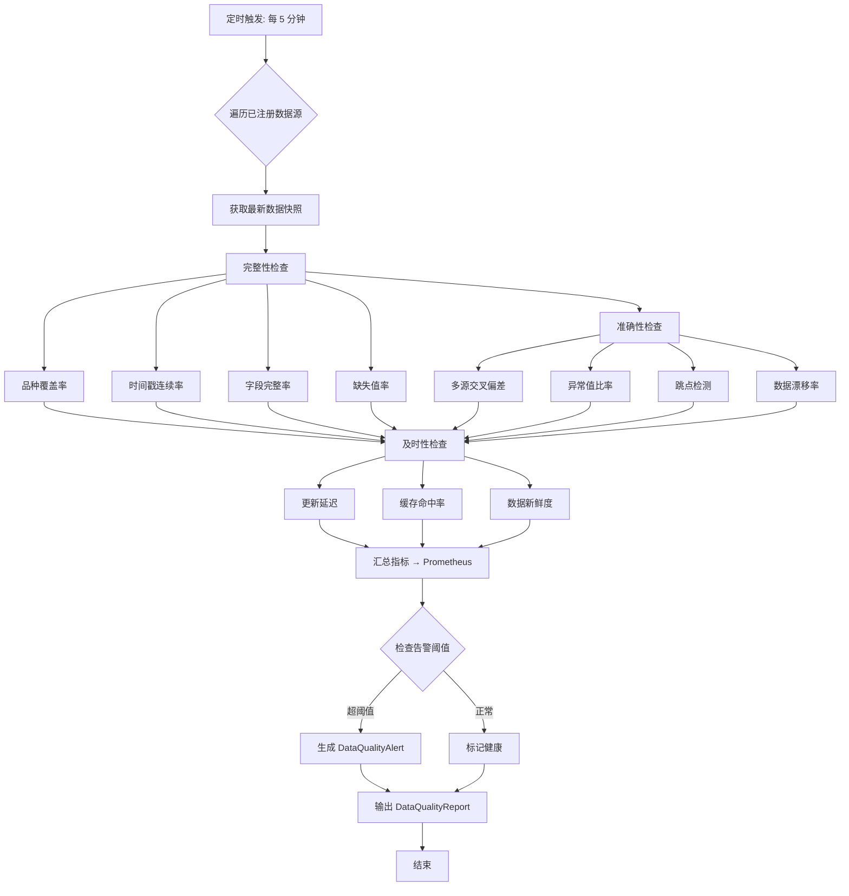
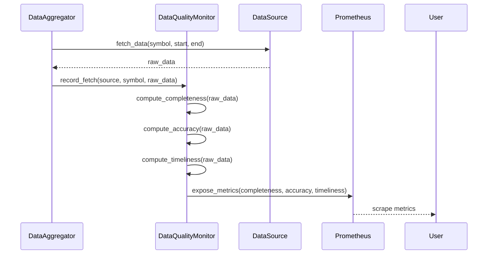

# B.1 数据质量实时监控 — 详细技术设计

> 版本: v2.103.0+33
> 关联: [11-factor-mining-optimization-plan.md](file:///d:/Programs/factor_system/docs/harness/plans/11-factor-mining-optimization-plan.md) → Phase B.1
> 状态: **已实现**（实现方向与原设计不同）
> 实现说明: 实际实现为 `fts/monitor/data_quality_monitor.py`（v0.1.0），监控对象从"数据源三维指标（完整性/准确性/及时性）"调整为**因子级质量监控**：IC 漂移（IC Z-Score 阈值告警）+ 容量突变（容量变化率阈值告警）+ `validate_market_data()` 市场数据完整性校验。HTTP 端点: `GET /metrics`、`GET /metrics/data-sources`（`fts/monitor/http_server.py`）。原设计的 `register_source`/`evaluate_all`/多源交叉偏差/跳点检测/PSI 漂移等均未实现。

---

## 1. 目标与范围

建立**数据完整性、准确性、及时性**三维实时监控体系：
- 在数据采集、融合、计算各环节埋点质量指标
- 通过 Prometheus + HTTP 端点暴露指标
- 配置分级告警阈值，异常自动触发

**范围**:
- 数据质量指标定义与计算逻辑
- Prometheus 指标埋点设计
- 告警规则与通知流程
- 与现有 `data_sources/` 和 `monitor/` 模块的集成

**不在范围**:
- 数据源适配器实现（在 data_sources 层）
- 告警渠道实现（复用现有告警基础设施）

---

## 2. 指标体系设计

> **实现现状**: 原设计的三维指标体系（完整性/准确性/及时性）**未实现**。实际实现为因子级二维告警体系:

| 指标 | 告警类型 | 阈值（`MonitorConfig`） | 计算逻辑 |
|------|----------|------------------------|----------|
| IC 漂移 | `ic_drift` | Z-Score warning=2.0 / critical=3.0 | `(current_ic - baseline_ic) / ic_std` |
| 容量突变 | `capacity_shock` | 变化率 warning=50% / critical=80% | `abs(current_capacity - baseline_capacity) / baseline_capacity` |

另有 `validate_market_data()`（市场数据完整性校验，含 `_last_completeness_ratio` 等指标追踪）与告警冷却机制（`alert_cooldown`，默认 3600s）。以下原设计三维指标体系保留作为扩展方向参考。

### 2.1 三维指标架构

```
数据质量监控
├── 完整性 (Completeness)
│   ├── 品种覆盖率     (coverage_ratio)
│   ├── 时间戳连续率   (timestamp_continuity)
│   ├── 字段完整率     (field_completeness)
│   └── 缺失值率       (missing_ratio)
├── 准确性 (Accuracy)
│   ├── 多源交叉偏差   (cross_source_deviation)
│   ├── 异常值比率     (outlier_ratio)
│   ├── 跳点检测数     (jump_detection_count)
│   └── 数据漂移率     (data_drift_rate)
└── 及时性 (Timeliness)
    ├── 数据更新延迟   (update_delay_seconds)
    ├── 缓存命中率     (cache_hit_ratio)
    └── 数据新鲜度     (freshness_seconds)
```

### 2.2 指标详细定义

#### 完整性指标

| 指标 | Prometheus 名 | 类型 | 标签 | 计算逻辑 |
|------|---------------|------|------|----------|
| 品种覆盖率 | `fts_data_coverage_ratio` | Gauge | `source`, `symbol` | 实际品种数 / 预期品种数 |
| 时间戳连续率 | `fts_data_timestamp_continuity` | Gauge | `source`, `symbol` | 连续时间戳数 / 总预期时间戳数 |
| 字段完整率 | `fts_data_field_completeness` | Gauge | `source`, `symbol`, `field` | 非空字段数 / 总字段数 |
| 缺失值率 | `fts_data_missing_ratio` | Gauge | `source`, `symbol` | 缺失行数 / 总行数 |

```python
def compute_coverage_ratio(df: pd.DataFrame, expected_symbols: set[str]) -> float:
    """计算品种覆盖率。"""
    actual = set(df['symbol'].unique())
    return len(actual & expected_symbols) / len(expected_symbols) if expected_symbols else 0.0

def compute_timestamp_continuity(df: pd.DataFrame, freq: str = 'D') -> float:
    """计算时间戳连续率。"""
    if df.empty: return 0.0
    timestamps = df['timestamp'].sort_values().unique()
    expected = pd.date_range(start=timestamps[0], end=timestamps[-1], freq=freq)
    actual_set = set(timestamps)
    expected_set = set(expected)
    return len(actual_set & expected_set) / len(expected_set) if expected_set else 0.0

def compute_field_completeness(df: pd.DataFrame, field: str) -> float:
    """计算单个字段的完整率。"""
    if field not in df.columns: return 0.0
    non_null = df[field].notna().sum()
    return non_null / len(df) if len(df) > 0 else 0.0
```

#### 准确性指标

| 指标 | Prometheus 名 | 类型 | 标签 | 计算逻辑 |
|------|---------------|------|------|----------|
| 多源交叉偏差 | `fts_data_cross_source_deviation` | Gauge | `symbol`, `primary_source`, `secondary_source` | 两源数据差异率 |
| 异常值比率 | `fts_data_outlier_ratio` | Gauge | `source`, `symbol`, `field` | 超出 3σ 的值比率 |
| 跳点检测数 | `fts_data_jump_detection_count` | Counter | `source`, `symbol` | 检测到的价格跳变次数 |
| 数据漂移率 | `fts_data_drift_rate` | Gauge | `source`, `symbol`, `field` | PSI 指标变化率 |

```python
def compute_cross_source_deviation(primary: pd.Series, secondary: pd.Series) -> float:
    """计算多源交叉偏差率。"""
    merged = pd.concat([primary.rename('p'), secondary.rename('s')], axis=1).dropna()
    if merged.empty: return 0.0
    # 相对偏差的中位数
    deviations = (merged['p'] - merged['s']).abs() / merged['s'].abs().clip(lower=0.001)
    return float(deviations.median())

def compute_outlier_ratio(series: pd.Series, threshold: float = 3.0) -> float:
    """计算异常值比率 (3σ 准则)。"""
    if len(series) < 2: return 0.0
    mean, std = series.mean(), series.std()
    if std == 0: return 0.0
    outliers = ((series - mean).abs() > threshold * std).sum()
    return outliers / len(series)

def compute_jump_detection(df: pd.DataFrame, threshold: float = 0.15) -> int:
    """检测价格跳变 (> 15% 变化)。"""
    if 'close' not in df.columns or len(df) < 2: return 0
    returns = df['close'].pct_change().abs()
    return int((returns > threshold).sum())

def compute_data_drift_rate(reference: pd.Series, current: pd.Series, bins: int = 10) -> float:
    """计算 PSI 数据漂移率。PSI > 0.25 表示严重漂移。"""
    ref_counts, bin_edges = np.histogram(reference.dropna(), bins=bins)
    curr_counts, _ = np.histogram(current.dropna(), bins=bin_edges)
    ref_ratios = ref_counts / ref_counts.sum()
    curr_ratios = curr_counts / curr_counts.sum()
    # 避免除零
    ref_ratios = np.clip(ref_ratios, 1e-6, None)
    psi = np.sum((curr_ratios - ref_ratios) * np.log(curr_ratios / ref_ratios))
    return float(psi)
```

#### 及时性指标

| 指标 | Prometheus 名 | 类型 | 标签 | 计算逻辑 |
|------|---------------|------|------|----------|
| 数据更新延迟 | `fts_data_update_delay_seconds` | Gauge | `source`, `symbol` | 当前时间 - 最新时间戳 |
| 缓存命中率 | `fts_data_cache_hit_ratio` | Gauge | `source` | 缓存命中次数 / 总请求次数 |
| 数据新鲜度 | `fts_data_freshness_seconds` | Gauge | `source`, `symbol` | 数据最大年龄 |

```python
def compute_update_delay(latest_timestamp: datetime, now: datetime | None = None) -> float:
    """计算数据更新延迟（秒）。"""
    now = now or datetime.now()
    return (now - latest_timestamp).total_seconds()

def compute_cache_hit_ratio(hits: int, total: int) -> float:
    """计算缓存命中率。"""
    return hits / total if total > 0 else 0.0

def compute_freshness(df: pd.DataFrame, now: datetime | None = None) -> float:
    """计算数据新鲜度（秒）。"""
    if df.empty or 'timestamp' not in df.columns: return float('inf')
    now = now or datetime.now()
    latest = pd.to_datetime(df['timestamp']).max()
    return (now - latest).total_seconds()
```

### 2.3 告警阈值配置

```python
class DataQualityAlertConfig(TypedDict, total=False):
    """数据质量告警阈值配置。"""
    # 完整性
    coverage_warning: float                   # 覆盖率先警 (默认 0.95)
    coverage_critical: float                 # 覆盖率严重 (默认 0.85)
    missing_warning: float                   # 缺失率先警 (默认 0.05)
    missing_critical: float                  # 缺失率严重 (默认 0.10)
    # 准确性
    deviation_warning: float                 # 偏差告警 (默认 0.02)
    deviation_critical: float               # 偏差严重 (默认 0.05)
    outlier_warning: float                   # 异常值告警 (默认 0.05)
    drift_warning: float                     # 数据漂移告警 (默认 0.25)
    # 及时性
    delay_warning_seconds: float             # 延迟告警 (默认 3600)
    delay_critical_seconds: float            # 延迟严重 (默认 7200)
    cache_hit_warning: float                 # 缓存命中率告警 (默认 0.90)
    # 持续时间
    eval_interval_seconds: float             # 评估间隔 (默认 300)
    consecutive_breaches_for_critical: int   # 连续违反次数升级 (默认 3)
```

### 2.4 告警通知规则

| 级别 | 触发条件 | 通知方式 | 处理方 |
|------|----------|----------|--------|
| Warning | 单指标超 Warning 阈值 | 日志 + 指标页面标注 | 数据运维 |
| Critical | 单指标超 Critical 阈值，或 Warning 持续 N 次 | 日志 + 推送通知 | 数据团队 + 系统负责人 |
| Fatal | 数据源完全不可用 > 30 分钟 | 电话 + 短信 | 值班工程师 |

---

## 3. 接口契约

### 3.1 `DataQualityMonitor` 类

> **实现现状**: 实际接口如下（`fts/monitor/data_quality_monitor.py` v0.1.0）。原设计的 `register_source`/`evaluate_all`/`evaluate_source`/`check_alerts`/`get_metrics_snapshot`/`reset_cache_stats` **均未实现**。

```python
@dataclass
class FactorBaseline:
    """因子基准数据。"""
    factor_id: str
    baseline_ic: float
    baseline_capacity: float
    ic_std: float = 0.01          # IC 标准差 (用于 Z-Score 计算)
    capacity_std: float = 0.0     # 容量标准差

@dataclass
class QualityAlert:
    """质量告警信息。"""
    factor_id: str
    alert_type: Literal["ic_drift", "capacity_shock"]
    severity: Literal["warning", "critical"]
    message: str
    metric_name: str
    metric_value: float
    baseline_value: float
    threshold: float
    timestamp: float

class DataQualityMonitor:
    """因子数据质量实时监控器。

    Usage:
        monitor = DataQualityMonitor(config)
        monitor.register_factor("factor_001", baseline_ic=0.05, baseline_capacity=1_000_000)
        alert = monitor.check("factor_001", current_ic=0.01, current_capacity=200_000)
        if alert:
            print(f"Alert: {alert}")
    """

    def __init__(self, config: MonitorConfig | None = None,
                 alert_callback: Callable[[QualityAlert], None] | None = None) -> None: ...

    def register_factor(self, factor_id: str, baseline_ic: float,
                        baseline_capacity: float, **kwargs) -> None:
        """注册因子基准数据。"""

    def check(self, factor_id: str, current_ic: float | None = None,
              current_capacity: float | None = None, **kwargs) -> QualityAlert | None:
        """检查因子质量，超阈值返回告警（含冷却控制）。"""

    def validate_market_data(self, data: pd.DataFrame, ...) -> dict:
        """市场数据完整性校验（启动时由 EvolutionLoop 调用）。"""
```

### 3.2 核心类型

```python
class SourceQualityMetrics(TypedDict, total=False):
    """单个数据源的质量指标。"""
    source: str
    timestamp: str
    completeness: CompletenessMetrics
    accuracy: AccuracyMetrics
    timeliness: TimelinessMetrics
    alerts: list[DataQualityAlert]


class CompletenessMetrics(TypedDict, total=False):
    coverage_ratio: float
    timestamp_continuity: float
    field_completeness_by_field: dict[str, float]
    missing_ratio: float
    total_symbols: int
    expected_symbols: int


class AccuracyMetrics(TypedDict, total=False):
    cross_source_deviation: float
    outlier_ratio: float
    jump_detection_count: int
    data_drift_rate: float


class TimelinessMetrics(TypedDict, total=False):
    update_delay_seconds: float
    cache_hit_ratio: float
    cache_hits: int
    cache_total: int
    freshness_seconds: float


class DataQualityAlert(TypedDict, total=False):
    alert_id: str
    level: Literal['warning', 'critical', 'fatal']
    metric: str
    source: str
    symbol: str | None
    current_value: float
    threshold: float
    message: str
    timestamp: str


class DataQualityReport(TypedDict, total=False):
    report_id: str
    generated_at: str
    overall_status: Literal['healthy', 'warning', 'critical']
    source_metrics: dict[str, SourceQualityMetrics]
    summary: QualitySummary


class QualitySummary(TypedDict, total=False):
    total_sources: int
    healthy_sources: int
    warning_sources: int
    critical_sources: int
    total_alerts: int
```

---

## 4. 流程设计

### 4.1 数据质量评估流程



### 4.2 数据采集埋点

在 `data_sources/` 层的关键路径上添加质量埋点：



### 4.3 HTTP 端点

> **实现现状**: 实际端点为 `fts/monitor/http_server.py` 提供的:
> - `GET /metrics` — 完整 Prometheus 指标
> - `GET /metrics/data-sources` — 数据源专用指标
> - 另有 `GET /api/status`、`GET /api/factors`、`GET /health`
>
> 原设计的 `/api/v1/monitor/data-quality` 系列端点未实现。

```
GET /api/v1/monitor/data-quality        （原设计，未实现）
→ 200 OK { "overall_status": "healthy", "source_metrics": {...}, "alerts": [] }

GET /api/v1/monitor/data-quality/alerts （原设计，未实现）
→ 200 OK { "active_alerts": [...] }

GET /api/v1/monitor/data-quality/metrics （原设计，未实现）
→ 200 OK { Prometheus text format }
```

---

## 5. 与现有系统集成

### 5.1 `data_sources/aggregator.py` 集成

```python
# 在 DataAggregator 中添加质量埋点
class DataAggregator:
    def __init__(self, ..., quality_monitor: DataQualityMonitor | None = None):
        self._quality_monitor = quality_monitor

    def fetch_data(self, ...):
        data = self._fetch_internal(...)
        # [新增] 记录数据采集质量
        if self._quality_monitor and data is not None:
            self._quality_monitor.record_fetch(
                source=self._active_source.name,
                symbol=symbol,
                data=data,
                fetch_time=time.time()
            )
        return data
```

### 5.2 `monitor/prometheus_metrics.py` 集成

```python
# 在 PrometheusMetrics 中新增数据质量指标
class PrometheusMetrics:
    def __init__(self):
        # [新增] 数据质量指标
        self.data_coverage = Gauge(...)
        self.data_deviation = Gauge(...)
        self.data_delay = Gauge(...)
        self.data_alerts_total = Counter(...)
```

### 5.3 `scheduler/schedules.py` 集成

```python
# 新增数据质量评估定时任务
# 频率: 每 5 分钟执行一次
# 任务: data_quality_monitor.evaluate_all() + check_alerts()
```

---

## 6. 技术约束

| 约束 | 说明 |
|------|------|
| **最小侵入** | 质量埋点不影响数据采集主路径性能，异步计算指标 |
| **可配置** | 所有告警阈值通过 `DataQualityAlertConfig` 配置 |
| **降级安全** | 质量监控模块不可用时数据采集不受影响 |
| **幂等性** | 同一批次数据重复计算结果一致 |
| **保留历史** | 指标快照至少保留 30 天 |
| **性能** | 单次质量评估 < 2 秒（单数据源） |

---

## 7. 文件改动清单

| 文件 | 动作 | 现状 | 说明 |
|------|------|------|------|
| `fts/monitor/data_quality_monitor.py` | **新增** | ✅ 已实现 | `DataQualityMonitor` 类（IC 漂移/容量突变告警 + `validate_market_data`） |
| `fts/data_sources/aggregator.py` | **修改** | ⬜ 未实现 | 数据质量埋点未添加（未发现 aggregator.py） |
| `fts/monitor/prometheus_metrics.py` | **修改** | ⬜ 未实现 | 文件不存在（指标由 `prometheus_setup.py` + `http_server.py` 暴露） |
| `fts/scheduler/schedules.py` | **修改** | ⬜ 未实现 | 质量评估定时任务未实现 |
| `fts/monitor/http_server.py` | **修改** | ✅ 已实现 | `GET /metrics`、`GET /metrics/data-sources` 端点 |
| `docs/harness/05-observability.md` | **修改** | ✅ 已实现 | 监控指标文档已同步 |
| `tests/monitor/test_data_quality_monitor.py` | **新增** | ✅ 已实现 | 数据质量监控单元测试 |

---

## 8. 验收标准

| # | 标准 | 检验方式 |
|---|------|----------|
| 1 | 三维指标（完整性/准确性/及时性）正确计算 | 单元测试 |
| 2 | Prometheus 指标在 HTTP 端点可查询 | 集成测试 |
| 3 | 超阈值触发告警（Warning/Critical/Fatal） | 集成测试 |
| 4 | 多源交叉偏差正确识别数据不一致 | 单元测试 |
| 5 | 跳点检测能识别 > 15% 的价格突变 | 单元测试 |
| 6 | PSI 数据漂移率正确计算 | 单元测试 |
| 7 | 数据采集主路径在监控不可用时不受影响 | 故障注入测试 |
| 8 | 单次质量评估 < 2 秒 | 性能测试 |
| 9 | HTTP 端点返回正确格式的质量报告 | 接口测试 |
| 10 | 告警持续时间和升级逻辑正确 | 集成测试 |

---

## 9. 一致性元数据

| 字段 | 值 |
|:-----|:----|
| 关联文档 | [11-factor-mining-optimization-plan.md](file:///d:/Programs/factor_system/docs/harness/plans/11-factor-mining-optimization-plan.md) → Phase B.1 |
| 依赖模块 | `data_sources/aggregator.py`（数据采集）、`monitor/prometheus_metrics.py`（指标暴露）、`scheduler/`（定时触发） |
| 前置条件 | 数据源适配器已实现，Prometheus 监控基础设施可用 |
| 后置影响 | 数据采集路径增加异步质量埋点，监控体系扩展 |
| 与其他计划关联 | B.2 回测流水线依赖数据质量监控确保输入数据可靠 |