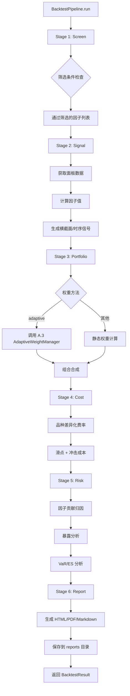
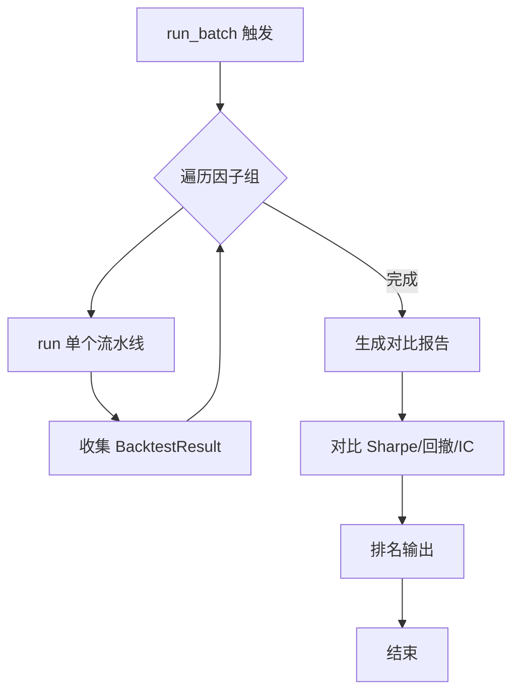

# B.2 端到端回测流水线 — 详细技术设计

> 版本: v1.0.0
> 关联: [11-factor-mining-optimization-plan.md](file:///d:/Programs/factor_system/docs/harness/11-factor-mining-optimization-plan.md) → Phase B.2
> 状态: **已实现**（4 阶段流水线 + 6 阶段类 + Builder + CLI）
> 实现说明: 实际实现为 `fts/factor_engine/backtest_pipeline.py`（v0.1.0）**4 阶段**流水线（DataLoadStage/FactorComputeStage/PerformanceStage/ReportStage），单因子入口 `BacktestPipeline.run(factor, data, benchmark, ...)`，含 `_execute_factor_code()`（被演化循环 `_check_factor_runtime` 复用）。**v2.9.0 增强**：新增 7 个独立阶段类（`FactorScreener`/`SignalGenerator`/`PortfolioConstructor`/`CostSimulator`/`RiskAttributor`/`ReportGenerator`/`CapitalAllocator`）、`BacktestPipeline.run_batch()` 批量对比排名、`BacktestPipelineBuilder` 构建器、CLI `fts backtest run/batch/compare` 子命令。

---

## 1. 目标与范围

建立标准化的**因子→策略→组合→交易**回测流水线：
- 支持单个和批量因子的端到端回测
- 集成信号生成、组合构建、成本模拟、风险归因、报告生成
- 支持多种资金管理模式
- 自动生成可视化回测报告

**范围**:
- 回测流水线六个阶段的设计
- 资金管理模块
- 可视化报告生成
- 与现有模块的集成

**不在范围**:
- 回测引擎核心算法（复用现有 `backtest/` 模块）
- 数据采集（复用现有 `data_futures.py`）

---

## 2. 流水线架构设计

### 2.1 流水线阶段（实际实现 4 阶段）

> **实现现状**: 实际为 4 阶段（`fts/factor_engine/backtest_pipeline.py`），原设计 6 阶段（screening/signal/portfolio/cost/risk/report）未实现。

```
┌─────────────────────────────────────────────────────────────────────┐
│                       BacktestPipeline                             │
│                                                                     │
│  1. data_load         → 数据加载与校验                             │
│  2. factor_compute    → 因子计算（含成本/滑点参数）                │
│  3. performance       → 绩效评估（IC/Sharpe/回撤等）               │
│  4. report            → 回测报告生成（净值/回撤/IC 时序/成交）     │
│                                                                     │
└─────────────────────────────────────────────────────────────────────┘
```

**核心输入输出**:

```python
@dataclass
class BacktestInput:
    factor: dict[str, Any]          # 因子元数据和代码
    data: pd.DataFrame              # OHLCV 数据
    benchmark: pd.Series | None = None   # 基准收益率序列
    forward_period: int = 1         # 预测周期 (天)
    cost_rate: float = 0.0003       # 交易成本率 (单边)
    slippage: float = 0.0001        # 滑点率
    initialization_capital: float = 1_000_000.0
    date_range: tuple[str, str] | None = None

@dataclass
class PerformanceMetrics:
    total_return: float = 0.0
    annual_return: float = 0.0
    sharpe_ratio: float = 0.0       # 注意: 字段为 sharpe_ratio（非设计中的 sharpe）
    max_drawdown: float = 0.0
    calmar_ratio: float = 0.0
    win_rate: float = 0.0
    volatility: float = 0.0
    ic_mean: float = 0.0
    ic_std: float = 0.0
    ic_ir: float = 0.0              # IC Information Ratio
    turnover: float = 0.0
    exposure: float = 0.0
    # 另含 downside_volatility / best_day / worst_day

@dataclass
class BacktestReport:
    factor_id: str
    factor_name: str
    start_date: str
    end_date: str
    metrics: PerformanceMetrics
    ic_series: pd.Series
    equity_curve: pd.Series
    drawdown_curve: pd.Series
    trades: pd.DataFrame
    benchmark_curve: pd.Series | None = None
    benchmark_excess: pd.Series | None = None
```

### 2.2 原设计六阶段（未实现，保留参考）

```
┌─────────────────────────────────────────────────────────────────────┐
│                        BacktestPipeline（原设计）                   │
│                                                                     │
│  1. factor_screening    → 筛选候选因子                              │
│  2. signal_generation  → 生成因子信号                              │
│  3. portfolio_construction → 组合构建与优化                        │
│  4. cost_simulation    → 真实成本模拟                              │
│  5. risk_attribution   → 风险归因分析                              │
│  6. report_generation  → 自动生成报告                              │
│                                                                     │
└─────────────────────────────────────────────────────────────────────┘
```

### 2.2 阶段详细设计

#### Stage 1: Factor Screening

```python
class FactorScreener:
    """因子筛选器。

    根据评分卡等级、状态、风格标签筛选待回测因子。
    """

    def screen(self,
               min_grade: Literal['A', 'B', 'C'] = 'B',
               min_total_score: float | None = None,
               style_filter: list[FactorStyle] | None = None) -> list[FactorCatalog]:
        """筛选符合条件的因子。"""
        ...
```

**筛选条件**:
- 最低等级（默认 B 级）
- 最低质量评分（可选）
- 因子状态（active / observing）
- 风格标签过滤（可选）
- 排除已在其他回测中使用的因子（可选）

#### Stage 2: Signal Generation

```python
class SignalGenerator:
    """因子信号生成器。

    为筛选出的因子生成横截面/时序信号。
    """

    def generate(self,
                 factors: list[FactorCatalog],
                 data: dict[str, pd.DataFrame],
                 signal_type: Literal['cross_section', 'time_series'] = 'cross_section') -> FactorSignals:
        """生成因子信号。"""
        ...

    def _cross_section_signal(self, factor: FactorCatalog,
                               panel_data: pd.DataFrame) -> pd.Series:
        """横截面信号：因子值排名 → 多空信号。"""
        # 1. 计算因子值
        # 2. 截面排名
        # 3. 生成多空信号 (top 20% 做多, bottom 20% 做空)
        ...

    def _time_series_signal(self, factor: FactorCatalog,
                              data: pd.DataFrame) -> pd.Series:
        """时序信号：因子值 → 方向信号。"""
        # 1. 计算因子值
        # 2. 时间序列标准化
        # 3. 生成方向信号
        ...
```

#### Stage 3: Portfolio Construction

```python
class PortfolioConstructor:
    """组合构建器。

    将因子信号合成为组合，支持多种权重方法。
    """

    def construct(self,
                  signals: FactorSignals,
                  weights: dict[str, float] | None = None,
                  weight_method: Literal['equal', 'sharpe', 'ridge', 'elastic_net', 'adaptive'] = 'adaptive',
                  regime: MarketRegime | None = None) -> PortfolioResult:
        """构建组合。"""
        ...

    def _equal_weight(self, n_factors: int) -> dict[str, float]:
        """等权。"""
        ...

    def _sharpe_weight(self, factor_metrics: dict) -> dict[str, float]:
        """Sharpe 加权。"""
        ...

    def _adaptive_weight(self, signals, regime) -> dict[str, float]:
        """自适应加权（集成 A.3 AdaptiveWeightManager）。"""
        ...
```

#### Stage 4: Cost Simulation

```python
class CostSimulator:
    """真实成本模拟器。

    按品种差异化费率模拟交易成本。
    """

    def simulate(self,
                 trades: TradePlan,
                 symbol_price_map: dict[str, float]) -> CostResult:
        """模拟交易成本。"""
        total_cost = 0.0
        for trade in trades:
            # 手续费 (按品种差异化)
            commission = self._get_commission(trade.symbol) * trade.quantity
            # 滑点 (按品种流动性)
            slippage = self._get_slippage(trade.symbol) * trade.quantity * trade.price
            # 冲击成本 (按订单簿深度)
            impact = self._estimate_impact_cost(trade)
            total_cost += commission + slippage + impact
        ...
        return CostResult(total_cost=total_cost, breakdown=...)

    def _get_commission(self, symbol: str) -> float:
        """获取品种手续费率。"""
        # 期货差异化费率表
        ...

    def _get_slippage(self, symbol: str) -> float:
        """获取品种滑点率。"""
        # 流动性分级
        ...
```

#### Stage 5: Risk Attribution

```python
class RiskAttributor:
    """风险归因分析器。

    分析组合的风险来源、因子贡献、品种暴露。
    """

    def attribute(self,
                  portfolio_returns: pd.Series,
                  factor_returns: pd.DataFrame,
                  holdings: pd.DataFrame) -> RiskAttributionReport:
        """执行风险归因。"""
        ...

    def _factor_contribution(self, ...) -> dict[str, float]:
        """各因子对组合收益的贡献度。"""
        ...

    def _exposure_analysis(self, holdings) -> ExposureReport:
        """品种/行业/风格暴露分析。"""
        ...

    def _var_analysis(self, returns) -> VaRReport:
        """VaR 和 ES 分析。"""
        ...
```

#### Stage 6: Report Generation

```python
class ReportGenerator:
    """报告生成器。

    生成包含净值曲线、回撤、IC 时序等的完整回测报告。
    """

    def generate(self,
                 backtest_result: BacktestResult,
                 output_dir: str = './reports') -> str:
        """生成完整回测报告，返回文件路径。"""
        ...

    def _generate_summary(self, result) -> str:
        """生成报告摘要。"""
        ...

    def _generate_equity_curve(self, result) -> str:
        """生成净值曲线图。"""
        ...

    def _generate_drawdown_curve(self, result) -> str:
        """生成回撤曲线图。"""
        ...

    def _generate_ic_timeline(self, result) -> str:
        """生成 IC 时序图。"""
        ...

    def _generate_monthly_heatmap(self, result) -> str:
        """生成月度收益热力图。"""
        ...
```

---

## 3. 资金管理模块

### 3.1 资金分配模式

```python
class CapitalAllocator:
    """资金分配器。

    支持多种资金管理模式。
    """

    def allocate(self,
                 portfolio_signals: pd.Series,
                 total_capital: float,
                 mode: Literal['fixed', 'vol_target', 'risk_parity', 'kelly'] = 'vol_target',
                 target_volatility: float = 0.15,
                 max_drawdown: float = 0.20) -> AllocationResult:
        """分配资金。"""
        if mode == 'fixed':
            return self._fixed_allocation(portfolio_signals, total_capital)
        elif mode == 'vol_target':
            return self._vol_target_allocation(portfolio_signals, total_capital, target_volatility)
        elif mode == 'risk_parity':
            return self._risk_parity_allocation(portfolio_signals, total_capital)
        elif mode == 'kelly':
            return self._kelly_criterion_allocation(portfolio_signals, total_capital)
        ...

    def _vol_target_allocation(self, ...) -> AllocationResult:
        """波动率目标：根据实现波动率调整仓位。"""
        realized_vol = portfolio_signals.std() * sqrt(252)
        scale = target_volatility / max(realized_vol, 1e-6)
        scale = min(scale, 2.0)  # 最大 2 倍杠杆
        scale = max(scale, 0.1)   # 最小 10% 仓位
        ...

    def _risk_parity_allocation(self, ...) -> AllocationResult:
        """风险平价：每个因子贡献相等风险。"""
        # 迭代求解权重使各因子风险贡献相等
        ...
```

### 3.2 核心类型

```python
class BacktestPipelineConfig(TypedDict, total=False):
    """回测流水线配置。"""
    start_date: str
    end_date: str
    benchmark: str
    signal_type: Literal['cross_section', 'time_series']
    weight_method: Literal['equal', 'sharpe', 'ridge', 'elastic_net', 'adaptive']
    capital_mode: Literal['fixed', 'vol_target', 'risk_parity', 'kelly']
    target_volatility: float
    total_capital: float
    rebalance_frequency: Literal['daily', 'weekly', 'monthly']
    use_cost_model: bool
    include_risk_attribution: bool
    output_format: Literal['html', 'pdf', 'markdown']


class FactorSignals(TypedDict, total=False):
    """因子信号集合。"""
    signals: dict[str, pd.Series]          # factor_id → 信号序列
    meta: dict                              # 元数据


class PortfolioResult(TypedDict, total=False):
    """组合结果。"""
    weights: dict[str, float]
    portfolio_returns: pd.Series
    holdings: pd.DataFrame
    turnover: pd.Series


class CostResult(TypedDict, total=False):
    """成本模拟结果。"""
    total_cost: float
    cost_by_type: dict[str, float]          # commission/slippage/impact
    cost_by_symbol: dict[str, float]


class BacktestResult(TypedDict, total=False):
    """完整回测结果。"""
    pipeline_id: str
    config: BacktestPipelineConfig
    signals: FactorSignals
    portfolio: PortfolioResult
    costs: CostResult
    risk_attribution: RiskAttributionReport
    performance_metrics: PerformanceMetrics
    report_path: str


class PerformanceMetrics(TypedDict, total=False):
    """绩效指标。"""
    total_return: float
    annual_return: float
    sharpe: float
    sortino: float
    calmar: float
    max_drawdown: float
    volatility: float
    win_rate: float
    profit_factor: float
    turnover_avg: float
```

---

## 4. 接口契约

### 4.1 `BacktestPipeline` 主类

> **实现现状**: 实际接口如下。原设计 `run(factors, data)` 批量入口与 `BacktestPipelineBuilder` 未实现（`run_batch` 亦不存在）。

```python
class BacktestPipeline:
    """端到端回测流水线。

    Usage:
        pipeline = BacktestPipeline()
        results = pipeline.run(
            factor=factor_program,
            data=ohlcv_dataframe,
            benchmark=benchmark_returns,
        )
        report = results.report
        print(report.sharpe_ratio, report.max_drawdown)
    """

    def __init__(self) -> None: ...

    def run(self, factor: dict[str, Any],
            data: pd.DataFrame,
            benchmark: pd.Series | None = None,
            forward_period: int = 1,
            cost_rate: float = 0.0003,
            slippage: float = 0.0001,
            initialization_capital: float = 1_000_000.0,
            date_range: tuple[str, str] | None = None,
            **kwargs) -> BacktestRunResult:
        """执行单个因子回测，返回含 report 的结果对象。"""

    def _execute_factor_code(self, code: str, data: pd.DataFrame,
                             params: dict[str, Any]) -> np.ndarray:
        """执行因子代码（静态方法，被 evolution_loop._check_factor_runtime 复用）。"""
```

### 4.2 流水线构建器

```python
class BacktestPipelineBuilder:
    """回测流水线构建器（Builder 模式）。

    Usage:
        pipeline = (BacktestPipelineBuilder()
            .set_period('2020-01-01', '2025-12-31')
            .set_weight_method('adaptive')
            .set_capital_mode('vol_target', target_vol=0.15)
            .enable_cost_model(True)
            .enable_risk_attribution(True)
            .build())
    """

    def set_period(self, start: str, end: str) -> 'BacktestPipelineBuilder': ...
    def set_signal_type(self, stype: Literal['cross_section', 'time_series']) -> 'BacktestPipelineBuilder': ...
    def set_weight_method(self, method: Literal['equal', 'sharpe', 'ridge', 'adaptive']) -> 'BacktestPipelineBuilder': ...
    def set_capital_mode(self, mode: Literal['fixed', 'vol_target', 'risk_parity'], **kwargs) -> 'BacktestPipelineBuilder': ...
    def enable_cost_model(self, enabled: bool) -> 'BacktestPipelineBuilder': ...
    def enable_risk_attribution(self, enabled: bool) -> 'BacktestPipelineBuilder': ...
    def build(self) -> BacktestPipeline: ...
```

---

## 5. 流程设计

### 5.1 单个回测流程



### 5.2 批量回测对比流程



### 5.3 报告内容

```
report.html
├── 摘要 (Summary)
│   ├── 回测期间
│   ├── 总收益 / 年化收益
│   ├── Sharpe / Sortino / Calmar
│   ├── 最大回撤
│   └── 胜率 / Profit Factor
├── 净值曲线 (Equity Curve)
├── 回撤曲线 (Drawdown Curve)
├── 月度收益热力图
├── IC 时序图
├── 因子贡献度排名
├── 品种暴露分析
├── 风险归因详情
└── 交易成本明细
```

---

## 6. CLI 命令设计

> **实现现状**: **未实现**。`fts/cli.py` 无 `backtest` 子命令组（现有子命令: version/monitor/evolution/meta-loop/portfolio/ui/scheduler/factor/data）。以下为原设计预留。

```bash
# 单个因子回测
fts backtest run \
  --factor-id <factor_id> \
  --start 2020-01-01 \
  --end 2025-12-31 \
  --weight-method adaptive \
  --capital-mode vol_target \
  --target-vol 0.15 \
  --output reports/

# 批量回测
fts backtest batch \
  --grade A \
  --min-score 40 \
  --start 2020-01-01 \
  --end 2025-12-31 \
  --weight-method adaptive \
  --output reports/batch_20260805/

# 对比回测
fts backtest compare \
  --factor-ids id1,id2,id3 \
  --start 2020-01-01 \
  --end 2025-12-31 \
  --output reports/compare_20260805/
```

---

## 7. 技术约束

| 约束 | 说明 |
|------|------|
| **性能** | 单因子回测 < 30 秒（5 年日线数据） |
| **批量** | 20 因子批量回测 < 5 分钟 |
| **数据安全** | 回测数据缓存 30 天，不修改原始数据 |
| **可复现** | 相同输入参数重复回测结果一致（随机种子固定） |
| **向后兼容** | 现有 `backtest/` 模块不受影响，流水线为上层封装 |
| **模块化** | 六个阶段可独立调用和替换 |
| **报告格式** | 支持 HTML、PDF、Markdown 三种输出格式 |

---

## 8. 文件改动清单

| 文件 | 动作 | 现状 | 说明 |
|------|------|------|------|
| `fts/factor_engine/backtest_pipeline.py` | **新增** | ✅ 已实现 | `BacktestPipeline` 4 阶段流水线 + `run_batch` + `BacktestPipelineBuilder`（v2.9.0） |
| `fts/factor_engine/factor_screener.py` | **新增** | ✅ 已实现 | `FactorScreener` 按等级/总分/状态/风格筛选（v2.9.0） |
| `fts/factor_engine/signal_generator.py` | **新增** | ✅ 已实现 | `SignalGenerator` 时序/横截面信号（v2.9.0） |
| `fts/factor_engine/portfolio_constructor.py` | **新增** | ✅ 已实现 | `PortfolioConstructor` 等权/Sharpe/自适应加权（v2.9.0） |
| `fts/factor_engine/cost_simulator.py` | **新增** | ✅ 已实现 | `CostSimulator` 品种差异化费率，复用 `cost_model.py`（v2.9.0） |
| `fts/factor_engine/risk_attributor.py` | **新增** | ✅ 已实现 | `RiskAttributor` 因子贡献/暴露/VaR-ES（v2.9.0） |
| `fts/factor_engine/report_generator.py` | **新增** | ✅ 已实现 | `ReportGenerator` Markdown 报告（净值/回撤/IC/月度热力表）（v2.9.0） |
| `fts/factor_engine/capital_allocator.py` | **新增** | ✅ 已实现 | `CapitalAllocator` fixed/vol_target/risk_parity/kelly（v2.9.0） |
| `fts/cli.py` | **修改** | ✅ 已实现 | `fts backtest run/batch/compare` 子命令（v2.9.0） |
| `tests/factor_engine/test_backtest_pipeline.py` | **新增** | ✅ 已实现 | 流水线单元测试 |
| `tests/factor_engine/test_backtest_stage3.py` | **新增** | ✅ 已实现 | 7 阶段类 + run_batch + Builder + CLI 测试（27 用例） |

---

## 9. 验收标准

| # | 标准 | 检验方式 |
|---|------|----------|
| 1 | 六阶段流水线可独立和整体调用 | 单元测试 |
| 2 | 单个因子回测 < 30 秒 | 性能测试 |
| 3 | 20 因子批量回测 < 5 分钟 | 性能测试 |
| 4 | 自适应权重模式正确调用 A.3 AdaptiveWeightManager | 集成测试 |
| 5 | 品种差异化成本模型正确计算 | 单元测试 |
| 6 | 四种资金管理模式（fixed/vol_target/risk_parity/kelly）正确 | 单元测试 |
| 7 | 报告生成包含净值/回撤/IC/热力图等核心图表 | 接口测试 |
| 8 | CLI 子命令（run/batch/compare）正确执行 | CLI 测试 |
| 9 | 相同输入重复回测结果一致 | 可复现性测试 |
| 10 | 流水线在因子筛选无结果时优雅降级 | 异常处理测试 |

---

## 10. 一致性元数据

| 字段 | 值 |
|:-----|:----|
| 关联文档 | [11-factor-mining-optimization-plan.md](file:///d:/Programs/factor_system/docs/harness/11-factor-mining-optimization-plan.md) → Phase B.2 |
| 依赖模块 | `evaluation_chain.py`（L1 评估）、`portfolio_loop.py`（组合构建）、`A.1`（质量评分）、`A.3`（自适应权重） |
| 前置条件 | A.1 因子质量评分卡、A.3 自适应权重已实施 |
| 后置影响 | 回测流程标准化，支持批量对比和可视化报告 |
| 与其他计划关联 | B.3 审计流程复用回测流水线结果进行审计 |