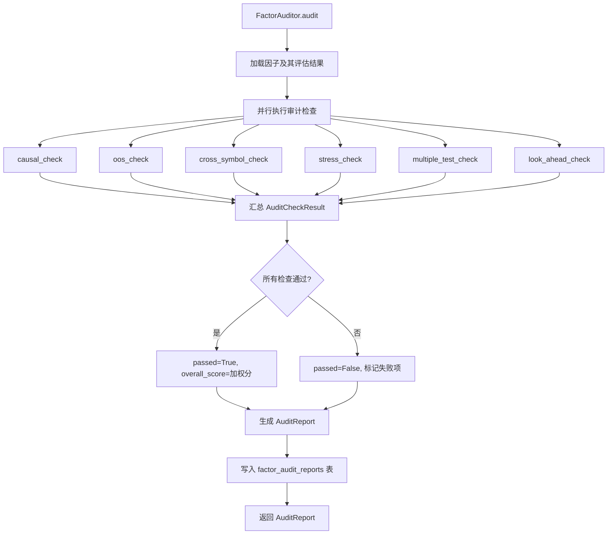
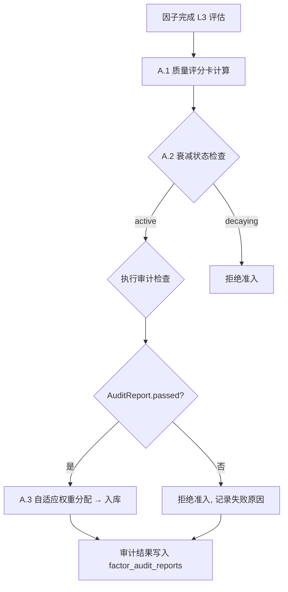

# B.3 因子审计流程标准化 — 详细技术设计

> 版本: v1.0.0
> 关联: [11-factor-mining-optimization-plan.md](file:///d:/Programs/factor_system/docs/harness/11-factor-mining-optimization-plan.md) → Phase B.3
> 状态: 规划中

---

## 1. 目标与范围

建立**系统化的因子审计清单**与自动化流程：
- 定义 6 项审计检查，因子入库前必须全部通过
- 审计结果生成标准化报告，可查询和追溯
- 审计结果作为 A.1 因子质量评分卡的输入项

**范围**:
- 审计清单设计（因果检验、样本外、跨品种、压力测试、多重检验、数据窥探）
- `FactorAuditor` 类及接口契约
- 审计报告生成
- 与现有评估链的集成

**不在范围**:
- 审计算法细节实现（复用现有 `causal_validator.py`、`robustness.py` 等）
- 审计流程的人工审核环节

---

## 2. 审计清单设计

### 2.1 六项审计检查

| # | 审计项 | 名称 | 核心问题 | 依赖模块 |
|---|--------|------|----------|----------|
| 1 | 因果检验 | `causal_check` | 因子是结果的真正原因吗？ | `causal_validator.py` |
| 2 | 样本外验证 | `oos_check` | 因子在未见数据上表现如何？ | `walk_forward.py` |
| 3 | 跨品种验证 | `cross_symbol_check` | 因子在其他品种上是否有效？ | `evaluation_chain.py` |
| 4 | 压力测试 | `stress_check` | 因子在极端行情下表现如何？ | `stress_test.py` |
| 5 | 多重检验 | `multiple_test_check` | 因子不是统计偶然吗？ | `evaluation_chain.py` (Level 3) |
| 6 | 数据窥探检验 | `look_ahead_check` | 因子是否使用了未来数据？ | `factor_program.py` |

### 2.2 审计项详细设计

#### Check 1: 因果检验

```python
class CausalCheck(TypedDict, total=False):
    """因果检验结果。"""
    passed: bool
    granger_f_statistic: float
    granger_p_value: float
    reverse_causation_check: bool          # 反向因果检查
    confound_check: bool                   # 混淆变量检查
    description: str
```

**检验方法**:
- **Granger 因果检验**: 检验因子值是否 Granger-cause 收益
- **反向因果**: 检验收益是否 Granger-cause 因子（排除反向因果）
- **混淆变量**: 控制市场指数、行业收益后因子是否仍然有效

**通过标准**:
- Granger p-value < 0.05
- 反向因果 p-value > 0.10
- 混淆变量控制后 IC 仍显著

#### Check 2: 样本外验证

```python
class OOSCheck(TypedDict, total=False):
    """样本外验证结果。"""
    passed: bool
    oos_ic_mean: float
    oos_sharpe_mean: float
    oos_coverage_ratio: float              # 样本外窗口占比
    min_oos_windows_passed: int            # 最少通过窗口数
    total_windows_evaluated: int
    description: str
```

**检验方法**:
- 复用 `WalkForwardOptimizer` 结果
- 检查每个样本外窗口的 IC 和 Sharpe

**通过标准**:
- OOS IC 均值 > 0.02
- OOS Sharpe 均值 > 1.0
- OOS 窗口占比 ≥ 30%
- 至少 50% 的窗口 IC > 0

#### Check 3: 跨品种验证

```python
class CrossSymbolCheck(TypedDict, total=False):
    """跨品种验证结果。"""
    passed: bool
    total_symbols_evaluated: int
    positive_ic_symbols: int
    coverage_ratio: float                  # 正 IC 品种占比
    avg_ic_all_symbols: float
    min_coverage_threshold: float          # 最低覆盖率阈值 (默认 0.80)
    symbol_details: dict[str, SymbolICDetail]
    description: str


class SymbolICDetail(TypedDict, total=False):
    symbol: str
    ic: float
    icir: float
    n_observations: int
```

**检验方法**:
- 在所有活跃期货品种上独立回测因子
- 计算每个品种的 IC 和 ICIR

**通过标准**:
- 正 IC 品种占比 ≥ 80%
- 平均 IC > 0.02
- 至少覆盖 10 个品种

#### Check 4: 压力测试

```python
class StressCheck(TypedDict, total=False):
    """压力测试结果。"""
    passed: bool
    drawdown_in_stress_periods: float      # 压力期最大回撤
    recovery_time_days: float              # 恢复天数
    stress_periods_evaluated: list[StressPeriod]
    max_drawdown_threshold: float          # 最大回撤阈值 (默认 0.15)
    description: str


class StressPeriod(TypedDict, total=False):
    name: str                              # 如 "2020 COVID", "2022 美联储加息"
    start_date: str
    end_date: str
    drawdown: float
    return_during: float
    ic_during: float
```

**检验方法**:
- 在历史极端行情区间（如 2020 年 3 月、2022 年 Q4）独立评估因子表现
- 检查回撤和恢复速度

**通过标准**:
- 压力期最大回撤 < 15%
- 恢复时间 < 60 天
- 压力期 IC 仍为正（或至少不显著为负）

#### Check 5: 多重检验校正

```python
class MultipleTestCheck(TypedDict, total=False):
    """多重检验校正结果。"""
    passed: bool
    bonferroni_corrected_p: float
    fdr_corrected_p: float
    original_p_value: float
    n_tests: int                           # 总检验数
    bonferroni_threshold: float            # 0.05 / n_tests
    fdr_threshold: float                   # Benjamini-Hochberg
    description: str
```

**检验方法**:
- Bonferroni 校正: `α' = α / n_tests`
- FDR (Benjamini-Hochberg) 校正

**通过标准**:
- Bonferroni 校正后 p < 0.05
- FDR 校正后 q < 0.05

#### Check 6: 数据窥探检验

```python
class LookAheadCheck(TypedDict, total=False):
    """数据窥探检验结果。"""
    passed: bool
    has_future_leakage: bool
    leakage_description: str
    code_analysis_result: CodeAnalysisResult
    data_lineage_check: DataLineageResult
    description: str


class CodeAnalysisResult(TypedDict, total=False):
    """因子代码分析结果。"""
    uses_future_data: bool
    suspicious_patterns: list[str]          # 如 ".shift(-1)", "future_data", "look_ahead"
    code_complexity: int
    sandbox_validation: bool


class DataLineageResult(TypedDict, total=False):
    """数据血缘检查结果。"""
    data_sources_used: list[str]
    has_timestamp_validation: bool
    data_snapshot_consistency: bool
```

**检验方法**:
- 静态代码分析：检查因子代码中是否有未来函数模式
- 运行时验证：沙箱中执行因子代码，检查数据时间戳
- 数据血缘：验证因子计算使用的数据时间戳不包含未来信息

**通过标准**:
- 无未来函数模式
- 数据时间戳验证通过
- 数据血缘可追溯

---

## 3. 接口契约

### 3.1 `FactorAuditor` 类

```python
class FactorAuditor:
    """因子审计器。

    Usage:
        auditor = FactorAuditor(config)
        report = auditor.audit(factor)
        if report.passed:
            # 允许入库
        else:
            # 展示未通过的审计项
    """

    def __init__(self, config: AuditConfig | None = None) -> None: ...

    def audit(self, factor: FactorCatalog) -> AuditReport:
        """执行完整审计流程。"""
        ...

    def run_check(self, factor: FactorCatalog,
                   check_name: AuditCheckName) -> AuditCheckResult:
        """执行单个审计检查。"""
        ...

    def run_all_checks(self, factor: FactorCatalog) -> dict[AuditCheckName, AuditCheckResult]:
        """执行所有审计检查。"""
        ...

    def generate_report(self, results: dict, factor: FactorCatalog) -> AuditReport:
        """生成标准化审计报告。"""
        ...

    def get_audit_history(self, factor_id: str) -> list[AuditReport]:
        """获取因子的审计历史。"""
        ...

    def get_audit_statistics(self) -> AuditStatistics:
        """获取审计统计（通过率、常见失败原因）。"""
        ...
```

### 3.2 核心类型

```python
class AuditCheckName(str, Enum):
    """审计检查名称枚举。"""
    CAUSAL = "causal_check"
    OOS = "oos_check"
    CROSS_SYMBOL = "cross_symbol_check"
    STRESS = "stress_check"
    MULTIPLE_TEST = "multiple_test_check"
    LOOK_AHEAD = "look_ahead_check"


class AuditCheckResult(TypedDict, total=False):
    """单个审计检查的结果。"""
    check_name: AuditCheckName
    passed: bool
    score: float                           # 0-100 分
    details: AuditCheckDetail              # 详细结果（CausalCheck/OOSCheck 等）
    execution_time_ms: float
    error_message: str | None
    timestamp: str


class AuditConfig(TypedDict, total=False):
    """审计配置。"""
    checks_to_run: list[AuditCheckName]    # 默认全部 6 项
    min_pass_rate: float                   # 通过率阈值 (默认 1.0 = 全通过)
    oos_config: WalkForwardConfig
    stress_periods: list[StressPeriod]
    cross_symbol_min_count: int            # 跨品种最少数量 (默认 10)
    bonferroni_alpha: float                # Bonferroni 全局 α (默认 0.05)


class AuditReport(TypedDict, total=False):
    """完整审计报告。"""
    report_id: str
    factor_id: str
    factor_version_id: str
    timestamp: str
    passed: bool
    overall_score: float
    results: dict[AuditCheckName, AuditCheckResult]
    summary: AuditSummary
    recommendations: list[str]
    generated_by: str                      # 'FactorAuditor v1.0'


class AuditSummary(TypedDict, total=False):
    total_checks: int
    passed_checks: int
    failed_checks: int
    pass_rate: float
    weakest_check: AuditCheckName
    strongest_check: AuditCheckName


class AuditStatistics(TypedDict, total=False):
    """审计统计。"""
    total_audits: int
    pass_rate: float
    failure_rate_by_check: dict[str, float]
    avg_audit_time_ms: float
    common_failure_reasons: list[tuple[str, int]]
```

---

## 4. 流程设计

### 4.1 审计执行流程



### 4.2 审计准入 Gate



### 4.3 审计结果与评分卡联动

```python
# 审计结果作为评分卡的输入
class FactorQualityCard:
    def evaluate(self, ..., audit_report: AuditReport | None = None):
        # 审计通过率作为"逻辑性"维度的加分项
        if audit_report:
            logic_score += (audit_report.pass_rate * 5.0)  # 审计通过率贡献最多 5 分
            # 审计失败扣分
            if not audit_report.passed:
                total_score -= 5.0  # 审计未通过扣 5 分
```

---

## 5. 数据模型设计

### 5.1 审计报告存储

```sql
CREATE TABLE IF NOT EXISTS factor_audit_reports (
    report_id       VARCHAR(36) PRIMARY KEY,
    factor_id       VARCHAR(36) NOT NULL,
    factor_version_id VARCHAR(36),
    passed          BOOLEAN NOT NULL,
    overall_score   DOUBLE NOT NULL,
    total_checks    INT NOT NULL,
    passed_checks   INT NOT NULL,
    results_json    JSON NOT NULL,          # AuditCheckResult 详情
    summary_json    JSON NOT NULL,          # AuditSummary
    recommendations  JSON,
    audited_at      TIMESTAMP NOT NULL,
    audit_version   VARCHAR(20) NOT NULL DEFAULT 'v1',
    FOREIGN KEY (factor_id) REFERENCES factor_catalog(factor_id)
);

CREATE INDEX IF NOT EXISTS idx_far_factor_id ON factor_audit_reports(factor_id);
CREATE INDEX IF NOT EXISTS idx_far_passed ON factor_audit_reports(passed);
CREATE INDEX IF NOT EXISTS idx_far_audited_at ON factor_audit_reports(audited_at);
```

---

## 6. 技术约束

| 约束 | 说明 |
|------|------|
| **并行执行** | 六项审计检查并行执行，总耗时 = 最慢的单项检查 |
| **超时保护** | 单项检查超时 5 分钟自动标记为 `incomplete` |
| **不可变** | 审计报告写入后不可修改，只可追加新报告 |
| **可追溯** | 每次审计记录因子版本 ID，支持版本关联 |
| **幂等性** | 同一因子版本重复审计结果一致 |
| **性能** | 完整审计 < 10 分钟（单因子） |
| **容错** | 单项审计失败不影响其他项执行 |

---

## 7. 文件改动清单

| 文件 | 动作 | 说明 |
|------|------|------|
| `fts/factor_engine/factor_auditor.py` | **新增** | `FactorAuditor` 类及六项审计检查实现 |
| `fts/factor_engine/factor_db/schema.py` | **修改** | 新增 `factor_audit_reports` 表 |
| `fts/factor_engine/factor_db/repository.py` | **修改** | 审计报告 CRUD |
| `fts/factor_engine/evolution_loop.py` | **修改** | L3 评估后插入审计 Gate |
| `fts/factor_engine/evaluation_chain.py` | **修改** | 审计结果作为评分卡输入 |
| `tests/factor_engine/test_factor_auditor.py` | **新增** | 审计器单元测试 |
| `tests/factor_engine/test_audit_causal.py` | **新增** | 因果检验测试 |
| `tests/factor_engine/test_audit_look_ahead.py` | **新增** | 数据窥探检验测试 |

---

## 8. 验收标准

| # | 标准 | 检验方式 |
|---|------|----------|
| 1 | 六项审计检查可独立和整体执行 | 单元测试 |
| 2 | 因子入库前必须通过全部审计项 | 集成测试 |
| 3 | 审计报告正确生成，包含所有检查详情 | 接口测试 |
| 4 | 审计结果可在数据库中查询 | 集成测试 |
| 5 | 因果检验正确识别 Granger 因果关系 | 单元测试 |
| 6 | 跨品种验证正确计算品种覆盖率 | 单元测试 |
| 7 | 数据窥探检验正确识别未来函数 | 单元测试 |
| 8 | 多重检验校正（Bonferroni/FDR）正确 | 单元测试 |
| 9 | 并行执行总耗时 < 10 分钟 | 性能测试 |
| 10 | 审计结果作为评分卡输入正确影响等级 | 集成测试 |

---

## 9. 一致性元数据

| 字段 | 值 |
|:-----|:----|
| 关联文档 | [11-factor-mining-optimization-plan.md](file:///d:/Programs/factor_system/docs/harness/11-factor-mining-optimization-plan.md) → Phase B.3 |
| 依赖模块 | `causal_validator.py`（因果）、`walk_forward.py`（OOS）、`stress_test.py`（压力）、`factor_program.py`（代码分析）、`evaluation_chain.py`（多重检验） |
| 前置条件 | A.1 质量评分卡、A.2 衰减追踪已实施 |
| 后置影响 | 因子准入增加审计 Gate，审计数据可追溯 |
| 与其他计划关联 | B.2 回测流水线的结果作为审计输入；C.3 反馈闭环使用审计数据 |