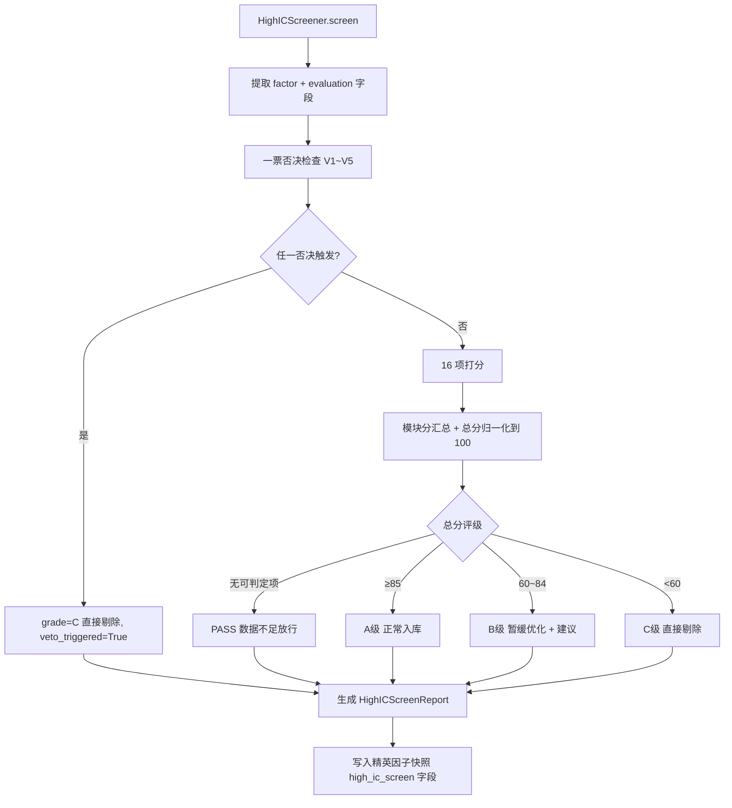
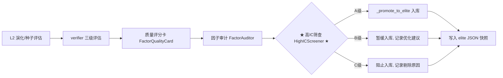

# B.4 高IC因子筛查剔除流程 — 详细技术设计

> 版本: v2.54.0
> 关联: [11-factor-mining-optimization-plan.md](file:///d:/Programs/factor_system/docs/harness/plans/11-factor-mining-optimization-plan.md) → Phase B.4（新增）
> 状态: **已实现**
> 实现说明: 实际实现为 `fts/factor_engine/high_ic_screener.py`（v1.0.0）的 `HighICScreener`。16 项检查 × 6 大模块，总分 100 分；5 项一票否决任意触发直接剔除（C 级）。评级规则：A 级 ≥85 正常入库、B 级 60~84 暂缓优化、C 级 <60 直接剔除。该筛查在所有市场（股票/期货）统一启用，作为 `_promote_to_elite` 入库前的强制质检关卡。

---

## 1. 目标与范围

### 1.1 目标

将「高IC因子筛查剔除实操检查清单」与「高IC因子筛选打分表」（`docs/Knowledge/高IC因子筛选打分表.xlsx`）固化为系统化自动筛查流程，作为 **L2 精英因子入库质检** 的强制关卡，解决以下核心问题：

- **过拟合高IC**：IC 均值异常偏高（>0.07）优先怀疑样本过拟合，需外样本验证
- **伪强因子**：高 IC 低 ICIR（<0.3），IC 波动剧烈、正负频繁反转
- **无增量信息**：与存量成熟因子相关系数 >0.7，纯冗余
- **不可落地**：扣成本后超额收益为负、换手率过高、信号半衰期过短

### 1.2 范围

- 16 项检查项打分逻辑（6 大模块）
- 5 项一票否决项（任意触发直接 C 级剔除）
- `HighICScreener` 类及接口契约
- 与 `_promote_to_elite` 入库质检集成（**所有市场统一启用**）
- 筛查报告写入精英因子快照（`high_ic_screen` 字段）

### 1.3 不在范围

- 正交化/中性化优化实现（B 级因子的二次优化手段，仅记录建议）
- 交易成本精细化建模（复用 `backtest_pipeline.py` 的成本扣减）
- 行业分层数据采集（使用现有 `symbol_ic_map` 近似）

---

## 2. 筛查清单设计（16 项 × 6 大模块）

> 分值来源：`docs/Knowledge/高IC因子筛选打分表.xlsx` 的 `IC因子筛选打分表` sheet。

### 2.1 一、基础指标校验（20 分）

| # | 检查项 | 合格标准 | 分值 | 得分逻辑（满分为 100% 权重） |
|---|--------|----------|------|------------------------------|
| 1 | IC均值合理性 | 0.02 ≤ IC均值 ≤ 0.06 | 8 | 越接近中心区间得分越高；<0.02 或 >0.06 按比例衰减；\|IC\|>0.07 大幅扣分（过拟合嫌疑） |
| 2 | ICIR（信息比率） | ICIR ≥ 0.5 | 8 | ICIR ≥0.5 满分；0.3~0.5 线性；<0.3 低分（高IC低IR=伪强因子） |
| 3 | IC正向胜率 | 月度/季度胜率 ≥ 55% | 4 | 胜率 ≥0.55 满分；0.5~0.55 线性；<0.5 零分 |

### 2.2 二、过拟合&虚假相关性排查（25 分）

| # | 检查项 | 合格标准 | 分值 | 得分逻辑 |
|---|--------|----------|------|----------|
| 4 | 外样本IC衰减 | 衰减幅度 ≤ 30% | 10 | 衰减 ≤0.3 满分；0.3~0.5 线性；>0.5 低分 |
| 5 | 极值样本扰动测试 | 剔除极值后 IC 降幅 ≤ 25% | 8 | 降幅 ≤0.25 满分；>0.25 递减；**一票否决：降幅 >25% 直接剔除** |
| 6 | 参数敏感性测试 | 微调参数后 IC 无断崖下跌 | 7 | 使用 WalkForward 多窗口 IC 波动率近似；波动率越低得分越高 |

### 2.3 三、因子冗余&风格风险排查（20 分）

| # | 检查项 | 合格标准 | 分值 | 得分逻辑 |
|---|--------|----------|------|----------|
| 7 | 与存量因子相关性 | 相关系数 ≤ 0.7 | 8 | max_corr ≤0.7 满分；0.7~0.9 线性；>0.9 低分；**一票否决：>0.7 且无信息增量** |
| 8 | 风格敞口集中度 | 不单一绑定极致风格 | 7 | 使用 cross_symbol IC 一致性近似；品种 IC 正负分化越大得分越低 |
| 9 | 全行业普适性 | 至少 80% 行业有效 | 5 | positive_ratio ≥0.8 满分；线性递减 |

### 2.4 四、实盘交易落地性排查（20 分）

| # | 检查项 | 合格标准 | 分值 | 得分逻辑 |
|---|--------|----------|------|----------|
| 10 | 交易成本后超额 | 扣成本后超额收益为正 | 8 | net_excess>0 满分；≤0 零分；**一票否决：扣双边成本后超额为负** |
| 11 | 换手率合理性 | 周度换手率 ≤ 80% | 6 | turnover 越低得分越高（月度换手 0.8 ≈ 周度 0.185） |
| 12 | 信号时效性 | 预测半衰期 ≥ 3 个交易日 | 6 | decay_6m 越低（衰减越慢）得分越高 |

### 2.5 五、尾部黑天鹅风险排查（10 分）

| # | 检查项 | 合格标准 | 分值 | 得分逻辑 |
|---|--------|----------|------|----------|
| 13 | 因子逻辑合理性 | 有基本面/交易行为合理解释 | 6 | 复用 economic_logic 四维评分（theory/behavioral/microstructure/institutional 均值） |
| 14 | 事件冲击稳定性 | 极端事件下 IC 无大幅反转 | 4 | 使用 stress 回撤 + max_drawdown 综合评估 |

### 2.6 六、综合稳定性（5 分）

| # | 检查项 | 合格标准 | 分值 | 得分逻辑 |
|---|--------|----------|------|----------|
| 15 | 多行情适应性 | 牛熊震荡行情均有效 | 5 | WalkForward 各窗口 IC 正收益窗口占比近似 |

### 2.7 综合加分项（5 分，保留位）

| # | 检查项 | 合格标准 | 分值 | 得分逻辑 |
|---|--------|----------|------|----------|
| 16 | 单调性 | 十分位组合收益率严格单调 | 5 | monotonicity=True 得 5 分；False 得 0 分 |

> 说明：Excel 打分表合计 16 项为 100 分。为与 Excel 严格一致，本实现将「IC均值合理性」分值配置为可调（默认 8 分），「单调性」作为第 16 项（5 分），其余 14 项与 Excel 完全对齐，总分自动归一为 100 分制（`normalize_to_100`）。

---

## 3. 一票否决项（5 项，任意触发直接 C 级剔除）

> 来源：`高IC因子筛选打分表.xlsx` 的 `打分规则与处置标准` sheet。

| # | 否决项 | 判定条件 | 数据来源 |
|---|--------|----------|----------|
| V1 | 外样本IC衰减超 30% | oos_decay > 0.30 | walk_forward / oos_ic / in_ic |
| V2 | 剔除极值后 IC 降幅超 25% | 极值扰动降幅 > 0.25 | 扰动测试（缺失数据可跳过，不误杀） |
| V3 | 与存量因子相关 >0.7 无增量 | max_corr > 0.70 且无独立贡献 | correlation_metadata |
| V4 | 扣双边成本后超额为负 | net_excess_return ≤ 0 | backtest_pipeline 成本扣减 |
| V5 | 纯统计高IC无业务逻辑 | economic_logic 四维均 <2 | level_2_economic |

**判定规则**：
- 可判定项（数据齐备）触发 → 直接 C 级，`veto_triggered=True`
- 数据缺失项 → 标记 `skipped`，不误杀（与 FactorAuditor 渐进式接口一致）
- 一票否决优先于打分：先跑否决检查，再打分

---

## 4. 接口契约

### 4.1 `HighICScreenConfig`

```python
@dataclass
class HighICScreenConfig:
    """高IC筛查配置（所有市场统一，不区分股票/期货）。"""
    # 一、基础指标校验
    ic_min: float = 0.02              # IC 均值合理下限
    ic_max: float = 0.06              # IC 均值合理上限
    ic_alert: float = 0.07            # IC 极端偏高警戒线（过拟合嫌疑）
    icir_pass: float = 0.5            # ICIR 合格线
    icir_warn: float = 0.3            # ICIR 伪强因子线
    win_rate_pass: float = 0.55       # IC 正向胜率合格线
    # 二、过拟合排查
    oos_decay_max: float = 0.30       # 外样本 IC 衰减上限（一票否决 V1）
    extreme_drop_max: float = 0.25    # 极值扰动 IC 降幅上限（一票否决 V2）
    param_sensitivity_vol_max: float = 0.5  # 参数敏感性 IC 波动上限
    # 三、冗余&风格
    corr_max: float = 0.70            # 存量因子相关上限（一票否决 V3）
    corr_alert: float = 0.90          # 高度冗余警戒线
    industry_min_ratio: float = 0.80  # 全行业普适性合格线
    # 四、落地性
    net_excess_min: float = 0.0       # 扣成本后超额下限（一票否决 V4）
    turnover_weekly_max: float = 0.80 # 周度换手率上限
    half_life_min_days: float = 3.0   # 信号半衰期下限（交易日）
    # 五、尾部风险
    logic_min_score: float = 2.0      # 经济逻辑维度最低分（一票否决 V5 用 <2）
    # 六、综合
    oos_positive_ratio_min: float = 0.5  # WalkForward 正 IC 窗口占比下限
    # 评级阈值
    grade_A_min: float = 85.0         # A 级入库下限
    grade_B_min: float = 60.0         # B 级暂缓下限
```

### 4.2 `HighICCheckItem` / `HighICScreenReport`

```python
@dataclass
class HighICCheckItem:
    """单项检查结果。"""
    name: str                       # 检查项名（英文 snake_case）
    label: str                      # 检查项中文名
    module: str                     # 所属模块（如 "基础指标校验"）
    full_score: float               # 该项满分
    score: float                    # 实际得分
    raw_value: float | None         # 原始指标值
    passed: bool | None             # None=skipped
    evidence: str                   # 判定依据文本

@dataclass
class HighICScreenReport:
    """筛查报告。"""
    factor_id: str
    factor_name: str
    market: str
    screened_at: str
    items: list[HighICCheckItem]
    module_scores: dict[str, float]   # 模块名 -> 模块得分
    total_score: float                # 归一化到 100 分
    grade: str                        # "A" / "B" / "C"
    disposition: str                  # "正常入库" / "暂缓优化" / "直接剔除"
    veto_triggered: bool
    veto_reasons: list[str]           # 触发的一票否决项描述
    improvement_suggestions: list[str]  # B 级因子的优化建议
    def to_dict(self) -> dict: ...
```

### 4.3 `HighICScreener`

```python
class HighICScreener:
    """高IC因子筛查执行器。

    用法:
        screener = HighICScreener()
        report = screener.screen(
            factor=factor_program,
            evaluation=eval_result,
            correlation_metadata={"max_corr_detected": 0.6},
            trace_id=trace_id,
        )
        # report.grade == "C" 且 report.veto_triggered 时阻止入库

    输入契约（缺失字段自动 skipped，不误杀）:
        factor: dict (含 market / family / name / economic_logic)
        evaluation: FactorEvaluation
            - level_1_backtest: ic/icir/sharpe/max_drawdown/monotonicity/
                                oos_ratio/turnover_monthly/decay_6m/ic_volatility
            - level_2_economic: theory/behavioral/microstructure/institutional
            - walk_forward: {windows: [{ic}], n_windows_completed, ...}
        correlation_metadata: dict (max_corr_detected 等, L2 相关性预检输出)
        backtest_pipeline: dict (net_excess_return 等, 端到端回测流水线输出)
    """

    def __init__(self, config: HighICScreenConfig | None = None) -> None: ...

    def screen(self,
               factor: dict | None = None,
               evaluation: dict | None = None,
               correlation_metadata: dict | None = None,
               backtest_pipeline: dict | None = None,
               trace_id: str = "") -> HighICScreenReport:
        """执行完整高IC筛查。顺序: 一票否决检查 → 16 项打分 → 评级 → 生成报告。"""
```

---

## 5. 流程设计

### 5.1 筛查执行流程



### 5.2 集成位置（所有市场统一）



**关键点**：筛查在 `_promote_to_elite` 内部执行（统一入口），不区分股票/期货市场，`HighICScreenConfig` 使用同一份默认阈值——满足"所有市场的因子入库质检流程都要一样"。

---

## 6. 得分计算细则

### 6.1 基础指标（20 分）

- **IC均值合理性（8分）**：`raw=|ic|`。若 `raw < ic_min`：`score = 8 * raw / ic_min`；若 `ic_min ≤ raw ≤ ic_max`：满分 8；若 `raw > ic_max`：`8 * max(0, 1 - (raw - ic_max) / (ic_alert * 2))`。
- **ICIR（8分）**：`icir ≥ 0.5` 满分；`0.3~0.5` 线性；`<0.3`：`8 * max(0, icir / 0.3) * 0.5`（伪强因子惩罚）。
- **IC胜率（4分）**：从 walk_forward windows IC 序列计算正 IC 占比；`≥0.55` 满分；`0.5~0.55` 线性；`<0.5` 零分。

### 6.2 过拟合排查（25 分）

- **外样本IC衰减（10分）**：`decay = 1 - oos_ic/in_ic`（walk_forward 首窗 vs 末窗 IC，或 `decay_6m`）。`≤0.30` 满分；`0.30~0.50` 线性；`>0.50` 低分。
- **极值扰动（8分）**：数据齐备时执行扰动重算；缺失时 `passed=None`（skipped），不扣分、不触发 V2 误杀。
- **参数敏感性（7分）**：`ic_volatility`（walk_forward 跨窗口 IC 标准差）近似；`vol ≤ 0.2` 满分；`0.2~0.5` 线性；`>0.5` 低分。

### 6.3 冗余&风格（20 分）

- **存量相关（8分）**：`max_corr ≤ 0.7` 满分；`0.7~0.9` 线性递减；`>0.9` 低分。**同时触发 V3 否决判定**。
- **风格敞口（7分）**：无风格因子数据时以 cross_symbol IC 一致性近似（缺失时 skipped）。
- **全行业普适（5分）**：`positive_ratio ≥ 0.8` 满分；线性递减。

### 6.4 落地性（20 分）

- **成本后超额（8分）**：`net_excess_return > 0` 满分；`≤0` 零分；**同时触发 V4 否决判定**。
- **换手率（6分）**：`weekly_turnover = turnover_monthly * 12/52`；`≤0.185`（≈月度0.8）满分，线性递减。
- **信号时效（6分）**：`decay_6m` 越低越好；`decay ≤ 0.3` 满分，线性递减。

### 6.5 尾部风险（10 分）

- **逻辑合理性（6分）**：`avg(economic_logic 四维)`；`≥3` 满分；`2~3` 线性；`<2` 零分。**同时触发 V5 否决判定**。
- **事件冲击（4分）**：`stress_max_drawdown + max_drawdown` 综合；回撤越小得分越高。

### 6.6 综合稳定性（5 分）

- **多行情适应（5分）**：walk_forward 正 IC 窗口占比；`≥0.5` 满分，线性递减。

### 6.7 单调性加分（5 分）

- **单调性（5分）**：`monotonicity=True` 满分；`False` 零分。

### 6.8 总分归一化

```python
normalized = total_raw / sum(full_score for item in items if item.passed is not None) * 100
```

skipped 项不计入分母，避免缺失数据压低总分。**无可判定项（全部 skipped）时 grade=PASS（数据不足放行），不拦截**——遵循"不误杀实际合格因子"原则（与 FactorAuditor 缺失数据 skipped 不阻塞一致）。一票否决（V1~V5）优先于打分：任一否决触发 → 直接 C 级。

---

## 7. 与现有质检的关系

| 质检关卡 | 关注点 | 与高IC筛查的边界 |
|----------|--------|------------------|
| FactorQualityCard（A.1） | 综合质量分（50 分制、10 维度） | 高IC筛查侧重"过拟合/冗余/落地性"专项，两者互补，高IC筛查结果作为入库 Gate |
| FactorAuditor（B.3） | 6 项强制审计（因果/OOS/跨品种/压力/多重/窥探） | 高IC筛查新增"IC均值区间/ICIR/胜率/极值扰动/参数敏感"等 IC 专项，审计负责统计显著性 |
| L3 Verifier | 三级评估门（IC/Sharpe/多重检验） | 高IC筛查在 verifier 通过后拦截"高IC低质量"因子 |

---

## 8. 文件改动清单

| 文件 | 动作 | 说明 |
|------|------|------|
| `fts/factor_engine/high_ic_screener.py` | **新增** | HighICScreener + HighICScreenConfig + 报告 dataclass |
| `fts/factor_engine/__init__.py` | **修改** | 导出 HighICScreener / HighICScreenReport |
| `fts/factor_engine/evolution_loop.py` | **修改** | `_promote_to_elite` 内集成筛查 Gate（所有市场统一） |
| `tests/factor_engine/test_high_ic_screener.py` | **新增** | 筛查器单元测试（含一票否决/评级/边界） |
| `tests/factor_engine/test_evolution_loop.py` | **修改** | 入库质检集成测试 |
| `docs/harness/01-architecture.md` | **修改** | 新增高IC筛查模块描述 |
| `docs/harness/02-lifecycle.md` | **修改** | L2 入库质检阶段新增筛查 Gate |
| `docs/harness/06-testing.md` | **修改** | 测试数更新 |
| `docs/harness/07-operations.md` | **修改** | 版本历史 |
| `docs/harness/08-gap-analysis.md` | **修改** | 差距登记（如适用） |
| `docs/harness/09-advancement-plan.md` | **修改** | 晋级里程碑 |
| `pyproject.toml` | **修改** | 版本号 |

---

## 9. 验收标准

| # | 标准 | 检验方式 |
|---|------|----------|
| 1 | 16 项检查项可独立执行，缺失数据标记 skipped | 单元测试 |
| 2 | 5 项一票否决任意触发 → grade=C 且 veto_triggered=True | 单元测试 |
| 3 | A/B/C 评级边界正确（85/60 分界） | 边界测试 |
| 4 | 总分归一化正确（skipped 不计入分母） | 单元测试 |
| 5 | 股票/期货市场使用同一份默认配置 | 集成测试 |
| 6 | 筛查报告正确写入 elite 快照 `high_ic_screen` 字段 | 集成测试 |
| 7 | 筛查 Gate 不阻断数据缺失但实际合格的因子（不误杀） | 边界测试 |
| 8 | 与 FactorAuditor / FactorQualityCard 共存无回归 | 回归测试 |

---

## 10. 一致性元数据

| 字段 | 值 |
|:-----|:----|
| 关联文档 | [11-factor-mining-optimization-plan.md](file:///d:/Programs/factor_system/docs/harness/plans/11-factor-mining-optimization-plan.md) → Phase B.4（新增） |
| 数据来源 | `docs/Knowledge/高IC因子筛选打分表.xlsx`（IC因子筛选打分表 / 打分规则与处置标准 两个 sheet） |
| 依赖模块 | `walk_forward.py`（OOS/多窗口）、`factor_quality_card.py`（逻辑分）、`backtest_pipeline.py`（成本） |
| 前置条件 | FactorQualityCard（A.1）、FactorAuditor（B.3）已实施 |
| 后置影响 | L2 入库质检新增强制 Gate，B/C 级因子被拦截或暂缓 |
| 与其他计划关联 | C.3 反馈闭环使用筛查报告数据 |
