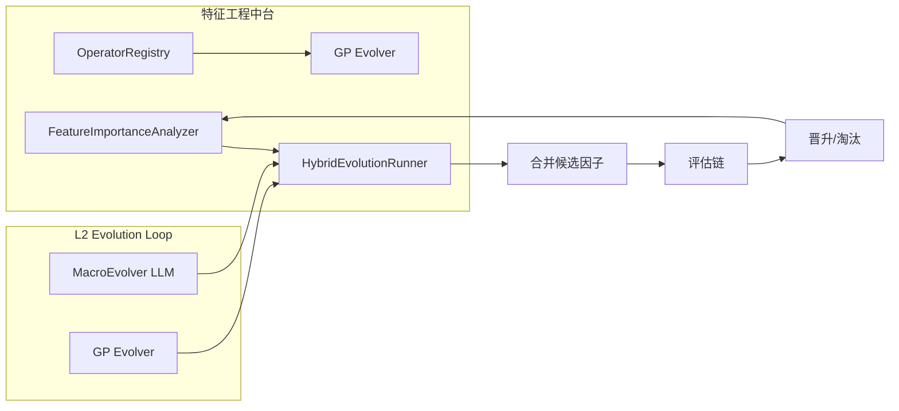

# C.1 特征工程中台 — 详细技术设计

> 版本: v3.0.0+25
> 关联: [11-factor-mining-optimization-plan.md](file:///d:/Programs/factor_system/docs/harness/plans/11-factor-mining-optimization-plan.md) → Phase C.1
> 状态: **已实现**（文件结构与算子类别与原设计不同；v2.9.0 补齐 CLI）
> 实现说明: 特征工程中台由 `fts/factor_engine/feature_ops.py`（单文件，7 类算子: TimeSeriesOps/PriceOps/RollingOps/**TechnicalOps**/CrossSectionOps/CrossSymbolOps/CompositeOps + `OperatorRegistry` + `FeatureOpsEngine`）、`fts/factor_engine/gp_evolver.py`（`GPEvolver`/`ExpressionTree`/`tree_to_factor_program`）、`fts/factor_engine/feature_importance.py` 承担。另新增 **`fts/factor_engine/expr_dsl/`**（FTS-Expr 算子表达式 DSL + `OperatorRegistry` 58 算子 L0-L5 分层，2026-08 算子演化基础层）。**v2.9.0 补齐 CLI**：`fts feature list`（列算子）、`fts feature analyze`（置换重要性）、`fts gp evolve`（GP 遗传规划演化）。原设计 `feature_ops/` 包目录结构未实现。

---

## 1. 目标与范围

建立**特征算子库**和**自动化特征搜索**能力：
- 实现 50+ 特征算子（基础/组合/跨品种）
- 基于 GP (gplearn) 在算子空间搜索最优因子表达式
- 特征重要性分析（SHAP 值）
- 与现有 LLM 演化形成互补搜索路径

**范围**:
- 特征算子库设计与实现
- GP 演化搜索引擎
- 特征重要性分析
- 与 L2 Evolution Loop 的集成

**不在范围**:
- LLM 演化本身（已有实现）
- 评估链改动（复用现有评估链）

---

## 2. 特征算子库设计

### 2.1 算子分类架构

> **实现现状**: 实际为 **7 类**算子（`fts/factor_engine/feature_ops.py`），在原设计 6 类基础上新增 `TechnicalOps`（技术指标算子，如 ADX/RSI/BOLL 等）；`CompositeOps` 与 `CrossSymbolOps` 均已实现。另有 `expr_dsl/` 提供新一代算子表达式（FTS-Expr DSL + 58 算子 L0-L5 分层）。

```
特征算子库（feature_ops.py — 实际实现，7 类）
├── 时序算子 (TimeSeriesOps)
│   ├── 时序算子: ts_mean, ts_std, ts_max, ts_min, ts_sum, ts_product
│   ├── 价格算子: rank, zscore, delta, pct_change, log_return
│   ├── 滚动算子: ts_rank, ts_zscore, ts_momentum, ts_volatility
│   └── 截面算子: cross_rank, cross_zscore, industry_neutral
├── 技术算子 (TechnicalOps)          # [新增]
│   └── 技术指标: adx, rsi, boll, macd 等
├── 组合算子 (CompositeOps)
│   ├── 嵌套算子: nest(op1, op2, ...)
│   ├── 条件算子: if_then_else, conditional_weight
│   └── 运算算子: add, sub, mul, div, scale
└── 跨品种算子 (CrossSymbolOps)
    ├── 行业中性化: industry_demean, industry_neutralize
    ├── 市值中性化: cap_demean, cap_neutralize
    └── 区域中性化: region_demean

FTS-Expr DSL（expr_dsl/ — 算子演化基础层，2026-08）
└── OperatorRegistry: 58 个算子，L0-L5 分层（fields/price/time_series/rolling/cross_section/composite）
```

### 2.2 基础算子详细定义

#### 时序算子

```python
class TimeSeriesOps:
    """时序算子集合。"""

    @staticmethod
    def ts_mean(series: pd.Series, window: int = 20) -> pd.Series:
        """滚动均值。"""
        return series.rolling(window=window).mean()

    @staticmethod
    def ts_std(series: pd.Series, window: int = 20) -> pd.Series:
        """滚动标准差。"""
        return series.rolling(window=window).std()

    @staticmethod
    def ts_max(series: pd.Series, window: int = 20) -> pd.Series:
        """滚动最大值。"""
        return series.rolling(window=window).max()

    @staticmethod
    def ts_min(series: pd.Series, window: int = 20) -> pd.Series:
        """滚动最小值。"""
        return series.rolling(window=window).min()

    @staticmethod
    def ts_sum(series: pd.Series, window: int = 20) -> pd.Series:
        """滚动求和。"""
        return series.rolling(window=window).sum()

    @staticmethod
    def ts_product(series: pd.Series, window: int = 20) -> pd.Series:
        """滚动乘积。"""
        return series.rolling(window=window).apply(np.prod)
```

#### 价格算子

```python
class PriceOps:
    """价格算子集合。"""

    @staticmethod
    def rank(series: pd.Series) -> pd.Series:
        """截面排名 (0-1 归一化)。"""
        return series.rank(pct=True)

    @staticmethod
    def zscore(series: pd.Series) -> pd.Series:
        """Z-Score 标准化。"""
        mean = series.mean()
        std = series.std()
        return (series - mean) / std if std > 0 else series

    @staticmethod
    def delta(series: pd.Series, periods: int = 1) -> pd.Series:
        """变化量。"""
        return series.diff(periods)

    @staticmethod
    def pct_change(series: pd.Series, periods: int = 1) -> pd.Series:
        """百分比变化。"""
        return series.pct_change(periods)

    @staticmethod
    def log_return(series: pd.Series) -> pd.Series:
        """对数收益。"""
        return np.log(series / series.shift(1))
```

#### 滚动算子

```python
class RollingOps:
    """滚动算子集合。"""

    @staticmethod
    def ts_rank(series: pd.Series, window: int = 20) -> pd.Series:
        """滚动窗口内排名。"""
        return series.rolling(window=window).rank(pct=True)

    @staticmethod
    def ts_zscore(series: pd.Series, window: int = 20) -> pd.Series:
        """滚动 Z-Score。"""
        return series.rolling(window=window).apply(
            lambda x: (x.iloc[-1] - x.mean()) / x.std() if x.std() > 0 else 0
        )

    @staticmethod
    def ts_momentum(series: pd.Series, window: int = 20) -> pd.Series:
        """动量指标 (当前值 / window 前的值 - 1)。"""
        return series / series.shift(window) - 1

    @staticmethod
    def ts_volatility(series: pd.Series, window: int = 20) -> pd.Series:
        """滚动波动率。"""
        return series.pct_change().rolling(window=window).std() * np.sqrt(252)
```

#### 截面算子

```python
class CrossSectionOps:
    """截面算子集合。"""

    @staticmethod
    def cross_rank(panel: pd.DataFrame, group_col: str = 'date',
                    value_col: str = 'value') -> pd.DataFrame:
        """截面排名。"""
        panel['cross_rank'] = panel.groupby(group_col)[value_col].rank(pct=True)
        return panel

    @staticmethod
    def cross_zscore(panel: pd.DataFrame, group_col: str = 'date',
                      value_col: str = 'value') -> pd.DataFrame:
        """截面 Z-Score。"""
        panel['cross_zscore'] = panel.groupby(group_col)[value_col].transform(
            lambda x: (x - x.mean()) / x.std() if x.std() > 0 else 0
        )
        return panel

    @staticmethod
    def industry_neutral(panel: pd.DataFrame, group_col: str = 'date',
                          industry_col: str = 'industry',
                          value_col: str = 'value') -> pd.DataFrame:
        """行业中性化。"""
        panel['industry_mean'] = panel.groupby([group_col, industry_col])[value_col].transform('mean')
        panel['neutralized'] = panel[value_col] - panel['industry_mean']
        return panel
```

### 2.3 算子注册表

> **实现现状**: `OperatorRegistry` 已实现于 `fts/factor_engine/feature_ops.py`（支持 register/call/list_operators/get_operator，用法与原设计一致）。此外 `fts/factor_engine/expr_dsl/registry.py` 提供新一代 `OperatorRegistry`（`OperatorMeta` dataclass，含语义/参数边界/lookback/经济含义元数据，58 算子）。

```python
class OperatorRegistry:
    """特征算子注册表（feature_ops.py — 实际实现）。

    管理所有可用算子，支持运行时查询和调用。

    Usage:
        registry = OperatorRegistry()
        registry.register('rank', PriceOps.rank)
        registry.register('ts_mean', TimeSeriesOps.ts_mean)
        # 运行时调用
        result = registry.call('ts_mean', series, window=20)
    """

    def __init__(self):
        self._operators: dict[str, OperatorInfo] = {}
        self._initialize_builtin()

    def register(self, name: str, func: Callable, category: str,
                 params: list[str]) -> None:
        """注册新算子。"""
        ...

    def call(self, name: str, *args, **kwargs) -> pd.Series:
        """调用算子。"""
        ...

    def list_operators(self, category: str | None = None) -> list[OperatorInfo]:
        """列出所有算子。"""
        ...

    def get_operator(self, name: str) -> OperatorInfo | None:
        """获取算子信息。"""
        ...
```

> **新一代算子元数据**（`expr_dsl/registry.py`，`OperatorMeta`）:
> `name` / `func` / `category`（L0-L5）/ `params` / `int_params` / `float_params` / `param_bounds` / `lookback_param` / `differentiable` / `economic_meaning` — 为算子演化（OperatorMacroEvolver）提供语义、梯度与边界约束。

### 2.4 算子元数据

```python
class OperatorInfo(TypedDict, total=False):
    """算子元数据。"""
    name: str
    category: Literal['time_series', 'price', 'rolling', 'cross_section', 'composite', 'cross_symbol']
    params: list[str]
    description: str
    signature: str                        # 如 "ts_mean(series, window=20)"
    version: str
    added_at: str
```

---

## 3. GP 演化搜索引擎

### 3.1 GP 演化架构

```mermaid
flowchart TD
    A[GP Evolution 启动] --> B[初始化种群]
    B --> B1[随机生成 100 个表达式树]
    B1 --> C[评估适应度]
    C --> C1[每个表达式 → FactorProgram]
    C1 --> C2[运行 L1 回测 → IC/Sharpe]
    C2 --> C3[计算适应度分数]
    C3 --> D{达到终止条件?}
    D -->|是| E[输出最优表达式]
    D -->|否| F[选择 + 交叉 + 变异]
    F --> F1[锦标赛选择 (top 50%)]
    F1 --> F2[交叉 (随机选择 2 个父代)]
    F2 --> F3[变异 (随机替换子树)]
    F3 --> G[生成新一代]
    G --> C
```

### 3.2 GP 演化器核心类

```python
class GPEvolver:
    """遗传规划演化器。

    Usage:
        gp = GPEvolver(
            operator_registry=registry,
            data_panel=panel_data,
            target_col='forward_return_20d',
            config=gp_config
        )
        best_factor = gp.evolve()
    """

    def __init__(self,
                 operator_registry: OperatorRegistry,
                 data_panel: pd.DataFrame,
                 target_col: str,
                 config: GPEvolverConfig | None = None) -> None: ...

    def evolve(self) -> GPEvolveResult:
        """执行 GP 演化，返回最优因子。"""
        ...

    def _initialize_population(self, size: int) -> list[ExpressionTree]: ...
    def _evaluate_fitness(self, tree: ExpressionTree) -> FitnessResult: ...
    def _tournament_select(self, population, tournament_size=3) -> ExpressionTree: ...
    def _crossover(self, parent1, parent2) -> ExpressionTree: ...
    def _mutate(self, tree, mutation_rate=0.1) -> ExpressionTree: ...
    def _to_factor_program(self, tree: ExpressionTree) -> FactorProgram: ...
```

### 3.3 核心类型

```python
class GPEvolverConfig(TypedDict, total=False):
    """GP 演化配置。"""
    population_size: int                  # 种群大小 (默认 200)
    max_generations: int                  # 最大代数 (默认 50)
    tournament_size: int                  # 锦标赛大小 (默认 3)
    crossover_rate: float                 # 交叉率 (默认 0.7)
    mutation_rate: float                  # 变异率 (默认 0.1)
    max_tree_depth: int                   # 最大树深度 (默认 5)
    min_tree_depth: int                   # 最小树深度 (默认 2)
    elitism_size: int                     # 精英保留数 (默认 5)
    fitness_metric: Literal['ic', 'sharpe', 'ic_sharpe_combo']
    parallel_workers: int                 # 并行评估数 (默认 4)


class ExpressionTree(TypedDict, total=False):
    """GP 表达式树。"""
    root: TreeNode
    depth: int
    size: int
    expression: str
    fitness: float


class TreeNode(TypedDict, total=False):
    """树节点。"""
    op_name: str | None                   # 算子名 (内部节点)
    operand: float | str | None           # 常量或列名 (叶节点)
    children: list['TreeNode'] | None
    is_terminal: bool


class FitnessResult(TypedDict, total=False):
    """适应度评估结果。"""
    ic: float
    sharpe: float
    fitness: float
    factor_program: FactorProgram
    evaluation_time_ms: float


class GPEvolveResult(TypedDict, total=False):
    """GP 演化结果。"""
    best_factor: FactorProgram
    best_fitness: float
    best_expression: str
    generation: int
    history: list[GenerationSnapshot]
    total_evaluations: int
```

### 3.4 表达式树 → FactorProgram 转换

```python
def tree_to_factor_program(tree: ExpressionTree) -> FactorProgram:
    """将 GP 表达式树转换为 FactorProgram。

    生成的因子代码示例：
    ```python
    def compute(close, high, low, volume):
        from .ops import ts_mean, rank, ts_std
        x1 = ts_mean(close, window=20)
        x2 = ts_std(close, window=20)
        x3 = (close - x1) / (x2 + 1e-8)
        return rank(x3)
    ```
    """
    code = _tree_to_code(tree.root)
    return FactorProgram.from_code(code)
```

---

## 4. 特征重要性分析

### 4.1 SHAP 值分析

```python
class FeatureImportanceAnalyzer:
    """特征重要性分析器。

    Usage:
        analyzer = FeatureImportanceAnalyzer()
        importance = analyzer.analyze(factor_program, data_panel)
        # importance → {feature_name: shap_value}
    """

    def analyze(self,
                factor: FactorProgram,
                data: pd.DataFrame) -> FeatureImportanceResult:
        """分析特征重要性。"""
        ...

    def _compute_shap_values(self, factor, data) -> dict[str, float]:
        """计算 SHAP 值。"""
        # 基于置换重要性 (Permutation Importance) 简化实现
        # 1. 计算基线 IC
        # 2. 逐个打乱特征，计算 IC 下降幅度
        # 3. IC 下降幅度 = SHAP 值估计
        ...

    def _get_feature_names(self, factor: FactorProgram) -> list[str]:
        """从因子代码中提取特征名。"""
        ...


class FeatureImportanceResult(TypedDict, total=False):
    """特征重要性分析结果。"""
    factor_id: str
    feature_importance: dict[str, float]     # feature → importance score
    top_features: list[tuple[str, float]]    # Top-10 特征
    analysis_method: Literal['permutation', 'shap', 'lime']
    n_features_analyzed: int
```

---

## 5. 与 L2 Evolution Loop 集成

### 5.1 GP 作为补充搜索路径

```
evolution_loop.py
  ├── 阶段 0: 种子因子加载
  ├── 阶段 1: UCT 选择父因子
  ├── 阶段 2: 宏观演化 (LLM) → [新增] 也可选 GP 演化
  ├── 阶段 3: 微观演化 (optuna)
  ├── 阶段 4: 三级评估链
  ├── 阶段 5: Verifier 检查
  └── 阶段 6: 晋升 / 淘汰

  [新增] GP 演化入口:
    gp_evolver = GPEvolver(...)
    gp_result = gp_evolver.evolve()
    # 将 GP 最优因子注入评估链
    evaluate(gp_result.best_factor)
```

### 5.2 并行搜索模式

```python
class HybridEvolutionRunner:
    """混合演化运行器 (LLM + GP 并行)。

    Usage:
        runner = HybridEvolutionRunner(config)
        result = runner.run()
    """

    def run(self) -> EvolutionRunResult:
        """并行运行 LLM 演化和 GP 演化，合并结果。"""
        with ThreadPoolExecutor(max_workers=2) as executor:
            llm_future = executor.submit(self._run_llm_evolution)
            gp_future = executor.submit(self._run_gp_evolution)
            llm_result = llm_future.result()
            gp_result = gp_future.result()
        # 合并最优因子
        ...
```

---

## 6. 接口契约

### 6.1 `FeatureOpsEngine` 主类

```python
class FeatureOpsEngine:
    """特征工程中台主引擎。

    Usage:
        engine = FeatureOpsEngine()
        # 注册算子
        engine.register_operator('new_op', new_op_func, category='basic')
        # GP 演化搜索
        result = engine.run_gp_search(data, target)
        # 特征重要性分析
        importance = engine.analyze_importance(factor, data)
        # 列出所有算子
        ops = engine.list_operators()
    """

    def __init__(self) -> None: ...

    # 算子管理
    def register_operator(self, name: str, func: Callable,
                           category: str, params: list[str]) -> None: ...
    def list_operators(self, category: str | None = None) -> list[OperatorInfo]: ...
    def get_operator(self, name: str) -> OperatorInfo | None: ...

    # GP 演化
    def run_gp_search(self,
                       data: pd.DataFrame,
                       target: str,
                       config: GPEvolverConfig | None = None) -> GPEvolveResult: ...
    def run_hybrid_search(self,
                          data: pd.DataFrame,
                          target: str,
                          llm_config: dict,
                          gp_config: GPEvolverConfig | None = None) -> HybridResult: ...

    # 特征分析
    def analyze_importance(self,
                            factor: FactorProgram,
                            data: pd.DataFrame) -> FeatureImportanceResult: ...
    def extract_features_from_code(self, code: str) -> list[str]: ...
```

---

## 7. 流程设计

### 7.1 GP 演化完整流程

```mermaid
flowchart TD
    A[FeatureOpsEngine.run_gp_search] --> B[加载数据面板]
    B --> C[初始化 GP 种群 (200 个随机表达式)]
    C --> D[Generation 0]
    D --> E[评估所有个体适应度]
    E --> E1[表达式树 → FactorProgram]
    E1 --> E2[L1 回测 → IC/Sharpe]
    E2 --> E3[计算适应度 = α*IC + β*Sharpe]
    E3 --> F{Generation >= max_generations?}
    F -->|否| G[锦标赛选择 + 交叉 + 变异]
    G --> H[生成新一代]
    H --> E
    F -->|是| I[输出最优表达式]
    I --> J[转换为 FactorProgram]
    J --> K[注入现有评估链]
    K --> L[返回 GPEvolveResult]
```

### 7.2 特征工程中台与 LLM/GP 协作



---

## 8. 技术约束

| 约束 | 说明 |
|------|------|
| **算子安全** | 所有算子在沙箱中执行，禁止访问外部资源 |
| **GP 性能** | 50 代 × 200 个体，并行评估 < 30 分钟 |
| **表达式复杂度** | 树深度 ≤ 5，节点数 ≤ 20，避免过度拟合 |
| **数据泄漏防护** | GP 评估严格使用训练集，OOS 验证用独立数据集 |
| **可解释性** | 每个 GP 因子生成可读的 Python 代码 |
| **向后兼容** | 现有演化流程不受影响，GP 为可选补充 |
| **算子版本化** | 算子注册表支持版本管理，支持回滚 |

---

## 9. 文件改动清单

| 文件 | 动作 | 现状 | 说明 |
|------|------|------|------|
| `fts/factor_engine/feature_ops/` | **新增** | ⬜ 未实现 | 实际为单文件 `fts/factor_engine/feature_ops.py`（7 类算子 + OperatorRegistry + FeatureOpsEngine） |
| `fts/factor_engine/feature_ops/basic_ops.py` | **新增** | ⬜ 未实现 | 原设计拆分未实现（算子内聚于 feature_ops.py） |
| `fts/factor_engine/feature_ops/operator_registry.py` | **新增** | ⬜ 未实现 | 原设计拆分未实现（OperatorRegistry 在 feature_ops.py） |
| `fts/factor_engine/gp_evolver.py` | **新增** | ✅ 已实现 | `GPEvolver` + `ExpressionTree`/`TreeNode`/`tree_to_factor_program` |
| `fts/factor_engine/feature_importance.py` | **新增** | ✅ 已实现 | 特征重要性分析 |
| `fts/factor_engine/feature_ops_engine.py` | **新增** | ⬜ 未实现 | `FeatureOpsEngine` 已实现于 `feature_ops.py` 内 |
| `fts/factor_engine/evolution_loop.py` | **修改** | ✅ 已实现 | GP 演化路径集成（`_gp_evolve` 方法） |
| `fts/factor_engine/expr_dsl/` | **新增** | ✅ 已实现 | 算子演化基础层（2026-08）: FTS-Expr DSL + 58 算子 L0-L5 |
| `fts/cli.py` | **修改** | ✅ 已实现 | `fts feature list`/`fts feature analyze`/`fts gp evolve` 子命令（v2.9.0） |
| `tests/factor_engine/test_operator_registry.py` | **新增** | ✅ 已实现 | 算子注册表测试 |
| `tests/factor_engine/test_gp_evolver.py` | **新增** | ✅ 已实现 | GP 演化器测试 |
| `tests/factor_engine/test_feature_importance.py` | **新增** | ✅ 已实现 | 特征重要性测试 |
| `tests/factor_engine/expr_dsl/` | **新增** | ✅ 已实现 | DSL 解析/校验/执行/编译/注册表测试 |

---

## 10. CLI 命令设计

> **实现现状**: **未实现**。`fts/cli.py` 无 `feature`/`gp` 子命令。以下为原设计预留。

```bash
# 列出所有可用算子
fts feature list

# 运行 GP 演化搜索
fts gp evolve \
  --data dataset_2025 \
  --target forward_return_20d \
  --population 200 \
  --generations 50 \
  --output gp_result.json

# 混合演化 (LLM + GP 并行)
fts gp hybrid \
  --data dataset_2025 \
  --target forward_return_20d \
  --gp-generations 30 \
  --llm-generations 10 \
  --output hybrid_result.json

# 分析因子特征重要性
fts feature analyze \
  --factor-id <factor_id> \
  --data dataset_2025 \
  --output importance_report.json
```

---

## 11. 验收标准

| # | 标准 | 检验方式 |
|---|------|----------|
| 1 | 算子库包含 ≥ 50 个算子，涵盖 6 大类别 | 代码审查 |
| 2 | GP 演化器可独立运行并输出最优因子 | 集成测试 |
| 3 | GP 生成的因子通过现有评估链 | 集成测试 |
| 4 | 表达式树可正确转换为 FactorProgram | 单元测试 |
| 5 | GP 演化 < 30 分钟（50 代 × 200 个体） | 性能测试 |
| 6 | 特征重要性分析正确识别 Top 特征 | 单元测试 |
| 7 | Hybrid 并行演化正确合并 LLM 和 GP 结果 | 集成测试 |
| 8 | CLI 子命令正确执行 | CLI 测试 |
| 9 | 算子安全：沙箱中无外部资源访问 | 安全测试 |
| 10 | 向后兼容：关闭 GP 时原有流程不变 | 回归测试 |

---

## 12. 一致性元数据

| 字段 | 值 |
|:-----|:----|
| 关联文档 | [11-factor-mining-optimization-plan.md](file:///d:/Programs/factor_system/docs/harness/plans/11-factor-mining-optimization-plan.md) → Phase C.1 |
| 关联计划 | [10-evolution-optimization-plan.md](file:///d:/Programs/factor_system/docs/harness/plans/10-evolution-optimization-plan.md) → Phase C.1 (GP/gplearn 补充搜索) |
| 依赖模块 | `factor_program.py`（因子代码转换）、`evaluation_chain.py`（适应度评估）、`evolution_loop.py`（集成） |
| 前置条件 | L2 Evolution Loop 可用，`FactorProgram` 沙箱执行器可用 |
| 后置影响 | 因子搜索空间扩大，LLM + GP 双路径并行 |
| 技术依赖 | `gplearn` 或自实现 GP 框架 |