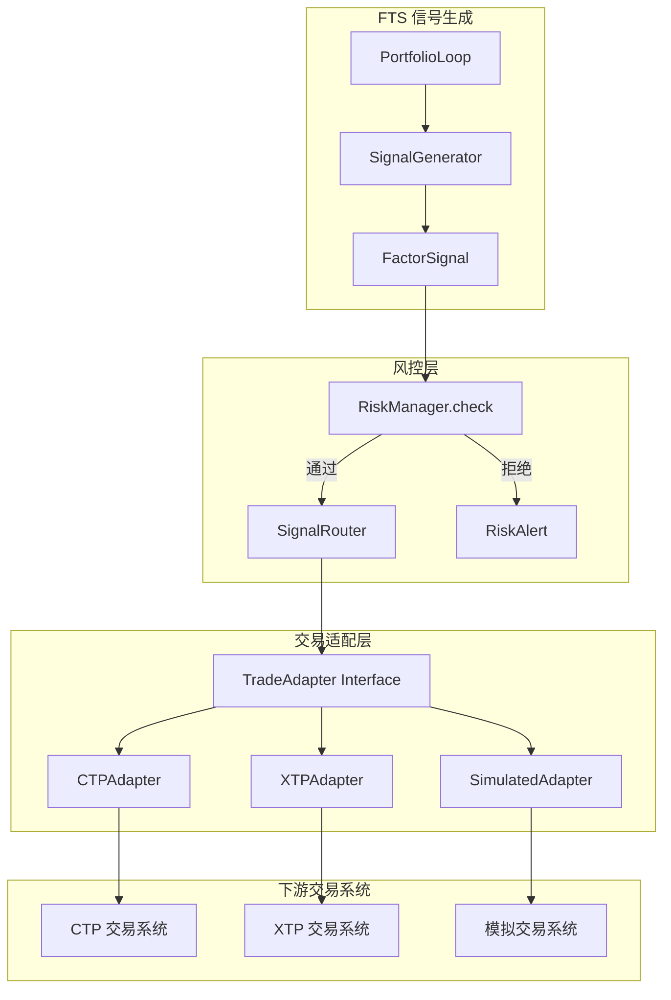
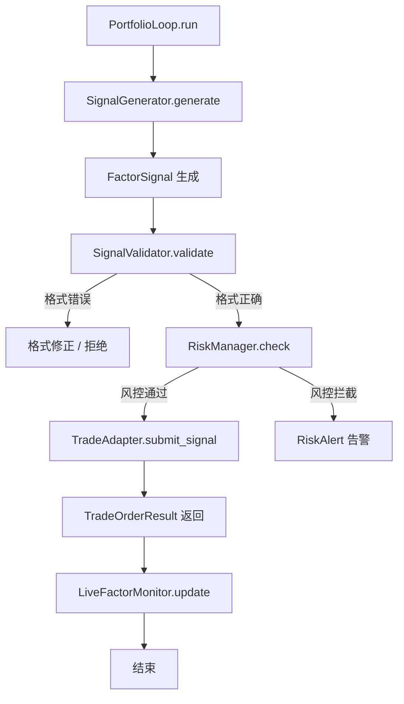
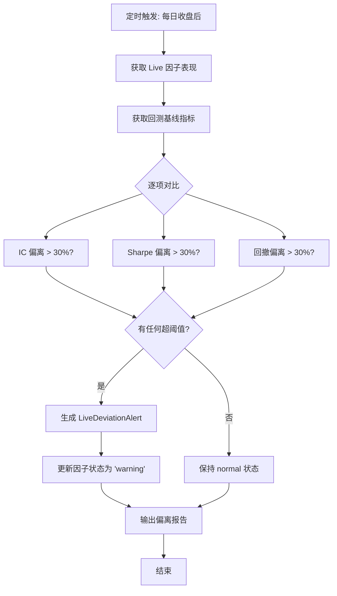

# C.2 实盘对接与实时监控 — 详细技术设计

> 版本: v1.0.0
> 关联: [11-factor-mining-optimization-plan.md](file:///d:/Programs/factor_system/docs/harness/11-factor-mining-optimization-plan.md) → Phase C.2
> 状态: 规划中

---

## 1. 目标与范围

建立**信号契约**和**实盘对接框架**：
- 定义标准信号 JSON Schema，供下游交易系统消费
- 预留 CTP/XTP 等期货交易 API 适配层
- 实现实时风控检查（仓位/回撤/杠杆/亏损限制）
- Live 因子表现监控与回测偏离告警

**范围**:
- 信号格式契约设计
- 交易接口适配层架构
- 实时风控模块
- Live 因子监控

**不在范围**:
- 具体交易系统实现（FTS 负责信号生成，交易执行由下游系统负责）
- 交易账户管理

---

## 2. 信号格式契约

### 2.1 Signal JSON Schema

```json
{
  "$schema": "https://json-schema.org/draft/2020-12/schema",
  "$id": "https://fts.system/schemas/signal/v1.json",
  "title": "FTS Factor Signal",
  "type": "object",
  "required": ["signal_id", "timestamp", "signals", "portfolio_id"],
  "properties": {
    "signal_id": {
      "type": "string",
      "description": "唯一信号 ID (UUID)",
      "format": "uuid"
    },
    "portfolio_id": {
      "type": "string",
      "description": "组合 ID"
    },
    "timestamp": {
      "type": "string",
      "format": "date-time",
      "description": "信号生成时间 (ISO 8601)"
    },
    "frequency": {
      "type": "string",
      "enum": ["tick", "1m", "5m", "15m", "30m", "1h", "4h", "1d"],
      "description": "信号频率"
    },
    "universe": {
      "type": "array",
      "items": { "type": "string" },
      "description": "交易品种列表"
    },
    "signals": {
      "type": "array",
      "items": {
        "$ref": "#/$defs/SignalDetail"
      },
      "description": "各品种信号详情"
    },
    "meta": {
      "type": "object",
      "description": "元数据",
      "properties": {
        "trace_id": { "type": "string" },
        "factor_count": { "type": "integer" },
        "regime": { "type": "string" },
        "source_version": { "type": "string" }
      }
    }
  },
  "$defs": {
    "SignalDetail": {
      "type": "object",
      "required": ["symbol", "direction", "position", "confidence"],
      "properties": {
        "symbol": {
          "type": "string",
          "description": "交易代码 (如 'IF2501')"
        },
        "direction": {
          "type": "string",
          "enum": ["long", "short", "flat"],
          "description": "交易方向"
        },
        "position": {
          "type": "number",
          "description": "目标仓位 (手数或权重)",
          "minimum": 0
        },
        "confidence": {
          "type": "number",
          "description": "置信度 (0-1)",
          "minimum": 0,
          "maximum": 1
        },
        "price": {
          "type": "number",
          "description": "参考价格"
        },
        "stop_loss": {
          "type": "number",
          "description": "止损价"
        },
        "take_profit": {
          "type": "number",
          "description": "止盈价"
        },
        "contributing_factors": {
          "type": "array",
          "items": {
            "type": "object",
            "properties": {
              "factor_id": { "type": "string" },
              "weight": { "type": "number" },
              "signal": { "type": "number" }
            }
          },
          "description": "贡献因子详情"
        }
      }
    }
  }
}
```

### 2.2 Python 类型定义

```python
class SignalDetail(TypedDict, total=False):
    """单个品种的信号详情。"""
    symbol: str
    direction: Literal['long', 'short', 'flat']
    position: float
    confidence: float
    price: float
    stop_loss: float
    take_profit: float
    contributing_factors: list[FactorContribution]


class FactorContribution(TypedDict, total=False):
    """因子贡献详情。"""
    factor_id: str
    weight: float
    signal: float


class FactorSignal(TypedDict, total=False):
    """完整因子信号包。"""
    signal_id: str
    portfolio_id: str
    timestamp: str
    frequency: Literal['tick', '1m', '5m', '15m', '30m', '1h', '4h', '1d']
    universe: list[str]
    signals: list[SignalDetail]
    meta: SignalMeta


class SignalMeta(TypedDict, total=False):
    """信号元数据。"""
    trace_id: str
    factor_count: int
    regime: str
    source_version: str
```

### 2.3 信号验证

```python
class SignalValidator:
    """信号格式验证器。

    Usage:
        validator = SignalValidator()
        errors = validator.validate(signal_dict)
        if not errors:
            # 信号格式正确
    """

    def validate(self, signal: dict) -> list[str]:
        """验证信号格式，返回错误列表。"""
        errors = []
        # 检查必填字段
        required = ['signal_id', 'timestamp', 'signals']
        for field in required:
            if field not in signal:
                errors.append(f"Missing required field: {field}")
        # 检查子项
        for sig in signal.get('signals', []):
            if 'symbol' not in sig:
                errors.append("Signal missing 'symbol'")
            if sig.get('direction') not in ('long', 'short', 'flat'):
                errors.append(f"Invalid direction: {sig.get('direction')}")
            if not 0 <= sig.get('confidence', 0) <= 1:
                errors.append(f"Confidence out of range: {sig.get('confidence')}")
        return errors
```

---

## 3. 交易接口适配层

### 3.1 架构设计



### 3.2 交易适配器接口

```python
class TradeAdapter(ABC):
    """交易适配器抽象基类。

    所有交易系统适配器必须实现此接口。
    """

    @abstractmethod
    def connect(self, config: dict) -> bool:
        """建立与交易系统的连接。"""
        ...

    @abstractmethod
    def disconnect(self) -> bool:
        """断开连接。"""
        ...

    @abstractmethod
    def submit_signal(self, signal: FactorSignal) -> TradeOrderResult:
        """提交信号到交易系统。"""
        ...

    @abstractmethod
    def get_position(self, symbol: str) -> PositionInfo:
        """查询当前持仓。"""
        ...

    @abstractmethod
    def get_account_status(self) -> AccountStatus:
        """查询账户状态。"""
        ...

    @abstractmethod
    def is_connected(self) -> bool:
        """检查连接状态。"""
        ...


class TradeOrderResult(TypedDict, total=False):
    """交易订单结果。"""
    order_id: str
    symbol: str
    direction: Literal['long', 'short']
    quantity: float
    price: float
    status: Literal['submitted', 'filled', 'rejected', 'cancelled']
    fill_price: float
    fill_quantity: float
    timestamp: str
    error_message: str


class PositionInfo(TypedDict, total=False):
    """持仓信息。"""
    symbol: str
    direction: Literal['long', 'short']
    quantity: float
    avg_price: float
    market_value: float
    unrealized_pnl: float


class AccountStatus(TypedDict, total=False):
    """账户状态。"""
    balance: float
    available: float
    margin_used: float
    position_value: float
    total_equity: float
```

### 3.3 适配器实现示例

```python
class SimulatedTradeAdapter(TradeAdapter):
    """模拟交易适配器（用于测试和仿真）。"""

    def __init__(self):
        self._connected = False
        self._positions: dict[str, PositionInfo] = {}
        self._balance = 1_000_000.00

    def connect(self, config: dict) -> bool:
        self._connected = True
        return True

    def submit_signal(self, signal: FactorSignal) -> TradeOrderResult:
        if not self._connected:
            return TradeOrderResult(status='rejected',
                                    error_message='Not connected')
        # 模拟成交
        result = TradeOrderResult(
            order_id=str(uuid.uuid4()),
            symbol=signal['signals'][0]['symbol'],
            direction=signal['signals'][0]['direction'],
            quantity=signal['signals'][0]['position'],
            price=signal['signals'][0]['price'],
            status='filled',
            fill_price=signal['signals'][0]['price'],
            fill_quantity=signal['signals'][0]['position'],
            timestamp=datetime.now().isoformat()
        )
        return result
```

---

## 4. 实时风控模块

### 4.1 风控规则

```python
class RiskManager:
    """实时风控管理器。

    Usage:
        risk_mgr = RiskManager(config)
        result = risk_mgr.check(signal, account_state, current_positions)
        if result.approved:
            # 允许下单
    """

    def __init__(self, config: RiskConfig | None = None) -> None: ...

    def check(self,
              signal: FactorSignal,
              account: AccountStatus,
              positions: dict[str, PositionInfo]) -> RiskCheckResult:
        """执行风控检查。"""
        results = []
        # 逐项检查
        results.append(self._check_single_position_limit(signal, positions))
        results.append(self._check_portfolio_drawdown(signal, account))
        results.append(self._check_daily_loss_limit(signal, account))
        results.append(self._check_leverage_limit(signal, account, positions))
        results.append(self._check_concentration_limit(signal, positions))

        all_passed = all(r.passed for r in results)
        return RiskCheckResult(
            approved=all_passed,
            checks=results,
            blocking_violations=[r for r in results if not r.passed]
        )

    def _check_single_position_limit(self, signal, positions) -> RiskCheckItem:
        """单品种仓位上限检查。"""
        # 规则：单品种仓位不超过总资产的 10%
        ...

    def _check_portfolio_drawdown(self, signal, account) -> RiskCheckItem:
        """组合最大回撤限制。"""
        # 规则：总回撤不超过 20%
        ...

    def _check_daily_loss_limit(self, signal, account) -> RiskCheckItem:
        """单日最大亏损限制。"""
        # 规则：单日亏损不超过 5%
        ...

    def _check_leverage_limit(self, signal, account, positions) -> RiskCheckItem:
        """杠杆率限制。"""
        # 规则：总杠杆不超过 3 倍
        ...

    def _check_concentration_limit(self, signal, positions) -> RiskCheckItem:
        """集中度限制。"""
        # 规则：前 3 大品种集中度不超过 50%
        ...
```

### 4.2 风控配置

```python
class RiskConfig(TypedDict, total=False):
    """风控配置。"""
    single_position_limit_pct: float         # 单品种仓位上限 (默认 0.10 = 10%)
    max_portfolio_drawdown_pct: float        # 最大组合回撤 (默认 0.20 = 20%)
    daily_loss_limit_pct: float             # 单日最大亏损 (默认 0.05 = 5%)
    max_leverage: float                      # 最大杠杆 (默认 3.0)
    max_concentration_pct: float             # 最大集中度 (默认 0.50 = 50%)
    max_open_positions: int                  # 最大持仓品种数 (默认 20)
    circuit_breaker_loss_pct: float         # 熔断亏损阈值 (默认 0.10 = 10%)
    check_enabled: dict[str, bool]           # 各项检查开关
```

### 4.3 风控检查结果

```python
class RiskCheckItem(TypedDict, total=False):
    """单项风控检查结果。"""
    check_name: str
    passed: bool
    current_value: float
    limit_value: float
    message: str
    severity: Literal['warning', 'critical']


class RiskCheckResult(TypedDict, total=False):
    """完整风控检查结果。"""
    approved: bool
    checks: list[RiskCheckItem]
    blocking_violations: list[RiskCheckItem]
    timestamp: str
    signal_id: str
```

---

## 5. Live 因子监控

### 5.1 监控指标

```python
class LiveFactorMonitor:
    """Live 因子表现监控器。

    Usage:
        monitor = LiveFactorMonitor(config)
        monitor.update_live_performance(factor_id, live_metrics)
        alerts = monitor.check_deviation()
    """

    def __init__(self, config: LiveMonitorConfig | None = None) -> None: ...

    def update_live_performance(self,
                                factor_id: str,
                                live_metrics: FactorPerformance) -> None:
        """更新 Live 因子表现。"""
        ...

    def check_deviation(self) -> list[LiveDeviationAlert]:
        """检查 Live 表现与回测表现的偏离。"""
        ...

    def get_factor_deviation(self,
                              factor_id: str) -> FactorDeviationReport:
        """获取单因子偏离报告。"""
        ...


class LiveMonitorConfig(TypedDict, total=False):
    """Live 监控配置。"""
    deviation_threshold_pct: float          # 偏离阈值 (默认 0.30 = 30%)
    check_interval_hours: int               # 检查间隔 (默认 24)
    min_live_samples: int                   # 最少 Live 样本数 (默认 20)
    alert_on_ic_deviation: bool             # IC 偏离告警开关
    alert_on_sharpe_deviation: bool         # Sharpe 偏离告警开关
    alert_on_drawdown_deviation: bool       # 回撤偏离告警开关


class FactorPerformance(TypedDict, total=False):
    """因子表现指标。"""
    factor_id: str
    period_start: str
    period_end: str
    ic: float
    sharpe: float
    max_drawdown: float
    turnover: float
    n_observations: int


class LiveDeviationAlert(TypedDict, total=False):
    """Live 偏离告警。"""
    alert_id: str
    factor_id: str
    metric: Literal['ic', 'sharpe', 'max_drawdown']
    backtest_value: float
    live_value: float
    deviation_pct: float
    threshold_pct: float
    severity: Literal['warning', 'critical']
    timestamp: str
    recommendation: str


class FactorDeviationReport(TypedDict, total=False):
    """因子偏离报告。"""
    factor_id: str
    deviations: list[LiveDeviationAlert]
    overall_status: Literal['normal', 'warning', 'critical']
    backtest_vs_live: dict[str, dict]
```

### 5.2 Prometheus 指标

| 指标名 | 类型 | 标签 | 说明 |
|--------|------|------|------|
| `fts_live_factor_ic` | Gauge | `factor_id` | Live IC 值 |
| `fts_live_factor_ic_deviation` | Gauge | `factor_id` | Live vs 回测 IC 偏离率 |
| `fts_live_factor_sharpe` | Gauge | `factor_id` | Live Sharpe 值 |
| `fts_live_factor_deviation_alerts_total` | Counter | `factor_id`, `severity` | 偏离告警次数 |
| `fts_risk_check_total` | Counter | `check_name`, `result` | 风控检查次数 |
| `fts_risk_check_blocked_total` | Counter | `check_name` | 风控拦截次数 |

---

## 6. 流程设计

### 6.1 信号生成到实盘流程



### 6.2 Live 因子偏离检查流程



---

## 7. HTTP 端点

```
# 提交信号（模拟模式）
POST /api/v1/signal/submit
Body: FactorSignal JSON
Response: { "approved": true, "order": TradeOrderResult }

# 查询风控状态
GET /api/v1/risk/status
Response: { "positions": [...], "risk_level": "normal", "violations": [] }

# 查询 Live 因子监控
GET /api/v1/live/factors
Response: { "factors": [...], "alerts": [...] }

# 查询单因子偏离报告
GET /api/v1/live/factors/{factor_id}/deviation
Response: FactorDeviationReport

# 查询账户状态
GET /api/v1/account/status
Response: AccountStatus
```

---

## 8. 技术约束

| 约束 | 说明 |
|------|------|
| **信号安全** | 信号传输必须加密，包含签名验证 |
| **风控优先** | 任何信号必须通过风控检查才能到达交易系统 |
| **降级安全** | 交易适配器不可用时信号缓存不丢失 |
| **幂等性** | 同一 signal_id 重复提交只执行一次 |
| **延迟** | 信号处理（生成→风控→提交）< 100ms |
| **向后兼容** | 信号契约版本化，支持 v1/v2 共存 |
| **审计追踪** | 所有信号和风控检查记录可追溯 |

---

## 9. 文件改动清单

| 文件 | 动作 | 说明 |
|------|------|------|
| `fts/factor_engine/signal_contract.py` | **新增** | 信号 Schema 和类型定义 |
| `fts/factor_engine/signal_validator.py` | **新增** | `SignalValidator` 类 |
| `fts/risk/__init__.py` | **新增** | 风控包 |
| `fts/risk/risk_manager.py` | **新增** | `RiskManager` 类 |
| `fts/risk/trade_adapter.py` | **新增** | `TradeAdapter` 抽象基类 |
| `fts/risk/simulated_adapter.py` | **新增** | `SimulatedTradeAdapter` 实现 |
| `fts/monitor/live_factor_monitor.py` | **新增** | `LiveFactorMonitor` 类 |
| `fts/monitor/prometheus_metrics.py` | **修改** | 新增风控和 Live 监控指标 |
| `fts/monitor/http_server.py` | **修改** | 新增信号/风控/Live 监控端点 |
| `tests/risk/test_risk_manager.py` | **新增** | 风控管理器测试 |
| `tests/risk/test_signal_validator.py` | **新增** | 信号验证测试 |
| `tests/risk/test_simulated_adapter.py` | **新增** | 模拟适配器测试 |
| `tests/monitor/test_live_factor_monitor.py` | **新增** | Live 因子监控测试 |

---

## 10. 验收标准

| # | 标准 | 检验方式 |
|---|------|----------|
| 1 | 信号 JSON Schema 符合定义，验证器正确工作 | 单元测试 |
| 2 | 五项风控规则（仓位/回撤/亏损/杠杆/集中度）正确执行 | 单元测试 |
| 3 | 风控拦截后信号不会到达交易系统 | 集成测试 |
| 4 | `TradeAdapter` 接口符合 Liskov 替换原则 | 接口测试 |
| 5 | `SimulatedTradeAdapter` 正确模拟交易流程 | 集成测试 |
| 6 | Live 因子偏离检测正确识别 > 30% 偏离 | 单元测试 |
| 7 | Prometheus 指标正确输出风控和 Live 监控数据 | 集成测试 |
| 8 | HTTP 端点正确响应信号提交和监控查询 | 接口测试 |
| 9 | 信号处理延迟 < 100ms | 性能测试 |
| 10 | 降级安全：适配器不可用时信号缓存 | 故障注入测试 |

---

## 11. 一致性元数据

| 字段 | 值 |
|:-----|:----|
| 关联文档 | [11-factor-mining-optimization-plan.md](file:///d:/Programs/factor_system/docs/harness/11-factor-mining-optimization-plan.md) → Phase C.2 |
| 依赖模块 | `portfolio_loop.py`（信号生成）、`monitor/`（指标和 HTTP）、`C.3`（反馈闭环） |
| 前置条件 | A.1-A.3 和 B.1-B.3 已实施 |
| 后置影响 | FTS 具备实盘信号输出能力和基础风控 |
| 与 FTS 角色边界 | FTS 负责因子计算和信号生成，交易执行由下游系统负责（角色边界原则） |