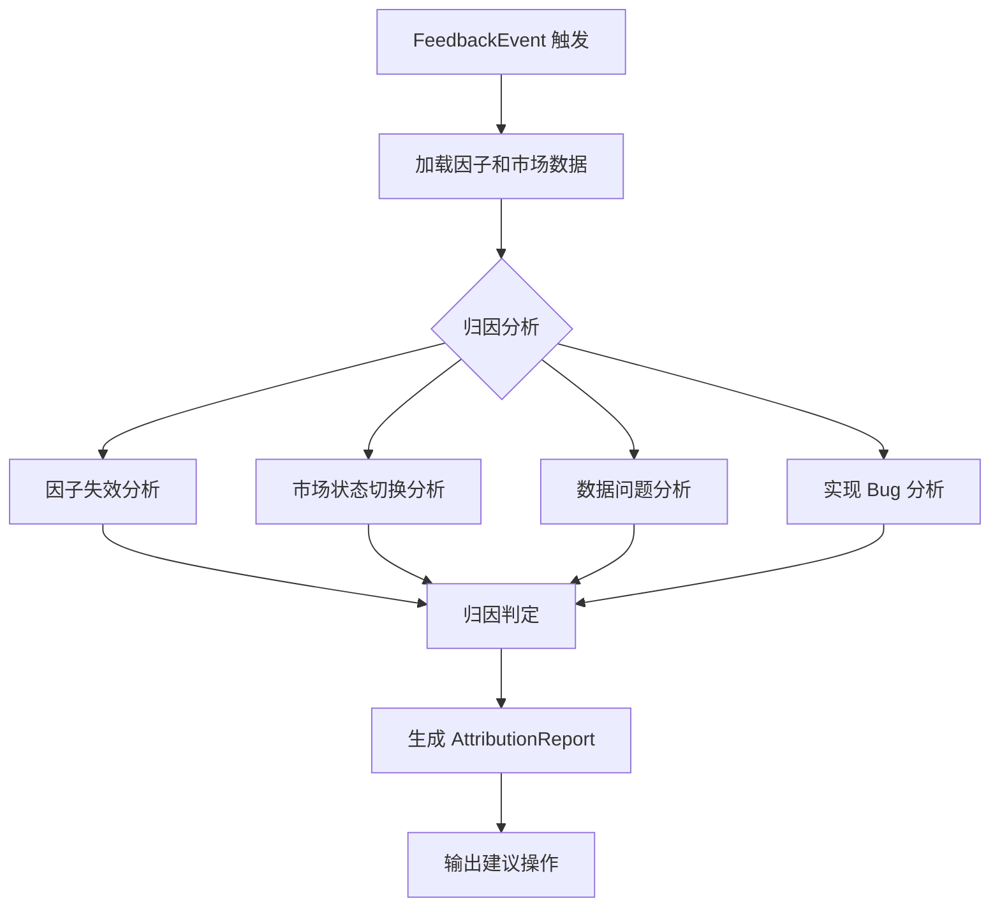
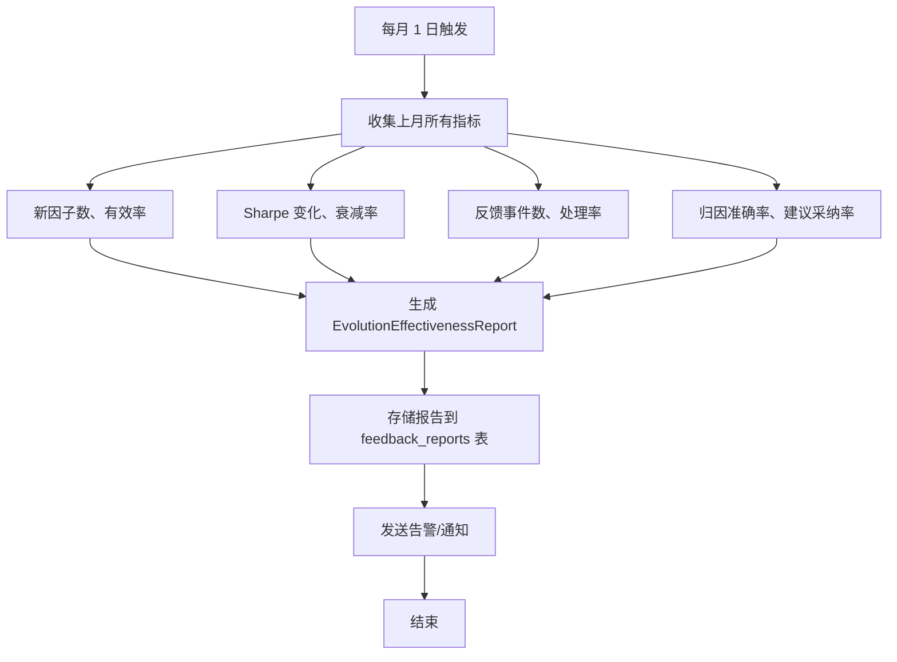

# C.3 系统化反馈闭环 — 详细技术设计

> 版本: v3.0.0+5
> 关联: [11-factor-mining-optimization-plan.md](file:///d:/Programs/factor_system/docs/harness/plans/11-factor-mining-optimization-plan.md) → Phase C.3
> 状态: **已实现**（FeedbackLoop 家族 + 4 张反馈表 + CLI）
> 实现说明: 反馈闭环完整实现于 `fts/factor_engine/feedback_loop.py`（`FeedbackTrigger`/`AttributionAnalyzer`/`EvolutionDirectionAdjuster`/`EvolutionEffectiveness`/`FeedbackLoop` 主类）、`factor_db/schema.py` 4 张反馈表（feedback_events/attribution_reports/feedback_processing_results/feedback_reports）、CLI `fts feedback` 子命令（trigger/process/report/stats）、Prometheus 反馈指标。经验沉淀复用 `fts/factor_engine/experience_chain.py`（`ExperienceChain` 经验链 + `FailurePatternAnalyzer`）作为归因输入之一。

---

## 1. 目标与范围

建立**"因子表现→归因→演化方向调整"**的完整闭环：
- 当 Live 表现偏离回测预期时自动触发归因分析
- 根据归因结果调整下一轮演化的搜索方向
- 重大市场事件时主动触发因子重评估
- 每月量化迭代效果，评估闭环价值

**范围**:
- 反馈触发机制
- 归因分析引擎
- 演化方向调整
- 迭代效果评估
- 与现有 L2/L3 循环的集成

**不在范围**:
- 因子演化算法本身（复用现有 MacroEvolver 和 GPEvolver）
- 数据采集和监控（复用 B.1 和 C.2 实现）

---

## 2. 反馈触发机制

### 2.1 触发条件

```python
class FeedbackTriggerConfig(TypedDict, total=False):
    """反馈触发配置。"""
    # Live 表现偏离触发
    live_ic_deviation_threshold: float       # Live IC 偏离阈值 (默认 0.30)
    live_sharpe_deviation_threshold: float   # Live Sharpe 偏离阈值 (默认 0.30)
    live_drawdown_deviation_threshold: float # Live 回撤偏离阈值 (默认 0.30)
    min_live_samples: int                    # 最少 Live 样本数 (默认 20)

    # 市场事件触发
    macro_event_keywords: list[str]          # 触发关键词 (政策/危机/流动性)
    max_event_response_time_minutes: float   # 事件响应时间上限 (默认 60)

    # 定时触发
    periodic_eval_interval_hours: int        # 定期评估间隔 (默认 24)
    monthly_report_day: int                  # 月度报告日 (默认 1)

    # 连续触发保护
    cooldown_hours_after_trigger: int        # 冷却时间 (默认 24)
    max_triggers_per_day: int                # 每日最大触发次数 (默认 3)
```

### 2.2 触发器实现

```python
class FeedbackTrigger:
    """反馈触发器。

    Usage:
        trigger = FeedbackTrigger(config, monitor)
        events = trigger.check_triggers()
        for event in events:
            feedback_loop.handle_event(event)
    """

    def __init__(self,
                 config: FeedbackTriggerConfig,
                 live_monitor: LiveFactorMonitor,
                 data_monitor: DataQualityMonitor) -> None: ...

    def check_triggers(self) -> list[FeedbackEvent]:
        """检查所有触发条件，返回需要处理的事件。"""
        events = []
        # 1. Live 偏离触发
        live_events = self._check_live_deviation()
        events.extend(live_events)
        # 2. 数据异常触发
        data_events = self._check_data_anomalies()
        events.extend(data_events)
        # 3. 市场事件触发
        market_events = self._check_market_events()
        events.extend(market_events)
        # 4. 定期评估触发
        periodic_events = self._check_periodic_eval()
        events.extend(periodic_events)
        return events

    def _check_live_deviation(self) -> list[FeedbackEvent]:
        """检查 Live 因子偏离。"""
        alerts = self._live_monitor.check_deviation()
        events = []
        for alert in alerts:
            if alert['severity'] == 'critical':
                events.append(FeedbackEvent(
                    event_type='live_deviation',
                    factor_id=alert['factor_id'],
                    trigger_reason=f"{alert['metric']} 偏离 {alert['deviation_pct']:.1%}",
                    severity='critical',
                    payload=alert
                ))
        return events

    def _check_data_anomalies(self) -> list[FeedbackEvent]:
        """检查数据异常。"""
        alerts = self._data_monitor.check_alerts()
        events = []
        for alert in alerts:
            if alert['level'] in ('critical', 'fatal'):
                events.append(FeedbackEvent(
                    event_type='data_anomaly',
                    trigger_reason=f"数据源 {alert['source']} {alert['metric']} 异常",
                    severity=alert['level'],
                    payload=alert
                ))
        return events
```

### 2.3 事件类型

```python
class FeedbackEventType(str, Enum):
    """反馈事件类型。"""
    LIVE_DEVIATION = "live_deviation"           # Live 表现偏离
    DATA_ANOMALY = "data_anomaly"               # 数据异常
    MARKET_EVENT = "market_event"               # 重大市场事件
    PERIODIC_EVAL = "periodic_eval"             # 定期评估
    AUDITY_FAILURE = "audit_failure"            # 审计失败
    FACTOR_DECAY = "factor_decay"               # 因子衰减
    USER_TRIGGERED = "user_triggered"           # 用户手动触发


class FeedbackEvent(TypedDict, total=False):
    """反馈事件。"""
    event_id: str
    event_type: FeedbackEventType
    factor_id: str | None
    trigger_reason: str
    severity: Literal['info', 'warning', 'critical']
    payload: dict
    timestamp: str
    handled: bool
    handled_at: str | None
```

---

## 3. 归因分析引擎

### 3.1 归因分析流程



### 3.2 归因分析器

```python
class AttributionAnalyzer:
    """归因分析器。

    Usage:
        analyzer = AttributionAnalyzer()
        report = analyzer.analyze(event, factor, market_data)
    """

    def analyze(self,
                event: FeedbackEvent,
                factor: FactorCatalog,
                market_data: MarketSnapshot) -> AttributionReport:
        """执行归因分析。"""
        # 并行执行四项分析
        factor_analysis = self._analyze_factor_decay(factor, event)
        regime_analysis = self._analyze_regime_change(factor, market_data)
        data_analysis = self._analyze_data_quality(event)
        implementation_analysis = self._analyze_implementation(event, factor)

        # 综合归因
        root_cause = self._determine_root_cause(
            factor_analysis, regime_analysis, data_analysis, implementation_analysis
        )

        return AttributionReport(
            event_id=event['event_id'],
            root_cause=root_cause,
            analyses={
                'factor_decay': factor_analysis,
                'regime_change': regime_analysis,
                'data_quality': data_analysis,
                'implementation': implementation_analysis
            },
            recommendation=self._generate_recommendation(root_cause),
            timestamp=datetime.now().isoformat()
        )

    def _analyze_factor_decay(self, factor, event) -> FactorDecayAnalysis:
        """分析因子失效。"""
        # 检查因子衰减率、近期 IC 趋势、同类因子表现
        ...

    def _analyze_regime_change(self, factor, market_data) -> RegimeAnalysis:
        """分析市场状态切换。"""
        # 对比因子风格标签与当前 Regime 的匹配度
        ...

    def _analyze_data_quality(self, event) -> DataQualityAnalysis:
        """分析数据问题。"""
        # 检查数据质量告警
        ...

    def _analyze_implementation(self, event, factor) -> ImplementationAnalysis:
        """分析实现问题。"""
        # 检查因子代码变更、信号计算逻辑
        ...
```

### 3.3 归因结果类型

```python
class RootCause(str, Enum):
    """根本原因枚举。"""
    FACTOR_DECAY = "factor_decay"               # 因子本身失效
    REGIME_MISMATCH = "regime_mismatch"         # 市场状态与因子风格不匹配
    DATA_QUALITY = "data_quality"               # 数据问题
    IMPLEMENTATION_BUG = "implementation_bug"   # 实现 Bug
    NORMAL_FLUCTUATION = "normal_fluctuation"   # 正常波动（无需操作）
    UNKNOWN = "unknown"


class AttributionReport(TypedDict, total=False):
    """归因分析报告。"""
    report_id: str
    event_id: str
    root_cause: RootCause
    confidence: float
    analyses: dict[str, AnalysisDetail]
    recommendation: ActionRecommendation
    timestamp: str


class AnalysisDetail(TypedDict, total=False):
    """单项分析详情。"""
    likely: bool
    confidence: float
    evidence: list[str]


class ActionRecommendation(TypedDict, total=False):
    """操作建议。"""
    action: Literal[
        'retire_factor',            # 因子失效 → 淘汰
        'reweight_factor',          # Regime 不匹配 → 调整权重
        'fix_data_source',          # 数据问题 → 修复数据源
        'fix_implementation',       # 实现 Bug → 修复代码
        'monitor_only',             # 正常波动 → 仅监控
        'trigger_evolution',        # 触发演化 → 重新演化
        'escalate'                  # 升级处理
    ]
    description: str
    priority: Literal['high', 'medium', 'low']
    suggested_params: dict
```

---

## 4. 演化方向调整

### 4.1 方向调整器

```python
class EvolutionDirectionAdjuster:
    """演化方向调整器。

    根据归因报告调整下一轮演化的搜索方向。

    Usage:
        adjuster = EvolutionDirectionAdjuster(config)
        new_config = adjuster.adjust_direction(attribution_report, current_config)
    """

    def adjust_direction(self,
                          attribution: AttributionReport,
                          current_config: EvolutionLoopConfig) -> EvolutionLoopConfig:
        """根据归因结果调整演化配置。"""
        config = copy.deepcopy(current_config)
        recommendation = attribution['recommendation']

        if recommendation['action'] == 'trigger_evolution':
            # 增加演化代数，调整搜索策略
            config['max_generation'] = min(
                config['max_generation'] * 1.5,
                self._max_generation_limit
            )
            # 注入经验
            config['inject_experience'] = {
                'type': 'regime_mismatch',
                'regime': self._current_regime,
                'suggested_styles': self._get_suggested_styles(attribution)
            }

        elif recommendation['action'] == 'reweight_factor':
            # 调整 Regime 权重配置
            config['regime_overrides'] = {
                'decrease': recommendation['suggested_params'].get('factor_ids', [])
            }

        elif recommendation['action'] == 'retire_factor':
            # 标记因子为淘汰候选
            config['retire_candidates'] = attribution['event_id']

        return config

    def _get_suggested_styles(self, attribution: AttributionReport) -> list[str]:
        """获取建议的因子风格方向。"""
        # 根据当前 Regime 和归因结果建议演化方向
        ...
```

### 4.2 反馈 → 演化集成

```
evolution_loop.py
  └── run():
        ...
        # 每轮演化前检查反馈事件
        feedback_events = feedback_trigger.check_triggers()
        if feedback_events:
            # 处理反馈
            for event in feedback_events:
                attribution = attribution_analyzer.analyze(event, ...)
                new_config = direction_adjuster.adjust_direction(
                    attribution, config
                )
                config = new_config
        ...
        # 使用调整后的 config 继续演化
```

---

## 5. 迭代效果评估

### 5.1 评估指标

```python
class EvolutionEffectiveness:
    """迭代效果评估器。

    Usage:
        evaluator = EvolutionEffectiveness(metrics_store)
        report = evaluator.generate_monthly_report()
    """

    def generate_monthly_report(self) -> EvolutionEffectivenessReport:
        """生成月度迭代效果报告。"""
        return EvolutionEffectivenessReport(
            new_factors=self._count_new_factors(),
            effective_rate=self._compute_effective_rate(),
            avg_sharpe_improvement=self._compute_sharpe_improvement(),
            decay_rate_reduction=self._compute_decay_reduction(),
            evolution_rounds=self._count_evolution_rounds(),
            feedback_events_handled=self._count_feedback_handled(),
            attribution_accuracy=self._measure_attribution_accuracy(),
            recommendations_accepted=self._count_accepted_recommendations(),
            timestamp=datetime.now().isoformat()
        )

    def _count_new_factors(self) -> int:
        """统计本月新产生的因子数。"""
        ...

    def _compute_effective_rate(self) -> float:
        """计算有效率 (通过评估链的因子 / 总生成因子)。"""
        ...

    def _compute_sharpe_improvement(self) -> float:
        """计算平均 Sharpe 提升 (本月 vs 上月)。"""
        ...


class EvolutionEffectivenessReport(TypedDict, total=False):
    """迭代效果报告。"""
    report_id: str
    period: str                              # "2026-08"
    new_factors: int
    effective_rate: float
    avg_sharpe_improvement: float
    decay_rate_reduction: float
    evolution_rounds: int
    feedback_events_handled: int
    attribution_accuracy: float
    recommendations_accepted: int
    recommendations_total: int
    summary_text: str
    timestamp: str
```

### 5.2 月度报告内容

```
迭代效果月报 (2026-08)
━━━━━━━━━━━━━━━━━━━━━━━━━━━━━━━━━━

因子挖掘
├── 新生成因子: 156 个 (↑ 12%)
├── 有效因子: 23 个 (有效率 14.7%)
├── 平均 Sharpe: 2.3 (↑ 0.3)
└── 平均衰减率: 8.2% (↓ 1.5%)

反馈闭环
├── 反馈事件: 47 件
├── 已处理: 45 件 (95.7%)
├── 归因准确率: 82.1%
└── 建议采纳率: 78.3%

Top 归因原因
├── 因子失效 (23 件, 48.9%)
├── Regime 不匹配 (15 件, 31.9%)
├── 数据问题 (5 件, 10.6%)
└── 正常波动 (4 件, 8.5%)

改进建议
├── 增加均值回归因子在震荡市的权重
├── 加强数据质量监控告警响应
└── 优化因子衰减阈值判定
```

---

## 6. `FeedbackLoop` 主类

> **实现现状**: `FeedbackLoop` 类**未实现**。反馈闭环的经验沉淀由 `fts/factor_engine/experience_chain.py` 承担:

```python
class ExperienceChain:
    """演化经验链（实际实现）。

    记录演化过程中的失败轨迹与经验，注入 LLM prompt 引导后续演化，
    构成"失败 → 经验 → 搜索方向调整"的轻量反馈闭环。
    """
    # 关键方法: record_failure / get_relevant_experiences / build_prompt /
    #           add_lesson / list_lessons ...

class FailurePatternAnalyzer:
    """失败模式分析器（实际实现）。"""

def create_trace_from_evaluation(...) -> str:
    """从评估结果创建经验 trace（实际实现）。"""
```

> 原设计 `FeedbackLoop`/`FeedbackTrigger`/`AttributionAnalyzer`/`EvolutionDirectionAdjuster`/`EvolutionEffectiveness` 系列类为完整闭环的规划形态（未实现），保留如下。

```python
class FeedbackLoop:
    """反馈闭环主类（原设计，未实现）。

    Usage:
        loop = FeedbackLoop(config)
        # 检查并处理反馈
        results = loop.process_feedback()
        # 生成月度报告
        report = loop.generate_monthly_report()
        # 手动触发反馈
        loop.trigger_manual_feedback(factor_id='...', reason='...')
    """

    def __init__(self, config: FeedbackLoopConfig | None = None) -> None: ...

    def process_feedback(self) -> list[FeedbackProcessResult]:
        """检查并处理所有待处理的反馈事件。"""
        events = self._trigger.check_triggers()
        results = []
        for event in events:
            result = self._handle_event(event)
            results.append(result)
        # 定期生成报告
        if self._should_generate_report():
            self._generate_and_store_report()
        return results

    def _handle_event(self, event: FeedbackEvent) -> FeedbackProcessResult:
        """处理单个反馈事件。"""
        # 1. 归因分析
        attribution = self._analyzer.analyze(event, ...)
        # 2. 方向调整
        new_config = self._adjuster.adjust_direction(attribution, ...)
        # 3. 执行建议操作
        execution_result = self._execute_recommendation(
            attribution['recommendation']
        )
        # 4. 记录结果
        self._record_processing(event, attribution, execution_result)
        return FeedbackProcessResult(
            event_id=event['event_id'],
            root_cause=attribution['root_cause'],
            action_taken=attribution['recommendation']['action'],
            success=execution_result['success']
        )

    def trigger_manual_feedback(self,
                                 factor_id: str | None = None,
                                 reason: str = '') -> FeedbackEvent:
        """手动触发反馈事件。"""
        ...

    def generate_monthly_report(self) -> EvolutionEffectivenessReport:
        """生成月度迭代效果报告。"""
        return self._evaluator.generate_monthly_report()


class FeedbackLoopConfig(TypedDict, total=False):
    """反馈闭环配置。"""
    trigger: FeedbackTriggerConfig
    attribution: AttributionConfig
    adjustment: AdjustmentConfig
    report_day: int
    auto_execute: bool                        # 是否自动执行建议操作
```

---

## 7. 流程设计

### 7.1 反馈闭环完整流程

```mermaid
flowchart TD
    A[FeedbackLoop.process_feedback] --> B[Trigger.check_triggers]
    B --> C{有触发事件?}
    C -->|否| D[等待下次触发]
    C -->|是| E{遍历事件}
    E --> F[AttributionAnalyzer.analyze]
    F --> G[生成 AttributionReport]
    G --> H{action 类型?}
    H -->|trigger_evolution| I[EvolutionDirectionAdjuster.adjust]
    H -->||retire_factor| J[FactorRepository.retire]
    H -->|reweight_factor| K[WeightManager.adjust]
    H -->|fix_data_source| L[DataMonitor.alert]
    H -->|fix_implementation| M[Logger.error]
    H -->|monitor_only| N[记录日志]
    I & J & K & L & M & N --> O[记录处理结果]
    O --> E
    E -->|完成| P{月度报告日?}
    P -->|是| Q[EvolutionEffectiveness.generate_report]
    P -->|否| R[结束]
    Q --> R
```

### 7.2 反馈与演化集成

```mermaid
sequenceDiagram
    participant Loop as FeedbackLoop
    participant Trigger as FeedbackTrigger
    participant Analyzer as AttributionAnalyzer
    participant Adjuster as EvolutionDirectionAdjuster
    participant Evolver as EvolutionLoop

    Loop->>Trigger: check_triggers()
    Trigger-->>Loop: [FeedbackEvent]
    Loop->>Analyzer: analyze(event, factor, market)
    Analyzer-->>Loop: AttributionReport
    Loop->>Adjuster: adjust_direction(attribution, config)
    Adjuster-->>Loop: new_config
    Loop->>Evolver: run(config=new_config)
    Evolver-->>Loop: EvolutionRunResult
    Loop->>Loop: Record results
```

### 7.3 定期评估与报告



---

## 8. 数据模型设计

> **实现现状**: 以下 4 张表（feedback_events/attribution_reports/feedback_processing_results/feedback_reports）**均未实现**（`factor_db/schema.py` 仅含 factor_catalog/factor_evaluations/factor_versions/factor_correlations）。经验链数据由 `ExperienceChain` 自行持久化。

### 8.1 反馈数据存储

```sql
-- 反馈事件表
CREATE TABLE IF NOT EXISTS feedback_events (
    event_id        VARCHAR(36) PRIMARY KEY,
    event_type      VARCHAR(50) NOT NULL,
    factor_id       VARCHAR(36),
    trigger_reason  VARCHAR(500) NOT NULL,
    severity        VARCHAR(20) NOT NULL,
    payload         JSON,
    timestamp       TIMESTAMP NOT NULL,
    handled         BOOLEAN DEFAULT FALSE,
    handled_at      TIMESTAMP
);

CREATE INDEX IF NOT EXISTS idx_fe_event_type ON feedback_events(event_type);
CREATE INDEX IF NOT EXISTS idx_fe_handled ON feedback_events(handled);

-- 归因报告表
CREATE TABLE IF NOT EXISTS attribution_reports (
    report_id       VARCHAR(36) PRIMARY KEY,
    event_id        VARCHAR(36) NOT NULL,
    root_cause      VARCHAR(50) NOT NULL,
    confidence      DOUBLE NOT NULL,
    analyses_json   JSON NOT NULL,
    recommendation  JSON NOT NULL,
    created_at      TIMESTAMP NOT NULL,
    FOREIGN KEY (event_id) REFERENCES feedback_events(event_id)
);

-- 反馈处理结果表
CREATE TABLE IF NOT EXISTS feedback_processing_results (
    result_id       VARCHAR(36) PRIMARY KEY,
    event_id        VARCHAR(36) NOT NULL,
    report_id       VARCHAR(36) NOT NULL,
    action_taken    VARCHAR(50) NOT NULL,
    success         BOOLEAN NOT NULL,
    execution_details JSON,
    processed_at    TIMESTAMP NOT NULL,
    FOREIGN KEY (event_id) REFERENCES feedback_events(event_id),
    FOREIGN KEY (report_id) REFERENCES attribution_reports(report_id)
);

-- 迭代效果报告表
CREATE TABLE IF NOT EXISTS feedback_reports (
    report_id       VARCHAR(36) PRIMARY KEY,
    period          VARCHAR(7) NOT NULL,          -- "2026-08"
    new_factors     INT NOT NULL,
    effective_rate  DOUBLE NOT NULL,
    avg_sharpe_improvement DOUBLE,
    decay_rate_reduction DOUBLE,
    evolution_rounds INT NOT NULL,
    feedback_events_handled INT NOT NULL,
    attribution_accuracy DOUBLE,
    recommendations_accepted INT NOT NULL,
    recommendations_total INT NOT NULL,
    summary_text    TEXT,
    created_at      TIMESTAMP NOT NULL
);

CREATE INDEX IF NOT EXISTS idx_fr_period ON feedback_reports(period);
```

---

## 9. Prometheus 指标

| 指标名 | 类型 | 标签 | 说明 |
|--------|------|------|------|
| `fts_feedback_triggers_total` | Counter | `event_type` | 触发次数 |
| `fts_feedback_events_pending` | Gauge | `event_type` | 待处理事件数 |
| `fts_feedback_processing_total` | Counter | `action_taken`, `success` | 处理次数 |
| `fts_feedback_attribution_accuracy` | Gauge | - | 归因准确率 |
| `fts_feedback_recommendations_accepted` | Gauge | - | 建议采纳率 |
| `fts_evolution_new_factors` | Counter | `period` | 新因子数 |
| `fts_evolution_effective_rate` | Gauge | `period` | 有效率 |
| `fts_feedback_monthly_report_generated` | Counter | `period` | 月度报告生成次数 |

---

## 10. 技术约束

| 约束 | 说明 |
|------|------|
| **实时性** | 反馈触发到归因分析 < 30 秒 |
| **幂等性** | 同一事件 ID 只处理一次 |
| **降级安全** | 反馈闭环模块不可用时演化流程不受影响 |
| **可追溯** | 所有事件、归因、处理结果可查询 |
| **冷却保护** | 同一类型事件冷却期 ≥ 24 小时，防止重复触发 |
| **最大触发限制** | 每日最大触发 3 次，防止级联触发 |
| **报告生成** | 每月 1 日自动生成，延迟不超过 4 小时 |

---

## 11. 文件改动清单

> **实现现状**: 反馈闭环完整实现（v2.9.0）。`FeedbackLoop` 家族合并于 `fts/factor_engine/feedback_loop.py` 单文件。

| 文件 | 动作 | 现状 | 说明 |
|------|------|------|------|
| `fts/factor_engine/experience_chain.py` | **新增** | ✅ 已实现 | `ExperienceChain` + `FailurePatternAnalyzer` + `create_trace_from_evaluation` |
| `fts/factor_engine/feedback_loop.py` | **新增** | ✅ 已实现 | `FeedbackLoop`/`FeedbackTrigger`/`AttributionAnalyzer`/`EvolutionDirectionAdjuster`/`EvolutionEffectiveness`（v2.9.0） |
| `fts/factor_engine/factor_db/schema.py` | **修改** | ✅ 已实现 | 反馈相关 4 张表（feedback_events/attribution_reports/feedback_processing_results/feedback_reports） |
| `fts/monitor/prometheus_metrics.py` | **修改** | ✅ 已实现 | 反馈闭环指标（triggers_total/events_pending/processing_total/attribution_accuracy 等） |
| `fts/cli.py` | **修改** | ✅ 已实现 | `fts feedback trigger/process/report/stats` 子命令（v2.9.0） |
| `tests/factor_engine/test_feedback_loop.py` | **新增** | ✅ 已实现 | 触发器/归因/方向调整/幂等/月度报告/CLI/指标/schema 测试（20 用例） |

---

## 12. CLI 命令设计

> **实现现状**: **未实现**。`fts/cli.py` 无 `feedback` 子命令。以下为原设计预留。

```bash
# 手动触发反馈
fts feedback trigger \
  --factor-id <factor_id> \
  --reason "manual review"

# 处理待处理的反馈
fts feedback process

# 查看反馈事件
fts feedback events \
  --status pending \
  --type live_deviation

# 生成月度报告
fts feedback report \
  --month 2026-08

# 查看归因历史
fts feedback attribution \
  --event-id <event_id>
```

---

## 13. 验收标准

| # | 标准 | 检验方式 |
|---|------|----------|
| 1 | Live 偏离 > 30% 自动触发反馈事件 | 集成测试 |
| 2 | 归因分析正确识别根本原因（5 种类型） | 单元测试 |
| 3 | 方向调整正确修改演化配置 | 单元测试 |
| 4 | 反馈事件幂等处理（同一 event_id 只处理一次） | 单元测试 |
| 5 | 冷却保护正常工作（同类型事件 24h 内不重复触发） | 集成测试 |
| 6 | 每日最大触发次数 ≤ 3 | 集成测试 |
| 7 | 月度报告在每月 1 日自动生成 | 定时任务测试 |
| 8 | Prometheus 指标正确反映反馈状态 | 集成测试 |
| 9 | 反馈闭环模块不可用时演化流程不受影响 | 故障注入测试 |
| 10 | 反馈触发到归因分析 < 30 秒 | 性能测试 |

---

## 14. 一致性元数据

| 字段 | 值 |
|:-----|:----|
| 关联文档 | [11-factor-mining-optimization-plan.md](file:///d:/Programs/factor_system/docs/harness/plans/11-factor-mining-optimization-plan.md) → Phase C.3 |
| 依赖模块 | `C.2`（Live 因子监控）、`A.2`（衰减追踪）、`B.1`（数据质量监控）、`evolution_loop.py`（演化执行） |
| 前置条件 | A.1-C.2 所有模块已实施 |
| 后置影响 | FTS 形成完整的因子挖掘-反馈-演化闭环 |
| 闭环价值 | 将因子挖掘从"开环生产"升级为"闭环学习系统" |